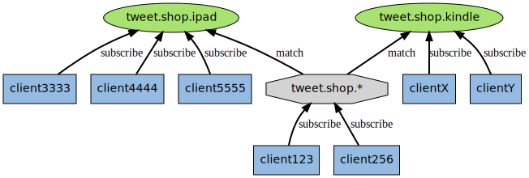

[TOC]

# Redis 发布订阅模式

## 简介

> Redis 发布订阅（pub/sub）是一种消息通信模式：发送者（pub）发送消息，订阅者（sub）接收消息。

Redis 的 SUBSCRIBE 命令可以让客户端订阅任意数量的频道，每当有新信息发送到被订阅的频道时，信息就会被发送给所有订阅指定频道的客户端。

作为例子，下图展示了频道 channel1，以及订阅这个频道的三个客户端 —— client2 、 client5 和 client1 之间的关系：


当有新消息通过 PUBLISH 命令发送给频道 channel1 时，这个消息就会被发送给订阅它的三个客户端：


## 发布/订阅使用

> Redis 有两种发布/订阅模式：
>
> - 基于频道（Channel）的发布/订阅
> - 基于模式（pattern）的发布/订阅

### 基于频道（Channel）的发布/订阅

【发布/订阅】模式包含两种角色，分别是发布者和订阅者。发布者可以向指定的频道（channel）发送消息；订阅者可以订阅一个或者多个频道（channel），所有订阅此频道的订阅者都会收到此消息。


- **发布者发布消息**

发布者发布消息的命令是  `publish`，用法是 `publish channel message`，如向 channel 1说一声 hi。

```bash
127.0.0.1:6379> publish channel:1 hi
(integer) 1 
```

这样消息就发出去了。返回值表示接收这条消息的订阅者数量。**发出去的消息不会被持久化**，也就是有客户端订阅 `channel:1` 后只能接收到后续发布到该频道的消息，之前的就接收不到了。

- **订阅者订阅频道**

订阅频道的命令是 `subscribe`，可以同时订阅多个频道，用法是 `subscribe channel1 [channel2 ...]`，例如新开一个客户端订阅上面频道：

```bash
127.0.0.1:6379> subscribe channel:1
Reading messages... (press Ctrl-C to quit)
1) "subscribe" // 消息类型
2) "channel:1" // 频道
3) "hi" // 消息内容
```

#### 底层实现原理

底层是通过字典（图中的 pubsub_channels）实现的，这个字典就用于保存订阅频道的信息：字典的键为正在被订阅的频道，而字典的值则是一个链表，链表中保存了所有订阅这个频道的客户端。

- **数据结构**

比如说，在下图展示的这个 pubsub_channels 示例中，client2 、client5 和 client1 就订阅了 channel1，而其他频道也分别被别的客户端所订阅：


- **订阅**

当客户端调用 SUBSCRIBE 命令时，程序就将客户端和要订阅的频道在 pubsub_channels 字典中关联起来。

举个例子，如果客户端 client10086 执行命令 `SUBSCRIBE channel1 channel2 channel3`，那么前面展示的 pubsub_channels 将变成下面这个样子：


- **发布**

当调用 `PUBLISH channel message` 命令，程序首先根据 channel 定位到字典的键，然后将信息发送给字典值链表中的所有客户端。

比如说，对于以下这个 pubsub_channels 实例，如果某个客户端执行命令 `PUBLISH channel1 "hello moto"`，那么 client2、client5 和 client1 三个客户端都将接收到 "hello moto" 信息。

- **退订**

使用 UNSUBSCRIBE 命令可以退订指定的频道，这个命令执行的是订阅的反操作： 它从 pubsub_channels 字典的给定频道链表中（键），删除关于当前客户端的信息，这样被退订频道的信息就不会再发送给这个客户端。

### 基于模式（pattern）的发布/订阅

客户端可以订阅一个带 * 号的模式，如果某个/某些频道的名字和这个模式匹配，那么当有信息发送给这个/这些频道的时候，客户端也会收到这个/这些频道的信息（类似正则表达式）。

比如执行命令：

```bash
PSUBSCRIBE tweet.shop.*
```

客户端将收到来自 `tweet.shop.kindle`、`tweet.shop.ipad` 等频道的信息。

- **用图例解释什么是基于模式的发布订阅**

下图展示了一个带有频道和模式的例子，其中 `tweet.shop.*` 模式匹配了 `tweet.shop.kindle` 频道和 `tweet.shop.ipad` 频道，并且有不同的客户端分别订阅它们三个：



当有信息发送到 `tweet.shop.kindle` 频道时，信息除了发送给 clientX 和 clientY 之外，还会发送给订阅 `tweet.shop.*` 模式的 client123 和 client256。


另一方面，如果接收到信息的是频道 `tweet.shop.ipad`，那么 client123 和 client256 同样会收到信息。

#### 底层实现原理

> 底层是 pubsubPattern 节点的链表。

- **数据结构**

**如无特殊说明，以下对应的都是 [Redis 3.0 版本](https://github.com/redis/redis/tree/3.0) 代码。**

`redisServer.pubsub_patterns` 属性是一个链表，链表中保存着所有和模式相关的信息：

```c
struct redisServer {
    list *pubsub_patterns;
};
```

链表中的每个节点都包含一个 `redis.h/pubsubPattern` 结构：

```c
typedef struct pubsubPattern {
    redisClient *client;
    robj *pattern;
} pubsubPattern;
```

`client`：保存着订阅模式的客户端

`pattern`：保存着被订阅的模式。

每当调用 PSUBSCRIBE 命令订阅一个模式时，程序就创建一个包含客户端信息和被订阅模式的 `pubsubPattern` 结构，并将该结构添加到 `redisServer.pubsub_patterns` 链表中。

作为例子，下图展示了一个包含两个模式的 `pubsub_patterns` 链表，其中 client123 和 client256 都正在订阅 `tweet.shop.*` 模式：


- **订阅**

```c
/* Subscribe a client to a pattern. Returns 1 if the operation succeeded, or 0 if the client was already subscribed to that pattern. */
int pubsubSubscribePattern(redisClient *c, robj *pattern) {
    int retval = 0;
	// 直接查找对应的 pattern, 没有则添加
    if (listSearchKey(c->pubsub_patterns,pattern) == NULL) {
        retval = 1;
        pubsubPattern *pat;
        listAddNodeTail(c->pubsub_patterns,pattern);
        incrRefCount(pattern);
        pat = zmalloc(sizeof(*pat));
        pat->pattern = getDecodedObject(pattern);
        pat->client = c;
        listAddNodeTail(server.pubsub_patterns,pat); // 添加到链表尾部
    }
    /* Notify the client */
    addReply(c,shared.mbulkhdr[3]);
    addReply(c,shared.psubscribebulk);
    addReplyBulk(c,pattern);
    addReplyLongLong(c,clientSubscriptionsCount(c));
    return retval;
}
```

如果这时客户端 client10086 执行 `PSUBSCRIBE broadcast.list.*`，那么 pubsub_patterns 链表将被更新成这样：


通过遍历整个 `pubsub_patterns` 链表，程序可以检查所有正在被订阅的模式，以及订阅这些模式的客户端。

**注意：所有客户端的订阅管理，server.pubsub_patterns 使用平坦式管理，即相同的模式订阅，有多少个客户端，就会有多个元素被添加到 pubsub_patterns 中。**

##### 新版本订阅实现源码

> 下面的源码是 Redis 7.0

新版的同一个 pattern 的 clients 用的是 list 方式去管理。

```c
/* Subscribe a client to a pattern. Returns 1 if the operation succeeded, or 0 if the client was already subscribed to that pattern. */
int pubsubSubscribePattern(client *c, robj *pattern) {
    dictEntry *de;
    list *clients;
    int retval = 0;
    
	// 直接查找对应的 pattern, 没有则添加
    if (listSearchKey(c->pubsub_patterns,pattern) == NULL) {
        retval = 1;
        listAddNodeTail(c->pubsub_patterns,pattern);
        incrRefCount(pattern);
        /* Add the client to the pattern -> list of clients hash table */
        de = dictFind(server.pubsub_patterns,pattern);
        if (de == NULL) {
            clients = listCreate();
            dictAdd(server.pubsub_patterns,pattern,clients);
            incrRefCount(pattern);
        } else {
            clients = dictGetVal(de);
        }
        listAddNodeTail(clients,c);
    }
    /* Notify the client */
    addReplyPubsubPatSubscribed(c,pattern);
    return retval;
}
```


- **发布**

发送信息到模式的工作也是由 PUBLISH 命令进行的，服务器会遍历 pubsub_patterns 链表找到 match channel 的 pattern，然后再把消息发给对应的客户端。

- **退订**

使用 `PUNSUBSCRIBE` 命令可以退订指定的模式，这个命令执行的是订阅模式的反操作： 程序会删除 `redisServer.pubsub_patterns` 链表中，所有和被退订模式相关联的 `pubsubPattern` 结构，这样客户端就不会再收到和模式相匹配的频道发来的信息。

## 参考文章

- https://pdai.tech/md/db/nosql-redis/db-redis-x-pub-sub.html

- https://redisbook.readthedocs.io/en/latest/feature/pubsub.html
- https://www.cnblogs.com/qlqwjy/p/9763754.html
- https://blog.csdn.net/ibigboy/article/details/95751542

