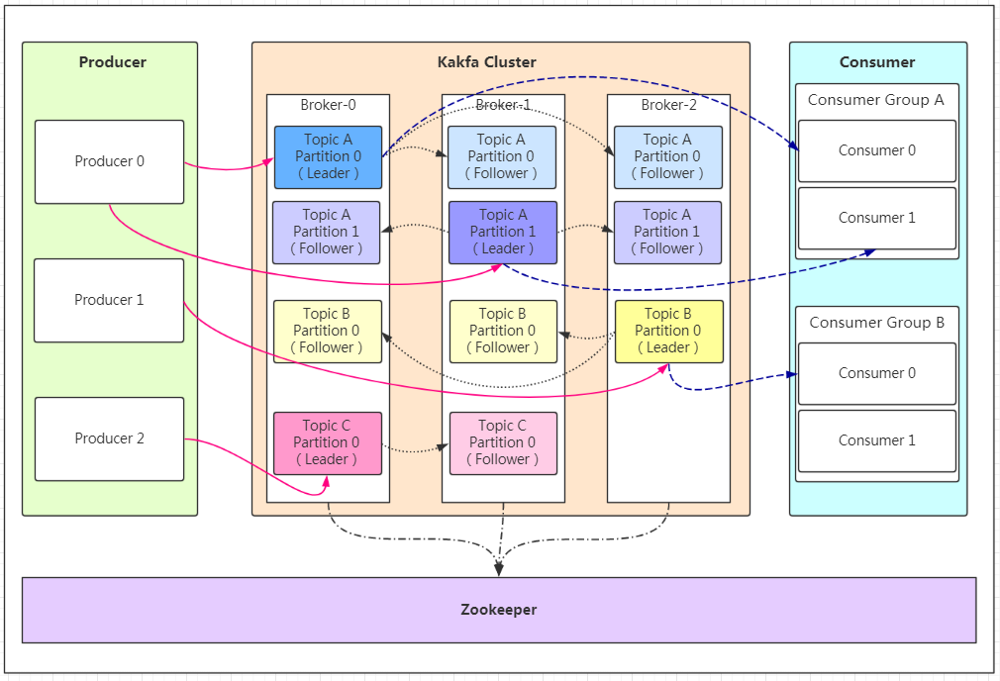
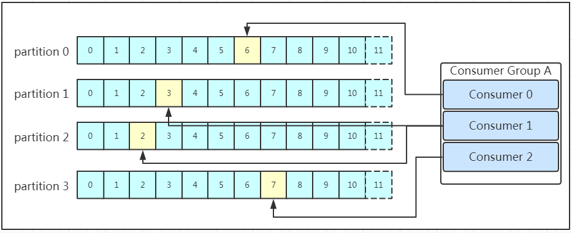
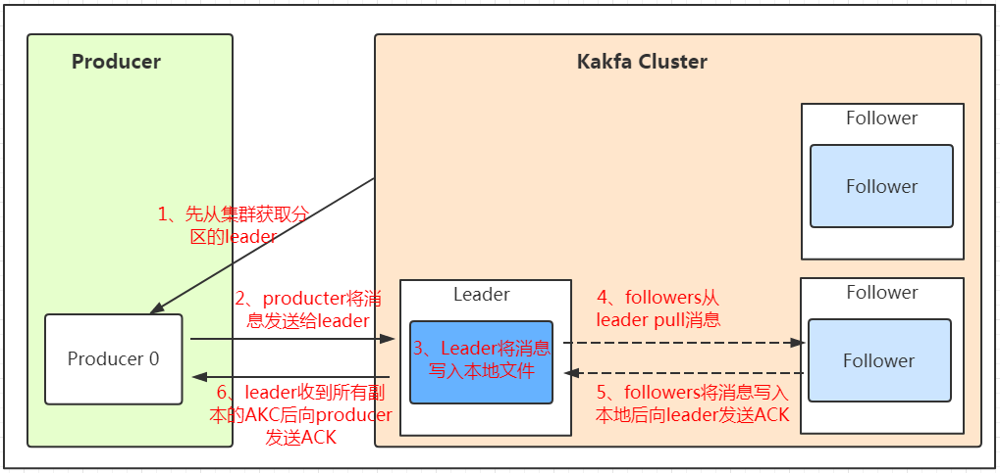
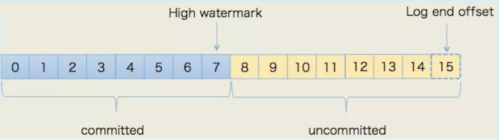
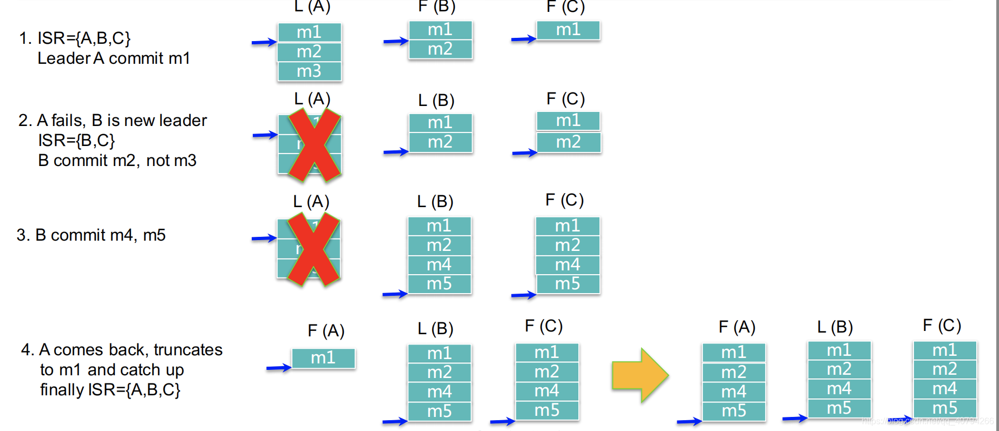
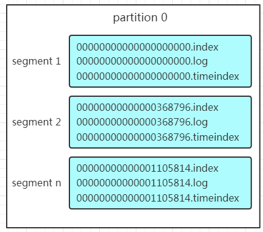

[TOC]

# kafka

## kafka 介绍

- kafka 架构图



### Kafka 所使用的基本术语

- Producer

Producer 即生产者，消息的产生者，是消息的入口。

- Broker

Broker 是 kafka 实例，每个服务器上有一个或多个 kafka 的实例，我们姑且认为每一台服务器只有一个 broker。每个 kafka 集群内的 broker 都有一个**不重复**的编号，如图中的 broker 0、broker1 等。

- Topic

消息的主题，可以理解为消息的分类，kafka 的数据就保存在 topic。在每个 broker 上都可以创建多个 topic。

- Partition

Topic 的分区，每个 topic 可以有多个分区，分区的作用是做负载，提高 kafka 的吞吐量。同一个 topic 在不同的分区的数据是不重复的，partition 的表现形式就是一个一个的文件夹。

- Replication

每一个 Partition 都有多个副本(一个 leader 和多个 follower)。

leader 副本：响应客户端的读写请求。所有的读写操作都在 leader上完成。

follower 副本：备份leader的数据，不进行读写操作

当主分区（Leader）故障的时候会选择一个 Follower 上位，成为 Leader。默认情况下，Kafka 的 replica 数量为 1。副本的数量不能大于 Broker 的数量。follower 和 leader 绝对是在不同的机器，同一机器对同一个分区也只可能存放一个副本。

- Message

每一条发送的消息主体。

- Consumer

消费者，即消息的消费方，是消息的出口。

- Consumer Group

我们可以将多个消费者组成一个消费者组，在 kafka 的设计中**同一个分区的数据只能被消费者组中的某一个消费者消费**。同一个消费者组的消费者可以消费同一个 topic 的不同分区的数据，这也是为了提高 kafka 的吞吐量。

- Zookeeper

ZooKeeper 是一个分布式协调服务，它的主要作用是为分布式系统提供一致性服务。kafka 集群依赖 zookeeper 来保存集群的的元信息，来保证系统的可用性。

**小结**

简单来说就是 Producer 生产一条 Message 给 kafka，然后 Consumer 从 kafka 消费这条消息。

结合上图我们简单总结一下 `kafka` 是如何运作的：首先 `Producer 0` 生产一条 `Topic A` 的 `Message`，这条 `Message` 被写入到 `Topic A` 的 `partition 0` 中。`Consumer Group A` 中有两个 `Consumer(Consumer 0, Consumer 1)` 且 `Consumer Group A` 订阅了 `Topic A` 的消息。最后 `Consumer 0` 消费了 `partition 0` 中的消息。

- produce message


- consume message



### partition 的作用

若没有分区，一个 topic 对应的消息集在分布式集群服务组中，就会分布不均匀，即可能导致某台服务器 A 记录当前 topic 的消息集很多，若此 topic 的消息压力很大的情况下，服务器 A 就可能导致压力很大，吞吐也容易导致瓶颈。

有了分区后，假设一个 topic 可能分为 10 个分区，kafka 内部会根据一定的算法把 10 分区尽可能均匀分布到不同的服务器上，比如：A 服务器负责 topic 的分区 1，B 服务器负责 topic 的分区 2，在此情况下，Producer 发消息时若没指定发送到哪个分区的时候，kafka 就会根据一定算法上个消息可能分区 1，下个消息可能在分区 2。

一句话总结：**分区对于 Kafka 集群的好处是：实现负载均衡。分区对于消费者来说，可以提高并发度，提高效率。**

### topic 和 partition

每个 topic 可以有多个 partition。简单来说 topic 是存放消息的逻辑队列，partition 是物理队列。

假如我的一个 topic 有三个分区，那么生产者生产一条消息后会放到**其中的一个分区**（<u>注意这里不是一条消息存到三个分区中</u>）。


每一个分区都是一个顺序的、不可变的消息队列， 并且可以持续的添加。分区中的消息都被分了一个序列号，称之为偏移量(offset)，在每个分区中此偏移量都是唯一的。

Kafka 集群保持所有的消息，直到它们过期（无论消息是否被消费）。实际上消费者所持有的仅有的元数据就是这个 offset（偏移量），也就是说 offset 由消费者来控制：正常情况当消费者消费消息的时候，偏移量也线性的的增加。但是实际偏移量由消费者控制，消费者可以将偏移量重置为更早的位置，重新读取消息。


Kafka 中采用分区的设计有几个目的。一是可以处理更多的消息，不受单台服务器的限制。Topic 拥有多个分区意味着它可以不受限的处理更多的数据。第二，分区可以作为并行处理的单元。

- 在 kafka 中，如果某个 topic 有多个 partition，producer 又怎么知道该将数据发往哪个 partition 呢？kafka 中有几个原则：

1. partition 在写入的时候可以指定需要写入的 partition，如果有指定，则写入对应的partition。
2. 如果没有指定 partition，但是设置了数据的 key，则会根据 key 的值 hash 出一个 partition。
3.  如果既没指定 partition，又没有设置 key，则会轮询选出一个 partition。

#### partition 的有序性

**为什么 kafka 是只能在 patition 上面做到有序，而 topic 如果有多个 partition 是不是就不能保证 topic 是有序的**？

网上看到的一个例子：

某一天举办了一次吃鸡蛋大赛，可以以小组的形式参加，报名结束后，一共有两个小组参加：

- A 小组有三个人 A1，A2，A3
- B 小组有两个人 B1，B2

在他们面前各自放着三条流水线，鸡蛋从流水线滚下来（3 个分区），厨师（生产者）在后台不停的往流水线里加鸡蛋，防止参赛选手（消费者）不够吃。

A 小组正巧有三个人，就一人负责一条流水线，按照流水线的上鸡蛋的顺序吃。

B 小组只有两个人，其中 B1 饭量比较大，独自负责两条流水线，这条流水线吃一个，那条流水线吃一个。

这里就对应了一个参赛选择按鸡蛋的生产顺序进行吃鸡蛋，比如 A 小组，那么每个人吃的鸡蛋的顺序都是按照厨师放入流水线的顺序。而 B 小组的 B1 这个人，就一会儿这吃个一会儿吃那个，没有一个顺序性保证了。

比赛的结局就是谁最后吃的鸡蛋最多，谁就获胜。

### 同步生产者和异步生产者

- kafka 同步生产者：这个生产者写一条消息的时候，它就立马发送到某个分区去。


- kafka 异步生产者：这个生产者写一条消息的时候，先是写到某个缓冲区，这个缓冲区里的数据还没写到 broker 集群里的某个分区的时候，它就返回到 client 去了。


### Controller Broker

在分布式系统中，通常需要有一个协调者，该协调者会在分布式系统发生异常时发挥特殊的作用。在 Kafka 中该协调者称之为控制器(Controller)，其实该控制器并没有什么特殊之处，它本身也是一个普通的 Broker，只不过需要负责一些额外的工作(追踪集群中的其他 Broker，并在合适的时候处理新加入的和失败的 Broker 节点、Rebalance 分区、分配新的 leader 分区等)。值得注意的是：**Kafka 集群中始终只有一个 Controller Broker。**

#### Controller Broker 是如何被选出来的

Broker 在启动时，会尝试去 ZooKeeper 中创建 /controller 节点。Kafka 当前选举控制器的规则是：**第一个成功创建 /controller 节点的 Broker 会被指定为控制器**。

#### Controller Broker 的具体作用是什么

Controller Broker 的主要职责有很多，主要是一些管理行为，主要包括以下几个方面：

- 创建、删除主题，增加分区并分配 leader 分区
- 集群 Broker 管理（新增 Broker、Broker 主动关闭、Broker 故障)
- 分区重分配

## kafka 高可用机制

Kafka 一个消息系统，最重要的就是保证消息不丢失，Kafka 通过<u>**备份机制**</u>和<u>**故障转移**</u>来做容错，下面围绕这两点来说说 Kafka 是如何实现高可用的。

### 备份机制(replication)

在 Kafka 在 0.8 以前的版本中，是没有 Replication 的，在没有 Replication 的情况下，一旦某机器宕机或者某个 Broker 停止工作则会造成整个系统的可用性降低

Kafka 的高可用保障来源于其健壮的副本(replication)策略。

每一个 partition 都有多个副本，副本的作用是做备胎。当主分区（Leader）故障的时候会选择一个备胎（Follower）上位，成为 Leader。follower 和 leader 绝对是在不同的机器，同一机器对同一个分区也只可能存放一个副本（包括自己）。如下图：


其中，Leader 负责响应客户端的读写请求，follower 只负责从 Leader 同步消息，不面向客户端。

#### ISR

分区中的所有副本统称为 AR(Assigned Repllicas)存储在 zookeeper 中，所有与 leader 副本保持一定程度同步的副本(包括 Leader)组成 ISR(In-Sync Replicas)，ISR 集合是 AR 集合中的一个子集，只要 ISR 里有至少一个副本，即认为消息不会丢失。

如果 follower 副本和 leader 副本数据

- 同步速度过慢(消息差值超过 `replica.lag.max.messages` 阈值，其默认值是 4000)

- 心跳超时(心跳丢失超过 `replica.lag.time.max.ms` 阈值，其默认值是10000)

该 follower 将会被踢出 ISR 集合表。

当一台服务器被踢出 ISR 列表后，它会请求 Leader 的数据，直到数据量没有比 Leader 落后太多，就会被重新加入到 ISR 列表中。

只有在 ISR 集合中的副本才有资格被选举为 leader。

#### 如何将所有 Replica 均匀分布到整个集群

如果所有的 Replica 都在同一个 Broker 上，那一旦该 Broker 宕机，该 Partition 的所有 Replica 都无法工作，所以需要保证它上面的负载可以被均匀的分配到其它的所有 Broker上。

> 默认情况下，Kafka 的 replica 数量为 1。

Kafka 分配 Replica 的算法如下：

1. 将所有 Broker(假设共 n 个 Broker)和待分配的 Partition 排序。

2. 将第 i 个 Partition 分配到第 `i mod n` 个 Broker 上。

3. 将第 i 个 Partition 的第 j 个 Replica 分配到第 `(i + j) mode n` 个 Broker 上。

#### ACK 应答机制

kafka 通过 ACK 应答机制保证消息不丢失。在生产者向队列写入数据的时候可以设置参数来确定是否确认 kafka 接收到数据，这个参数可设置的值为 **0**、**1**、**all**。

- `0`  代表 producer 往集群发送数据不需要等到集群的返回，不确保消息发送成功。安全性最低但是效率最高。
- `1`  代表 producer 往集群发送数据只要 leader 应答就可以发送下一条，只确保 leader 发送成功。
- `all`  代表 producer 往集群发送数据需要所有的 follower 都完成从 leader 的同步才会发送下一条，确保 leader 发送成功和所有的副本都完成备份。安全性最高，但是效率最低。

golang 使用 kafka 的 sarama 包 ack 参数定义如下（该参数是 new 一个 producer 实例的时候去配置）：

```go
const (
    // NoResponse doesn't send any response, the TCP ACK is all you get.
    NoResponse RequiredAcks = 0
    // WaitForLocal waits for only the local commit to succeed before responding.
    WaitForLocal RequiredAcks = 1
    // WaitForAll waits for all in-sync replicas to commit before responding.
    // The minimum number of in-sync replicas is configured on the broker via
    // the `min.insync.replicas` configuration key.
    WaitForAll RequiredAcks = -1
)
```

Kafka 可以通过参数来限制 ISR 的数量的: min.insync.replicas = n，代表的语义是，如果生产者 acks=all，而在发送消息时，Broker 的 ISR 数量没有达到 n，Broker 不能处理这条消息，需要直接给生产者报错。



### 故障转移(failover)

#### broker 故障

当某个 Broker 节点由于故障离开 Kafka 群集时，则存在于该 Broker 的 leader 分区将不可用。为了最大程度地减少停机时间，需要快速找到替代的 leader 分区。

每个 Broker 启动后，会在 zookeeper 的 /Brokers/ids 下创建一个临时 znode。当 Broker 宕机或主动关闭后，该 Broker 与 ZooKeeper 的会话结束，这个 znode 会被自动删除。同理，ZooKeeper 的 Watch 机制将这一变更推送给 Controller，这样 Controller 就能知道有 Broker 关闭或宕机了，从而进行后续的协调操作。

Controller 将收到通知并对此采取行动，决定哪些 Broker 上的分区成为 leader 分区，然后它会通知每个相关的 Broker：

1、要么将 Broker上的主题分区变成 leader。

2、要么通过 `LeaderAndISR` 请求从新的 leader 分区中复制数据。

> 当然如果该故障的 broker 恢复了，controller 就会把它加进来。

**committed offset**

我们知道 consumer 维护已读取消息的 offset，当发生 Leader 切换之后，如何保证在新的 leader 上这个 offset 仍然有效？换句话来说，就是要解决 follower 同步 leader 消息滞后带来的问题。

- read message by offset


Kafka 用一种机制，即 `committed offset`，来保证这种一致性，如下图所示：



committed offset 只有在所有 replica 都同步完该 offset 的 message 后，该 offset 才会被置为 committed。这时，uncommitted 的 message 对 consumer 是不可见的。

上图中 consumer 最多只能读到 offset 7。

如果此时，leader dead，无论哪个 follower 重新选举成 leader，都不会影响数据的一致性，因为 consumer 可见的 offset 最多为 7，而这个 offset 在所有的 replica 上都是一致的。

**Leader 切换示意图**

<u>需要注意的是如果 Leader 选不出来，那么该 Partition offline。</u>



#### Controller 故障

Kafka 会从 Broker 中选出一个作为 Controller。说白了就是抢占 zk 的分布式锁。

Controller 的 failover 过程如下：

- 试图去在 /controller 目录抢占创建 node；
- 如果已经有其他的 broker node 先创建成功，那么说明新的 controller 已经诞生，更新当前的元数据即可；
- 如果自己创建成功，说明我已经成为新的 controller，下面就要开始做初始化工作；

> 初始化主要就是创建和初始化 partition 和 replicas 的状态机，并对 partitions 和 brokers 的目录的变化设置 watcher。

可以看到，单纯 Controller 发生 failover，是不会影响正常数据读写的，只是 partition 的 leader 无法被重新选举，如果此时有 partition 的 leader fail，会导致 partition offline。但是 Controller 的 dead，往往是伴随着 broker 的 dead，所以在 Controller 发生 failover 的过程中，往往会出现 partition offline，导致数据暂时不可用。

#### All Replica Fail

假设某个 Partition 的所有副本都宕机，这时候 Kafka 有以下两种降级处理：

- 等待 ISR 中任一 Replica 恢复，并选它为 Leader。

 优缺点：等待时间较长，降低可用性，但是消息不丢失(强一致性)。

- 选择第一个恢复的 Replica 为新的 Leader，无论它是否在 ISR 中，称为脏选举。

 优缺点：并未包含所有已被之前 Leader Commit 过的消息，因此会造成数据丢失，但可用性较高(高可用性：减少停工时间，而保持其服务的高度可用性)。

需要根据不同的使用场景选择**高可用性**还是**强一致性**。

#### Zookeeper Failover

Kafka 底层是强依赖 Zookeeper 的**(注意：Apache Kafka2.8 版本之后可以不需要使用ZooKeeper)**，如果 Zookeeper 发生故障，势必会对 Kafka 造成影响。

Zookeeper 故障大致分为：Zookeeper Dead、Zookeeper Hang 两种。

##### Zookeeper Dead

这种情况下 Broker 是无法启动的，因为连不上 Zookeeper，Kafka 完全无法工作直到 Zookeeper 恢复正常服务为止。

##### Zookeeper Hang

zookeeper hang 的原因有很多，主要是 zk 负载过重，zk 所在主机 cpu，memeory 或网络资源不够等，hang 造成的影响就是 Session Timeout。

Session Timeout 就引发如下问题：

- Controller fail，触发 Controller 重新选举
- Broker fail，触发 Partition 的 Leader 切换 or Partition offline

### 消息持久化

Producer 将数据写入 kafka 后，集群就需要对数据进行保存了，kafka 将数据保存在磁盘，可能在我们的一般的认知里，写入磁盘是比较耗时的操作，不适合这种高并发的组件。 Kafka 初始会单独开辟一块磁盘空间，顺序写入数据（效率比随机写入高）。

#### Partition 结构

Partition 在服务器上的表现形式就是一个一个的文件夹，每个 partition 的文件夹下面会有多组 segment 文件，每组 segment 文件又包含 .index 文件、.log 文件、.timeindex 文件（早期版本中没有）三个文件， log 文件就实际是存储 message 的地方，而 index 和 timeindex 文件为索引文件，用于检索消息。



如上图，这个 partition 有三组 segment 文件，每个 log 文件的大小是一样的，但是存储的 message 数量是不一定相等的（每条的 message 大小不一致）。

文件的命名是以该 segment 最小 offset 来命名的，如 000.index 存储 offset 为 0~368795 的消息。

kafka 就是利用**分段+索引**的方式来解决查找效率的问题。

#### Message结构

上面说到 log 文件就实际是存储 message 的地方，我们在 producer 往 kafka 写入的也是一条一条的 message，那存储在 log 中的 message 是什么样子的呢？消息主要包含消息体、消息大小、offset、压缩类型……等等！我们重点需要知道的是下面三个：

1、 offset：offset 是一个占 8byte 的有序 id 号，它可以唯一确定每条消息在 partition 内的位置！

2、 消息大小：消息大小占用 4byte，用于描述消息的大小。

3、 消息体：消息体存放的是实际的消息数据（被压缩过），占用的空间根据具体的消息而不一样。

#### 存储策略

无论消息是否被消费，kafka 都会保存所有的消息。那对于旧数据有什么删除策略呢？

1、 基于时间，默认配置是 168 小时（7 天）。

2、 基于大小，默认配置是 1073741824。

需要注意的是，kafka 读取特定消息的时间复杂度是 O(1)，所以这里删除过期的文件并不会提高 kafka 的性能。

## kafka 安装

### mac os 安装

**安装**

- 安装的命令

`brew install kafka`

- 安装的目录

`/usr/local/Cellar/kafka`

**启动**

- 配置文件目录

`/usr/local/etc/kafka`

- 先启动 zookeeper

`zookeeper-server-start zookeeper.properties`

- 后启动 kafka

`kafka-server-start server.properties`

**遇到的问题**

- Failed to acquire lock on file

```bash
[2022-01-21 14:52:49,322] ERROR [KafkaServer id=0] Fatal error during KafkaServer startup. Prepare to shutdown (kafka.server.KafkaServer)
org.apache.kafka.common.KafkaException: Failed to acquire lock on file .lock in /usr/local/var/lib/kafka-logs. A Kafka instance in another process or thread is using this directory.
```

解决：直接删除 /usr/local/var/lib/kafka-logs 这个文件夹

- node already exists

```bash
EERROR Error while creating ephemeral at /brokers/ids/0, node already exists and owner '72057670489079818' does not match current session '72057670489079822' (kafka.zk.KafkaZkClient$CheckedEphemeral)
[2022-01-21 16:51:54,540] ERROR [KafkaServer id=0] Fatal error during KafkaServer startup. Prepare to shutdown (kafka.server.KafkaServer)
org.apache.zookeeper.KeeperException$NodeExistsException: KeeperErrorCode = NodeExists
```

解决：进入 zookeeper 客户端删除 /brokers/ids/0 节点

```bash
# 进入 zookeeper 的客户端
zkCl
ls /brokers/ids
# 删除 ids 0 节点
delete /brokers/ids/0
```

### 使用 docker 安装 kafka

- 拉取 docker 镜像

这里需要需要用到 zookeeper 和 kafka

```bash
docker pull wurstmeister/zookeeper
docker pull wurstmeister/kafka
```

**zookeeper 与 kafka 之间具体的是一种什么关系呢？**

> kafka 之间是无法互相发现对方的，每个 kafka 向 zk 注册，说我是 A 节点（broker.id），我是 B 节点，这样组成了一个 kafka 集群。每个人通过 zk 来发现彼此。

- 先启动 zookeeper

```
docker run -d --name zookeeper -p 2181:2181 -t wurstmeister/zookeeper
```

- 启动 kafka

~~docker run -d --name kafka \~~
~~-p 9092:9092 \~~
~~-e KAFKA_BROKER_ID=0 \~~
~~-e KAFKA_ZOOKEEPER_CONNECT=[ip]:2181 \~~
~~-e KAFKA_ADVERTISED_LISTENERS=PLAINTEXT://[ip]:9092 \~~
~~-e KAFKA_LISTENERS=PLAINTEXT://0.0.0.0:9092 wurstmeister/kafka~~

~~**注意：** [ip] 这里填写的是你本机的 ip 地址。如 `172.17.0.1`。如果个人电脑是 mac，在 [ip] 这块就不能填本机 ip（windows 和 linux 能够），须要填  docker.for.mac.host.internal~~

```bash
docker run -d --name kafka --publish 9092:9092 --link zookeeper \
--env KAFKA_ZOOKEEPER_CONNECT=zookeeper:2181 \
--env KAFKA_ADVERTISED_HOST_NAME=localhost \
--env KAFKA_ADVERTISED_PORT=9092 \
wurstmeister/kafka:latest
```

- 进入 kafka bash

```text
docker exec -it kafka bash
cd /opt/kafka/bin
```

- 创建Topic，分区为 2，Topic name 为 kafkaDemo

```text
kafka-topics.sh --create --zookeeper zookeeper:2181 \
--replication-factor 1 --partitions 2 --topic kafkaDemo
```

- 查看当前所有topic

```text
kafka-topics.sh --zookeeper zookeeper:2181 --list
```

**启动 kafka 遇到的问题**

- kafka 连接 zookeeper 超时。随缘解决办法：1、rm zookeeper 容器，重新 run。2、重启电脑。这两种方法都试过，莫名其妙好了，真奇怪。

### 在 wsl 上安装 docker 和 kafka

因为家里用的 windows，所以平常用的都是 wsl 写代码。但是安装 docker 遇到了很多的问题。
好不容易安装好后，出现了 kafka 容器无法启动。

一度放弃 wsl 回去用了虚拟机。后面查询资料后发现 wsl 1 是不支持 docker 简答粗暴的安装的。需要切换到 wsl 2(可以简单的理解为 wsl 1 的升级版本)。查看 wsl 版本：wsl -l -v。

一键安装的 docker 的脚本代码如下（不是我写的）

```bash
# install docker
curl -fsSL get.docker.com -o get-docker.sh
sh get-docker.sh

if [ ! $(getent group docker) ];
then
    sudo groupadd docker;
else
    echo "docker user group already exists"
fi

sudo gpasswd -a $USER docker
sudo service docker restart

rm -rf get-docker.sh
```

安装好后启动 docker

```bash
sudo service docker start
# 查看 docker 的状态
sudo service docker status
# 重启
sudo service docker restart
```

避免每次使用 docker 都要加 sudo

```bash
sudo usermod -aG docker username
# username 为你的用户名
```

重启 wsl

```bash
wsl -d ubuntu -u root /etc/init.d/ssh start
```

## kafka 功能验证

kafka 的背景知识已经讲了很多了，让我们现在开始实践吧。

参考链接里的方法即可：https://www.orchome.com/6

## 使用 golang 连接 kafka

截止当前时间，github 上 golang 操作 kafka 的包主要有两个：

```
Shopify/sarama
confluentinc/confluent-kafka-go
```

## 参考链接

- [kafka 中文文档](https://www.orchome.com/66)
- [macOS 下 使用 docker 安装 kafka](http://www.javashuo.com/article/p-eizveeqh-be.html)
- [再过半小时，你就能明白 kafka 的工作原理了](https://www.cnblogs.com/sujing/p/10960832.html)
- [Kafka 的 Controller Broker 是什么](https://zhuanlan.zhihu.com/p/165989024)
