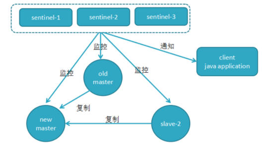

[TOC]

# Redis 哨兵

在 Redis 主从集群中，哨兵机制是实现主从库自动切换的关键机制，它有效地解决了主从复制模式下故障转移的问题。

下图是一个典型的哨兵集群监控的逻辑图

一个哨兵节点是一个独立的进程。redis 哨兵主要有下面的功能：

- **监控（Monitoring）**：哨兵会不断地检查主节点和从节点是否运作正常。
- **自动故障转移（Automatic failover）**：当主节点不能正常工作时，哨兵会开始自动故障转移操作，它会将失效主节点的其中一个从节点升级为新的主节点，并让其他从节点改为复制新的主节点。
- **通知（Notification）**：哨兵可以将故障转移的结果发送给客户端。

## 哨兵是如何监控的？

- **和 redis 库建立连接**

这是由哨兵向主库发送 INFO 命令来完成的。就像下图所示，哨兵给主库发送 INFO 命令，主库接受到这个命令后，就会把从库列表返回给哨兵。接着，哨兵就可以根据从库列表中的连接信息，和每个从库建立连接，并在这个连接上持续地对从库进行监控。

- **定期 check redis 节点**

哨兵会每隔 1 秒给所有主从节点发送 PING 命令，当主从节点收到 PING 命令后，会发送一个响应命令给哨兵，这样就可以判断它们是否在正常运行。如果主节点或者从节点没有在规定的时间内响应哨兵的 PING 命令，哨兵就会将它们标记为「**主观下线**」。这个「规定的时间」是配置项  `down-after-milliseconds` 参数设定的，单位是毫秒。

如果哨兵检测到从库的状态异常，可以判定其下线，对整个系统的影响不大。如果出现状态异常的是主库，那么，就要启动主从切换，需要完成新主节点的选择和所有节点和客户端的通知，需要计算资源和通信资源。

但是，这里存在一个问题。如果由于哨兵节点自身的故障，或者哨兵节点和主库节点之间的网络问题，导致哨兵误判了主库的状态，从而启动主从切换，这将造成大量的计算和通信资源浪费。

所以，为了减少误判的情况，哨兵在部署的时候不会只部署一个节点，而是用多个节点部署成**哨兵集群**（最少需要三台机器来部署哨兵集群），**通过多个哨兵节点一起判断，就可以就可以避免单个哨兵因为自身网络状况不好，而误判主节点下线的情况**。同时，多个哨兵的网络同时不稳定的概率较小，由它们一起做决策，误判率也能降低。

## 哨兵集群的组建

**基于 Redis 的 pub/sub 机制**，多个哨兵可以在主节点的 `__sentinel__:hello` 频道互相发现。哨兵通过这个频道发布自己的连接信息，并获取其它哨兵的连接信息。这样，多个哨兵之间就形成了一个哨兵集群。

## 主库下线的判定

首先要理解两个概念：**主观下线**和**客观下线**

- **主观下线**：任何一个哨兵都是可以监控探测，并作出 Redis 节点下线的判断；
- **客观下线**：有哨兵集群共同决定 Redis 节点是否下线；

当某个哨兵（如下图中的哨兵2）判断主库“主观下线”后，就会给其他哨兵发送 `is-master-down-by-addr` 命令。接着，其他哨兵会根据自己和主库的连接情况，做出 Y 或 N 的响应，Y 相当于赞成票，N 相当于反对票。

如果赞成票数（这里是 2）是**大于等于**哨兵配置文件中的 `quorum` 配置项（比如这里如果是 quorum=2），则可以判定**主库【客观下线】**了。

## 由哪个哨兵进行主从故障转移？

判断完主库下线后，由哪个哨兵节点来执行主从切换呢？这里就需要哨兵集群的选举机制了。

- **为什么必然会出现选举/共识机制？**

为了避免哨兵的单点情况发生，所以需要一个哨兵的分布式集群。作为分布式集群，必然涉及共识问题（即选举问题）；同时故障的转移和通知都只需要一个主的哨兵节点（leader）就可以了。

- **哨兵的选举机制是什么样的？**

哨兵的选举机制其实很简单，就是一个 Raft 选举算法。

任何一个想成为 Leader 的哨兵，要同时满足两个条件：

1. 拿到半数以上的赞成票，即选举的票数大于等于 `num(sentinels)/2 + 1`）。
2. 拿到的票数同时还需要大于等于哨兵配置文件中的 quorum 值。

以 3 个哨兵为例，假设此时的 quorum 设置为 2，那么，任何一个想成为 Leader 的哨兵只要拿到 2 张赞成票，就可以了。

- **更进一步理解**

这里很多人会搞混【判定客观下线】和【是否能够主从切换】两个概念，我们再看一个例子。

> Redis 有 1 主 4 从，5 个哨兵，哨兵配置 quorum 为 2，如果 3 个哨兵故障，当主库宕机时，哨兵能否判断主库【客观下线】？能否进行【主从切换】？

1. 哨兵集群可以判定主库主观下线。由于 quorum=2，所以当一个哨兵判断主库主观下线后，询问另外一个哨兵后也会得到同样的结果，2 个哨兵都判定主观下线，达到了 quorum 的值，因此，**哨兵集群可以判定主库为【客观下线】**。
2. **但哨兵不能完成主从切换**。哨兵标记主库客观下线后，在选举哨兵领导者时，一个哨兵必须拿到超过多数的选票（5/2 + 1=3 票）。但目前只有 2 个哨兵活着，无论怎么投票，一个哨兵最多只能拿到 2 票，永远无法达到 `N/2+1` 选票的结果。

## 新主库的选出

> 主库既然判定客观下线了，那么如何从剩余的从库中选择一个新的主库呢？

- 过滤掉不健康的（下线或断线），没有回复过哨兵 ping 响应的从节点
- 选择 `salve-priority` 从节点优先级最高（redis.conf）的
- 选择复制偏移量最大，只复制最完整的从节点

## 故障的转移

> 新的主库选择出来后，就可以开始进行故障的转移了。

我们假设：判断主库客观下线了，同时选出 `sentinel 3` 是哨兵 leader

- **转移前**

- **故障转移**

1. 将 slave-1 脱离原从节点（PS：5.0 中应该是 `replicaof no one`)，升级为主节点。
2. 将从节点 slave-2 指向新的主节点。
3. 通知客户端主节点已更换。
4. 将原主节点（oldMaster）变成从节点，指向新的主节点。

- **转移后**

## 参考文章

- https://pdai.tech/md/db/nosql-redis/db-redis-x-sentinel.html
- https://mp.weixin.qq.com/s/DzVY4iA-_my0JUSqOOniOw
- https://time.geekbang.org/column/article/275337
- https://time.geekbang.org/column/article/274483
- https://www.cnblogs.com/andy6/p/10829929.html