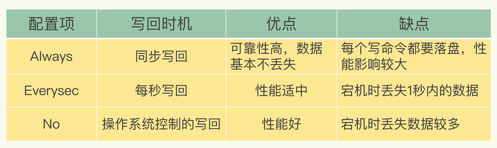

[TOC]

# Redis 持久化

> 为什么需要持久化？

Redis 是个基于内存的数据库。那服务一旦宕机，内存中的数据将全部丢失。通常的解决方案是从后端数据库恢复这些数据，但后端数据库有性能瓶颈，如果是大数据量的恢复：

1、会对数据库带来巨大的压力。

2、数据库的性能不如 Redis，导致程序响应慢。

所以对 Redis 来说，实现数据的持久化，避免从后端数据库中恢复数据，是至关重要的。

## fork 写时复制

> 一个进程调用 `fork` 函数后，系统先给新的进程分配资源，例如存储数据和代码的空间。然后把原来的进程的所有值都复制到新的新进程中，只有少数值与原来的进程的值不同。相当于克隆了一个自己。因为 Redis 持久化最重要的步骤是 `fork` 操作，所以在这里简单复习一下。

- **主线程 `fork` 出子进程的是如何拷贝主进程资源**？

`fork` 采用操作系统提供的**写时复制（copy on write）机制**，就是为了避免一次性拷贝大量内存数据给子进程造成阻塞。`fork` 子进程时，子进程时会**拷贝父进程的页表**，即虚实映射关系（虚拟内存和物理内存的映射索引表），而不会拷贝物理内存。这个拷贝会消耗大量 cpu 资源，并且拷贝完成前会阻塞主线程，阻塞时间取决于内存中的数据量，数据量越大，则内存页表越大。拷贝完成后，父子进程使用相同的内存地址空间。

**但主进程是可以有数据写入的，这时候就会拷贝物理内存中的数据**。如下图（进程 1 看做是主进程，进程 2 看做是子进程）：


在主进程有数据写入时，而这个数据刚好在页 C 中，操作系统会创建这个页面的副本（页 C 的副本），即拷贝当前页的物理数据，将其映射到主进程中，而子进程还是使用原来的的页 C。

## RDB 持久化

> RDB 就是 Redis DataBase 的缩写，中文名为快照/内存快照，RDB 持久化是把当前进程数据生成快照保存到磁盘上的过程（全量）。由于是某一时刻的快照，那么快照中的值要早于或者等于内存中的值。

### 触发方式

> 触发 rdb 持久化的方式有 2 种，分别是**手动触发**和**自动触发**。手动触发分别对应 save 和 bgsave 命令。自动触发就懒得讲了。

- **save 命令**：阻塞当前 Redis 服务器，直到 RDB 过程完成为止，对于内存比较大的实例会造成长时间**阻塞**，线上环境不建议使用。
- **bgsave 命令**：Redis 进程执行 fork 操作创建子进程，RDB 持久化过程由子进程负责，完成后自动结束。阻塞只发生在 fork 阶段，一般时间很短。

bgsave 流程图如下所示


### RDB 更深入理解

- **由于生产环境中我们为 Redis 开辟的内存区域都比较大（例如 6GB），那么将内存中的数据同步到硬盘的过程可能就会持续比较长的时间，而实际情况是这段时间 Redis 服务一般都会收到数据写操作请求。那么如何保证数据一致性呢**？

RDB 中的核心思路是 Copy-on-Write，来保证在进行快照操作的这段时间，需要压缩写入磁盘上的数据在内存中不会发生变化。在正常的快照操作中，一方面 Redis 主进程会 fork 一个新的快照进程专门来做这个事情，这样保证了 Redis 服务不会停止对客户端包括写请求在内的任何响应。另一方面这段时间发生的数据变化会以副本的方式存放在另一个新的内存区域，待快照操作结束后才会同步到原来的内存区域。

举个例子：如果主线程对这些数据也都是读操作（例如图中的键值对 A），那么，主线程和 bgsave 子进程相互不影响。但是，如果主线程要修改一块数据（例如图中的键值对 C），那么这块数据就会被复制一份，生成该数据的副本。然后，**bgsave 子进程会把这个副本数据写入 RDB 文件**，而在这个过程中，主线程仍然可以直接修改原来的数据。


- **在进行快照操作的这段时间，如果发生服务崩溃怎么办**？

很简单，在没有将数据全部写入到磁盘前，这次快照操作都不算成功。如果出现了服务崩溃的情况，将以上一次完整的 RDB 快照文件作为恢复内存数据的参考。也就是说，在快照操作过程中不能影响上一次的备份数据。Redis 服务会在磁盘上创建一个临时文件进行数据操作，待操作成功后才会用这个临时文件替换掉上一次的备份。


- **可以每秒做一次快照吗**？

虽然 bgsave 执行时不阻塞主线程，但是，**如果频繁地执行全量快照，也会带来两方面的开销**：

- 一方面，频繁将全量数据写入磁盘，会给磁盘带来很大压力，多个快照竞争有限的磁盘带宽，前一个快照还没有做完，后一个又开始做了，容易造成恶性循环。
- 另一方面，bgsave 子进程需要通过 fork 操作从主线程创建出来。虽然，子进程在创建后不会再阻塞主线程，但是，fork 这个创建过程本身会阻塞主线程，而且主线程的内存越大，阻塞时间越长。如果频繁 fork 出 bgsave 子进程，这就会频繁**阻塞主线程**了。

### RDB 优缺点

- **优点**
  - RDB 文件是某个时间节点的快照，默认使用 LZF 算法进行压缩，压缩后的文件体积远远小于内存大小，适用于备份、全量复制等场景；
  - Redis 加载 RDB 文件恢复数据要远远快于 AOF 方式；
- **缺点**
  - RDB 方式实时性不够，无法做到秒级的持久化；
  - 每次调用 bgsave 都需要 fork 子进程，fork 子进程属于重量级操作，频繁执行成本较高；
  - RDB 文件是二进制的，没有可读性，AOF 文件在了解其结构的情况下可以手动修改或者补全；

针对 RDB 不适合实时持久化的问题，Redis 提供了 AOF 持久化方式来解决。

## AOF 持久化

> AOF（apeend only file）。Redis 是【写后】日志，Redis 先执行命令，把数据写入内存，然后才记录日志。日志里记录的是 Redis 收到的每一条命令，这些命令是以文本形式保存。PS：大多数的数据库采用的是写前日志（WAL），例如 MySQL，通过写前日志和两阶段提交，实现数据和逻辑的一致性。

而 AOF 日志采用写后日志，即**先写内存，后写日志**。


**为什么采用写后日志**？

Redis 要求高性能，采用写日志有两方面好处：

- **避免额外的检查开销**：Redis 在向 AOF 里面记录日志的时候，并不会先去对这些命令进行语法检查。所以，如果先记日志再执行命令的话，日志中就有可能记录了错误的命令，Redis 在使用日志恢复数据时，就可能会出错。
- 不会阻塞当前的写操作

但这种方式存在潜在风险：

- 如果命令执行完成，写日志之前宕机了，会丢失数据。
- 主线程写磁盘压力大，导致写盘慢，阻塞后续操作。

### 如何实现 AOF

AOF 日志记录 Redis 的每个写命令，步骤分为：命令追加（append）、文件写入（write）和文件同步（sync）。

- **命令追加**：当 AOF 持久化功能打开了，服务器在执行完一个写命令之后，会以协议格式将被执行的写命令追加到服务器的 aof_buf 缓冲区。
- **文件写入和同步**：关于何时将 aof_buf 缓冲区的内容写入 AOF 文件中，Redis 提供了三种写回策略：



`Always`：同步写回：每个写命令执行完，立马同步地将日志写回磁盘；

`Everysec`：每秒写回：每个写命令执行完，只是先把日志写到 AOF 文件的内存缓冲区，每隔一秒把缓冲区中的内容写入磁盘；

`No`：操作系统控制的写回：每个写命令执行完，只是先把日志写到 AOF 文件的内存缓冲区，由操作系统决定何时将缓冲区内容写回磁盘。

- **三种写回策略的优缺点**

上面的三种写回策略体现了一个重要原则：**trade-off（取舍）**，指在性能和可靠性保证之间做取舍。

关于 AOF 的同步策略是涉及到操作系统的 `write` 函数和 `fsync` 函数的，在《Redis 设计与实现》中是这样说明的：

```bash
为了提高文件写入效率，在现代操作系统中，当用户调用 write 函数，将一些数据写入文件时，操作系统通常会将数据暂存到一个内存缓冲区里，当缓冲区的空间被填满或超过了指定时限后，才真正将缓冲区的数据写入到磁盘里。

这样的操作虽然提高了效率，但也为数据写入带来了安全问题：如果计算机停机，内存缓冲区中的数据会丢失。为此，系统提供了 fsync、fdatasync 同步函数，可以强制操作系统立刻将缓冲区中的数据写入到硬盘里，从而确保写入数据的安全性。
```

### AOF 重写

> AOF 会记录每个写命令到 AOF 文件，随着时间越来越长，AOF 文件会变得越来越大。如果不加以控制，会对 Redis 服务器，甚至对操作系统造成影响，而且 AOF 文件越大，数据恢复也越慢。为了解决 AOF 文件体积膨胀的问题，Redis 提供 AOF 文件重写机制来对 AOF 文件进行【瘦身】。

- **图例解释 AOF 重写**

Redis 通过创建一个新的 AOF 文件来替换现有的 AOF，新旧两个 AOF 文件保存的数据相同，但新 AOF 文件没有了冗余命令。


- **AOF 重写会阻塞吗**？

AOF 重写过程是由后台进程 bgrewriteaof 来完成的。主线程 fork 出后台的 bgrewriteaof 子进程，fork 会把主线程的内存拷贝一份给 bgrewriteaof 子进程，这里面就包含了数据库的最新数据。然后，bgrewriteaof 子进程就可以在不影响主线程的情况下，逐一把拷贝的数据写成操作，记入重写日志。

所以 aof 在重写时，在 fork 进程时是会阻塞住主线程的。

- **AOF 日志何时会重写**？

有两个配置项控制 AOF 重写的触发：

`auto-aof-rewrite-min-size`：表示运行 AOF 重写时文件的最小大小，默认为 64MB。

`auto-aof-rewrite-percentage`：这个值的计算方式是，当前 aof 文件大小和上一次重写后 aof 文件大小的差值，再除以上一次重写后 aof 文件大小。

- **重写日志时，有新数据写入咋整**？

重写过程总结为：【一个拷贝，两处日志】。在 fork 出子进程时的拷贝，以及在重写时，如果有新数据写入，主线程就会将命令记录到两个 aof 日志内存缓冲区中。如果 AOF 写回策略配置的是 always，则直接将命令写回旧的日志文件，并且**保存一份命令至 AOF 重写缓冲区**，这些操作对新的日志文件是不存在影响的。（旧的日志文件：主线程使用的日志文件，新的日志文件：bgrewriteaof 进程使用的日志文件）。简单来说，就是和之前的 AOF 操作一样，只多出了**保存一份命令至 AOF 重写缓冲区**这个步骤。

而在 bgrewriteaof 子进程完成日志文件的重写操作后，会提示主线程已经完成重写操作，**主线程会将 AOF 重写缓冲中的命令追加到新的日志文件后面**。~~这时候在高并发的情况下，AOF 重写缓冲区积累可能会很大，这样就会造成阻塞，Redis 后来通过 Linux 管道技术让 aof 重写期间就能同时进行回放，这样 aof 重写结束后只需回放少量剩余的数据即可。~~

最后通过修改文件名的方式，保证文件切换的原子性。在 AOF 重写日志期间发生宕机的话，因为日志文件还没切换，所以恢复数据时，用的还是旧的日志文件。

**总结操作**：

1. 主线程 fork 出子进程重写 aof 日志

2. 如果在重写日志的时候，有新的数据修改或者写入，主进程会多保存一份命令到 AOF 重新缓冲区中。

3. 子进程重写日志完成后，主线程追加 aof 重写缓冲区日志

4. 替换日志文件


- **在重写日志整个过程时，主线程有哪些地方会被阻塞**？

1. fork 子进程时，需要拷贝虚拟页表，会对主线程阻塞。
2. 主进程有 big key 写入时，操作系统会创建页面的副本，并拷贝原有的数据，会对主线程阻塞。
3. 子进程重写日志完成后，主进程追加 aof 重写缓冲区时可能会对主线程阻塞。

- **为什么 AOF 重写不复用原 AOF 日志**？

两方面原因：

1. 父子进程写同一个文件会产生竞争问题，影响父进程的性能。
2. 如果 AOF 重写过程中失败了，相当于污染了原本的 AOF 文件，无法做恢复数据使用。

## RDB 和 AOF 混合方式（4.0 版本)

> Redis 4.0 中提出了一个**混合使用 AOF 日志和内存快照**的方法。简单来说，内存快照以一定的频率执行，在两次快照之间，使用 AOF 日志记录这期间的所有命令操作。

这样一来，快照不用很频繁地执行，这就避免了频繁 fork 对主线程的影响。而且，AOF 日志也只用记录两次快照间的操作，也就是说，不需要记录所有操作了，因此，就不会出现文件过大的情况了，也可以避免重写开销。

如下图所示，T1 和 T2 时刻的修改，用 AOF 日志记录，等到第二次做全量快照时，就可以清空 AOF 日志，因为此时的修改都已经记录到快照中了，恢复时就不再用日志了。


这个方法既能享受到 RDB 文件快速恢复的好处，又能享受到 AOF 只记录操作命令的简单优势，实际环境中用的很多。

## 从持久化中恢复数据

> 数据的备份、持久化做完了，我们如何从这些持久化文件中恢复数据呢？如果一台服务器上有既有 RDB 文件，又有 AOF 文件，该加载谁呢？

其实想要从这些文件中恢复数据，只需要重新启动 Redis 即可。我们还是通过图来了解这个流程：


那么为什么会优先加载 AOF 呢？因为 AOF 保存的数据更完整，通过上面的分析我们知道 AOF 基本上最多损失 1s 的数据。

## 性能与实践

通过上面的分析，我们都知道 RDB 的快照、AOF 的重写都需要 fork，这是一个重量级操作，会对 Redis 造成阻塞。因此为了不影响 Redis 主进程响应，我们需要尽可能降低阻塞。

- 降低 fork 的频率，比如可以手动来触发 RDB 生成快照、与 AOF 重写；
- 控制 Redis 最大使用内存，防止 fork 耗时过长；
- 使用更好的硬件；
- 合理配置 Linux 的内存分配策略，避免因为物理内存不足导致 fork 失败。

在线上我们到底该怎么做？我提供一些自己的实践经验。

- 如果 Redis 中的数据并不是特别敏感或者可以通过其它方式重写生成数据，可以关闭持久化，如果丢失数据可以通过其它途径补回；
- 自己制定策略定期检查 Redis 的情况，然后可以手动触发备份、重写数据；
- 单机如果部署多个实例，要防止多个机器同时运行持久化、重写操作，防止出现内存、CPU、IO 资源竞争，让持久化变为串行；
- 可以加入主从机器，利用一台从机器进行备份处理，其它机器正常响应客户端的命令；
- RDB 持久化与 AOF 持久化可以同时存在，配合使用。

## 参考链接

- https://pdai.tech/md/db/nosql-redis/db-redis-x-rdb-aof.html
- https://www.cnblogs.com/ybyn/p/14157568.html
- https://segmentfault.com/a/1190000015983518
- https://blog.csdn.net/qq_41434612/article/details/108791437
- https://www.cnblogs.com/liang24/p/14180036.html
- https://www.jianshu.com/p/d3ba7b8ad964
- https://blog.csdn.net/liupeifeng3514/article/details/79048767