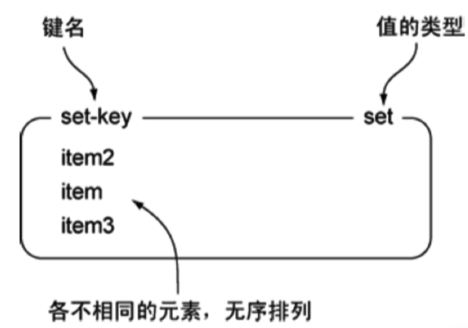

[TOC]

# Redis 数据类型

## 基础数据类型

首先对 redis 来说，所有的 key（键）都是字符串。我们在谈基础数据结构时，讨论的是**存储值的数据类型**，主要包括常见的 5 种数据类型，分别是：String、List、Set、Zset、Hash

| 结构类型                  | 结构存储的值                               | 结构的读写能力                                               |
| ------------------------- | ------------------------------------------ | ------------------------------------------------------------ |
| String 字符串             | 可以是字符串、整数或浮点数                 | 对整个字符串或字符串的一部分进行操作；对整数或浮点数进行自增或自减操作； |
| List 列表                 | 一个链表，链表上的每个节点都包含一个字符串 | 对链表的两端进行 push 和 pop 操作，读取单个或多个元素；根据值查找或删除元素； |
| Set 集合                  | 包含字符串的无序集合                       | 字符串的集合，包含基础的方法有看是否存在添加、获取、删除；还包含计算交集、并集、差集等 |
| Zset(Sorted Set) 有序集合 | 和 Hash 一样，用于存储键值对               | 字符串成员与浮点数分数之间的有序映射；元素的排列顺序由分数的大小决定；包含方法有添加、获取、删除单个元素以及根据分值范围或成员来获取元素 |
| Hash 散列                 | 包含键值对的无序散列表                     | 包含方法有添加、获取、删除单个元素                           |

著作权归https://pdai.tech所有。 链接：https://pdai.tech/md/db/nosql-redis/db-redis-data-types.html

### String 字符串

> String 是 redis 中最基本的数据类型，一个 key 对应一个 value。

String 类型是二进制安全的，意思是 redis 的 string 可以包含任何数据。如数字，字符串，jpg 图片或者序列化的对象。

- **图例**

下图是一个 String 类型的实例，其中键为 hello，值为 world。

- 实战场景
  - **缓存**：经典使用场景，把常用信息，字符串，图片或者视频等信息放到 redis 中，redis 作为缓存层，mysql 做持久化层，降低 mysql 的读写压力。
  - **计数器**：redis 是单线程模型，一个命令执行完才会执行下一个，同时数据可以一步落地到其他的数据源。
  - **session**：实现 session 共享。

### List列表

> Redis 中的 List 其实就是链表（Redis 用双端链表实现List）。

使用 List 结构，我们可以轻松地实现最新消息排队功能（比如新浪微博的 TimeLine）。List 的另一个应用就是消息队列，可以利用 List 的 PUSH 操作，将任务存放在 List 中，然后工作线程再用 POP 操作将任务取出进行执行。

- **图例**

- 实战场景
  - **微博 TimeLine**: 有人发布微博，用 lpush 加入时间轴，展示新的列表信息。
  - **消息队列**

### Set 集合

> Redis 的 Set 是 String 类型的无序集合。集合成员是唯一的，这就意味着集合中不能出现重复的数据。

Redis 中集合是通过哈希表实现的，所以添加，删除，查找的复杂度都是 O(1)。

- **图例**

- 实战场景
  - **标签**（tag）：给用户添加标签，或者用户给消息添加标签，这样有同一标签或者类似标签的可以给推荐关注的事或者关注的人。
  - **点赞，或点踩，收藏等**，可以放到 set 中实现。

### Zset(Sorted Set) 有序集合

> Redis 有序集合和集合一样也是 string 类型元素的集合,且不允许重复的成员。不同的是每个元素都会关联一个 double 类型的分数。redis 正是通过分数来为集合中的成员进行从小到大的排序。

有序集合的成员是唯一的，但分数(score)却可以重复。有序集合有两种不同数据结构实现：

1. **压缩列表（ZipList）**：ziplist 是为了提高存储效率而设计的一种特殊编码的双向链表。它可以存储字符串或者整数，存储整数时是采用整数的二进制而不是字符串形式存储。它能在 O(1) 的时间复杂度下完成 list 两端的 push 和 pop 操作。但是因为每次操作都需要重新分配 ziplist 的内存，所以实际复杂度和 ziplist 的内存使用量相关。
2. **跳跃表（ZSkipList)**：跳跃表的性能可以保证在查找，删除，添加等操作的时候在对数期望时间内完成，这个性能是可以和平衡树来相比较的，而且在实现方面比平衡树要优雅，这是采用跳跃表的主要原因。跳跃表的复杂度是 O(log(n))。

- **图例**

- 实战场景
  - **排行榜**：有序集合经典使用场景。例如小说视频等网站需要对用户上传的小说视频做排行榜，榜单可以按照用户关注数，更新时间，字数等打分，做排行。

### Hash 散列

> Redis hash 是一个 string 类型的 field（字段） 和 value（值） 的映射表，hash 特别适合用于存储对象。

- **图例**

- 实战场景
  - **缓存**： 能直观，相比 string 更节省空间。维护缓存信息，如用户信息，视频信息等。

## 特殊数据类型

### HyperLogLogs（基数统计）

> Redis 2.8.9 版本更新了 Hyperloglog 数据结构

- **什么是基数？**

举个例子，A = {1, 2, 3, 4, 5}， B = {3, 5, 6, 7, 9}；那么基数（不重复的元素）为 1, 2, 4, 6, 7, 9；（允许容错，即可以接受一定误差）

- **HyperLogLogs 基数统计用来解决什么问题**？

这个结构可以非常省内存的去统计各种计数，比如注册 IP 数、每日访问 IP 数、页面实时 UV、在线用户数，共同好友数等。

> 业务场景

一、统计 PV（Page View 页面的访问量）

直接用 redis 计数器或者直接存数据库都可以。

二、要统计一个页面 UV（Unique Visitor 独立访客），即一个用户一天内如果访问多次的话，也只能算一次。

1. 存储在 MySQL 数据库表中，使用 distinct count 计算不重复的个数。

2. 使用 Redis 的 set 来存储。把用户 ID 加入 set 集合。

但是上面的两个方案都存在两个比较大的问题：

1. 随着数据量的增加，存储数据的空间占用越来越大，对于非常大的页面的 UV 统计，基本不合实际。

2. 统计的性能比较慢，虽然可以通过异步方式统计，但是性能并不理想。

因此针对 UV 的统计，我们将会考虑使用 Redis 的新数据类型 HyperLogLog。

- **它的优势体现在哪？**

HyperLogLog 的优点在于，输入元素的数量或者体积非常大时，基数计算的存储空间是固定的。

一个大型的网站，每天 IP 比如有 100 万，粗算一个 IP 消耗 15 字节，那么 100 万个 IP 就是 15M。而 HyperLogLog 在 Redis 中每个键占用的内容都是 12K，理论存储近似接近 2^64 个值，不管存储的内容是什么，它一个基于基数估算的算法，只能比较准确的估算出基数，可以使用少量固定的内存去存储并识别集合中的唯一元素。而且这个估算的基数并不一定准确，是一个带有 0.81% 标准错误的近似值（对于可以接受一定容错的业务场景，比如 IP 数统计，UV 等，是可以忽略不计的）。

但是 HyperLogLog 只能统计基数的大小（也就是数据集的大小，集合的个数），它不能存储元素的本身，不能像 set 集合那样存储元素本身，也就是说无法返回元素。

### Bitmap（位存储）

> Bitmap 即位图数据结构，都是操作二进制位来进行记录，只有 0 和 1 两个状态。

- **用来解决什么问题**？

比如：统计用户信息，活跃，不活跃！ 登录，未登录！ 打卡，不打卡！ **两个状态的，都可以使用 Bitmaps**。

如果存储一年的打卡状态需要多少内存呢？ 365 天 = 365 bit，1 字节 = 8 bit。所以 365 / 8 = 46 个字节左右。

### geospatial（地理位置）

> Redis 的 Geo 在 Redis 3.2 版本就推出了。这个功能可以推算地理位置的信息：两地之间的距离, 方圆几里的人。

### Stream

> Redis5.0 中还增加了一个数据结构 Stream，从字面上看是流类型，但其实从功能上看，应该是 Redis 对消息队列（MQ，Message Queue）的完善实现

基于 Reids 的消息队列实现有很多种，例如：

- PUB/SUB，订阅/发布模式
  - 但是发布订阅模式是无法持久化的，如果出现网络断开、Redis 宕机等，消息就会被丢弃；
- 基于 List LPUSH+BRPOP 或者基于 Sorted-Set 的实现
  - 支持了持久化，但是不支持多播，分组消费等

#### Stream 的结构

每个 Stream 都有唯一的名称，它就是 Redis 的 key，在我们首次使用 `xadd` 指令追加消息时自动创建。

上图解析：

- `Consumer Group` ：消费组，使用 `XGROUP CREATE` 命令创建，一个消费组有多个消费者(Consumer)，这些消费者之间是竞争关系。
- `last_delivered_id` ：游标，每个消费组会有个游标 last_delivered_id，任意一个消费者读取了消息都会使游标 last_delivered_id 往后移动。
- `pending_ids` ：消费者(Consumer)的状态变量，作用是维护消费者的未确认的 id。 pending_ids 记录了当前已经被客户端读取的消息，但是还没有 `ack` (Acknowledge character：确认字符）。如果客户端没有 ack，这个变量里面的消息 ID 会越来越多，一旦某个消息被 ack，它就开始减少。这个 pending_ids 变量在 Redis 官方被称之为 PEL，也就是 Pending Entries List，这是一个很核心的数据结构，它用来确保客户端至少消费了消息一次，而不会在网络传输的中途丢失了没处理。

此外我们还需要理解两点：

- `消息ID`: 消息 ID 的形式是 `timestampInMillis-sequence`，例如 1527846880572-5，它表示当前的消息在毫秒时间戳 1527846880572 时产生，并且是该毫秒内产生的第 5 条消息。消息 ID 可以由服务器自动生成，也可以由客户端自己指定，但是形式必须是【整数-整数】，而且必须是后面加入的消息的 ID 要大于前面的消息ID。
- `消息内容`: 消息内容就是键值对，形如 hash 结构的键值对，这没什么特别之处。

## 参考链接

- https://pdai.tech/md/db/nosql-redis/db-redis-data-types.html

- http://ddrv.cn/a/260579
- https://www.cnblogs.com/haoprogrammer/p/11065461.html
- https://www.pianshen.com/article/6479421770/
- https://www.runoob.com/redis/redis-sorted-sets.html