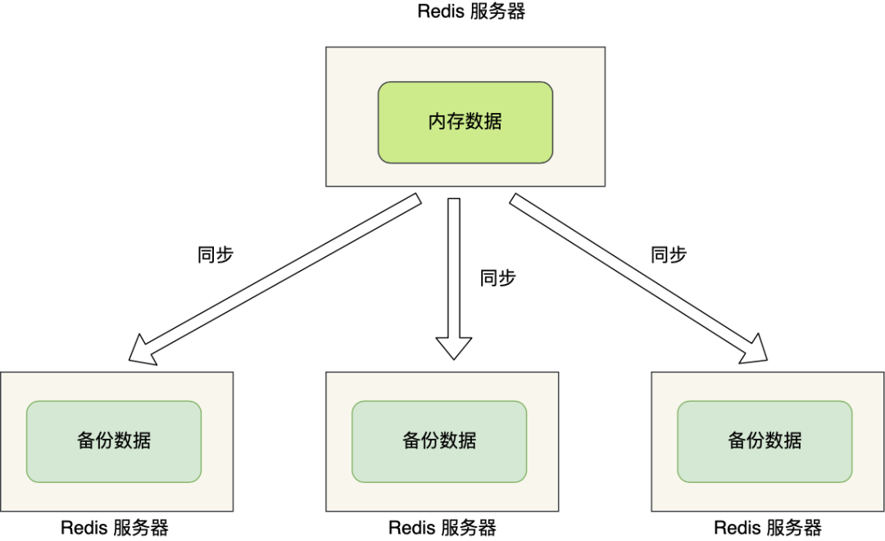
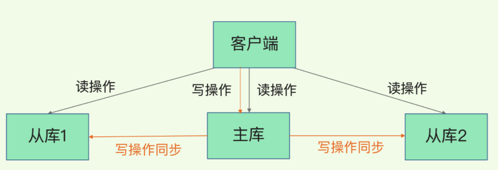
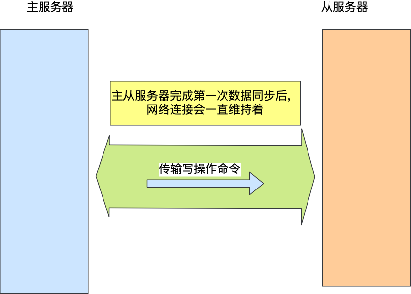
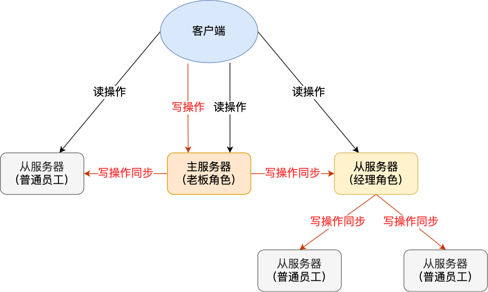

[TOC]

# Redis 高可用 - 主从复制

> 背景

由于数据都是存储在一台服务器上，如果出事就完了，比如：

- 如果服务器发生了宕机，由于数据恢复是需要点时间，那么这个期间是无法服务新的请求的；
- 如果这台服务器的硬盘出现了故障，可能数据就都丢失了。

要避免这种单点故障，最好的办法是将数据备份到其他服务器上，让这些服务器也可以对外提供服务，这样即使有一台服务器出现了故障，其他服务器依然可以继续提供服务。


多台服务器要保存同一份数据，这里问题就来了。这些服务器之间的数据如何保持一致性呢？数据的读写操作是否每台服务器都可以处理？

Redis 提供了主从复制模式，来避免上述的问题。

这个模式可以保证多台服务器的数据一致性，且主从服务器之间采用的是「读写分离」的方式。

主服务器可以进行读写操作，当发生写操作时自动将写操作同步给从服务器，而从服务器一般是只读，并接受主服务器同步过来写操作命令，然后执行这条命令。



也就是说，所有的数据修改只在主服务器上进行，然后将最新的数据同步给从服务器，这样就使得主从服务器的数据是一致的。

## 主从复制原理

> 注意：在 2.8 版本之前只有全量复制，而 2.8 版本后有全量和增量复制：

- `全量（同步）复制`：比如第一次同步时
- `增量（同步）复制`：只会把主从库网络断连期间主库收到的命令，同步给从库。

### 全量复制

> 当我们启动多个 Redis 实例的时候，它们相互之间就可以通过 replicaof（Redis 5.0 之前使用 slaveof）命令形成主库和从库的关系，之后会按照三个阶段完成数据的第一次同步。

- **确立主从关系**

例如，现在有实例 1（ip：172.16.19.3）和实例 2（ip：172.16.19.5），我们在实例 2 上执行以下这个命令后，实例 2 就变成了实例 1 的从库，并从实例 1 上复制数据：

```bash
replicaof 172.16.19.3 6379  
```

- **全量复制的三个阶段**

主从服务器间的第一次同步的过程可分为三个阶段：

- 第一阶段是建立链接、协商同步；
- 第二阶段是主服务器同步数据给从服务器；
- 第三阶段是主服务器发送新写操作命令给从服务器。


**第一阶段是主从库间建立连接、协商同步的过程**，主要是为全量复制做准备。在这一步，从库和主库建立起连接，并告诉主库即将进行同步，主库确认回复后，主从库间就可以开始同步了。

具体来说，从库给主库发送 `psync` 命令，表示要进行数据同步，主库根据这个命令的参数来启动复制。`psync` 命令包含了主库的 `runID` 和复制进度 `offset` 两个参数。`runID` 是每个 Redis 实例启动时都会自动生成的一个随机 ID，用来唯一标记这个实例。当从库和主库第一次复制时，因为不知道主库的 runID，所以将 runID 设为“？”。`offset` 表示复制进度，此时设为 -1，表示第一次复制。

主库收到 `psync` 命令后，会用 `FULLRESYNC` 响应命令带上两个参数：主库 `runID` 和主库目前的复制进度 `offset`，返回给从库。从库收到响应后，会记录下这两个参数。这里有个地方需要注意，`FULLRESYNC` 响应表示第一次复制采用的全量复制，也就是说，主库会把当前所有的数据都复制给从库。

**第二阶段，主库将所有数据同步给从库**。从库收到数据后，在本地完成数据加载。这个过程依赖于内存快照生成的 RDB 文件。

具体来说，主库执行 `bgsave` 命令，生成 RDB 文件，接着将文件发给从库。从库接收到 RDB 文件后，会先清空当前数据库，然后加载 RDB 文件。这是因为从库在通过 replicaof 命令开始和主库同步前，可能保存了其他数据。为了避免之前数据的影响，从库需要先把当前数据库清空。在主库将数据同步给从库的过程中，主库不会被阻塞，仍然可以正常接收请求。否则，Redis 的服务就被中断了。但是，这些请求中的写操作并没有记录到刚刚生成的 RDB 文件中。为了保证主从库的数据一致性，主库会在内存中用专门的 replication buffer，记录 RDB 文件生成后收到的所有写操作。

**第三个阶段，主库会把第二阶段执行过程中新收到的写命令，再发送给从库**。具体的操作是，当主库完成 RDB 文件发送后，就会把此时 replication buffer 中的修改操作发给从库，从库再重新执行这些操作。这样一来，主从库就实现同步了。

#### 命令传播

主从服务器在完成第一次同步后，双方之间就会维护一个 TCP 连接。



后续主服务器可以通过这个连接继续将写操作命令传播给从服务器，然后从服务器执行该命令，使得与主服务器的数据库状态相同。

而且这个连接是长连接的，目的是避免频繁的 TCP 连接和断开带来的性能开销。

上面的这个过程被称为基于长连接的命令传播，通过这种方式来保证第一次同步后的主从服务器的数据一致性。

#### 分摊主服务器的压力

在前面的分析中，我们可以知道主从服务器在第一次数据同步的过程中，主服务器会做两件耗时的操作：生成 RDB 文件和传输 RDB 文件。

主服务器是可以有多个从服务器的，如果从服务器数量非常多，而且都与主服务器进行全量同步的话，就会带来两个问题：

由于是通过 `bgsave` 命令来生成 RDB 文件的，那么主服务器就会忙于使用 `fork` 创建子进程，如果主服务器的内存数据非大，在执行 `fork` 函数时是会阻塞主线程的，从而使得 Redis 无法正常处理请求；

传输 RDB 文件会占用主服务器的网络带宽，会对主服务器响应命令请求产生影响。

这种情况就好像，刚创业的公司，由于人不多，所以员工都归老板一个人管，但是随着公司的发展，人员的扩充，老板慢慢就无法承担全部员工的管理工作了。要解决这个问题，老板就需要设立经理职位，由经理管理多名普通员工，然后老板只需要管理经理就好。

Redis 也是一样的，从服务器可以有自己的从服务器，我们可以把拥有从服务器的从服务器当作经理角色，它不仅可以接收主服务器的同步数据，自己也可以同时作为主服务器的形式将数据同步给从服务器，组织形式如下图：



通过这种方式，主服务器生成 RDB 和传输 RDB 的压力可以分摊到充当经理角色的从服务器。

那具体怎么做到的呢？

其实很简单，我们在「从服务器」上执行下面这条命令，使其作为目标服务器的从服务器：

```bash
replicaof <目标服务器的 IP> 6379
```


此时如果目标服务器本身也是「从服务器」，那么该目标服务器就会成为「经理」的角色，不仅可以接受主服务器同步的数据，也会把数据同步给自己旗下的从服务器，从而减轻主服务器的负担。

### 增量复制

> 在 Redis 2.8 版本引入了增量复制。

- **为什么会设计增量复制**？

如果主从库在命令传播时出现了网络闪断，为了保持主从数据一致，那么从库就会和主库重新进行一次全量复制，开销非常大。从 Redis 2.8 开始，网络断了之后，主从库会采用增量复制的方式继续同步。

- **增量复制的流程**

主要有三个步骤：

1. 从服务器在恢复网络后，会发送 `psync` 命令给主服务器，此时的 `psync` 命令里的 `offset` 参数不是 -1；
2. 主服务器收到该命令后，然后用 `CONTINUE` 响应命令告诉从服务器接下来采用增量复制的方式同步数据；
3. 然后主服务将主从服务器断线期间，所执行的写命令发送给从服务器，然后从服务器执行这些命令。


那么关键的问题来了，主服务器怎么知道要将哪些增量数据发送给从服务器呢？

答案藏在这两个东西里：

1. `repl_backlog_buffer`，是一个「环形」缓冲区，用于主从服务器断连后，从中找到差异的数据；
2. `replication offset`，**标记上面那个缓冲区的同步进度**，主从服务器都有各自的偏移量，主服务器使用 `master_repl_offset` 来记录自己「写」到的位置，从服务器使用 `slave_repl_offset` 来记录自己「读」到的位置。

那 `repl_backlog_buffer` 缓冲区是什么时候写入的呢？

**在主服务器进行命令传播时**，不仅会将写命令发送给从服务器，还会将写命令写入到 `repl_backlog_buffer` 缓冲区里，因此 这个缓冲区里会保存着最近传播的写命令。

网络断开后，当从服务器重新连上主服务器时，从服务器会通过 `psync` 命令将自己的复制偏移量 `slave_repl_offset` 发送给主服务器，主服务器根据自己的 `master_repl_offset` 和 `slave_repl_offset` 之间的差距，然后来决定对从服务器执行哪种同步操作：

1. 如果判断出从服务器要读取的数据还在 `repl_backlog_buffer` 缓冲区里，那么主服务器将采用增量同步的方式；
2. 相反，如果判断出从服务器要读取的数据已经不存在 `repl_backlog_buffer` 缓冲区里，那么主服务器将采用全量同步的方式。

当主服务器在 `repl_backlog_buffer` 中找到主从服务器差异（增量）的数据后，就会将增量的数据写入到 `replication buffer` 缓冲区，这个缓冲区我们前面也提到过，它是缓存将要传播给从服务器的命令。

#### repl_backlog_buffer 补充

`repl_backlog_buffer` 缓行缓冲区的默认大小是 1M，并且由于它是一个环形缓冲区，所以当缓冲区写满后，主服务器继续写入的话，就会覆盖之前的数据。

因此，当主服务器的写入速度远超于从服务器的读取速度，缓冲区的数据一下就会被覆盖。

那么在网络恢复时，如果从服务器想读的数据已经被覆盖了，主服务器就会采用全量同步，这个方式比增量同步的性能损耗要大很多。

因此，为了避免在网络恢复时，主服务器频繁地使用全量同步的方式，我们应该调整下 `repl_backlog_buffer` 缓冲区大小，尽可能的大一些，减少出现从服务器要读取的数据被覆盖的概率，从而使得主服务器采用增量同步的方式。

#### replication buffer

Redis 和客户端通信也好，和从库通信也好，Redis 都需要给分配一个 内存 buffer 进行数据交互，客户端是一个 client，从库也是一个 client，我们每个 client 连上 Redis 后，Redis 都会分配一个 client buffer，所有数据交互都是通过这个 buffer 进行的：Redis 先把数据写到这个 buffer 中，然后再把 buffer 中的数据发到 client socket 中再通过网络发送出去，这样就完成了数据交互。所以主从在增量同步时，从库作为一个 client，也会分配一个 buffer，只不过这个 buffer 专门用来传播用户的写命令到从库，保证主从数据一致，我们通常把它叫做 replication buffer。


## 总结

主从复制共有三种模式：**全量复制、基于长连接的命令传播、增量复制**。

主从服务器第一次同步的时候，就是采用全量复制，此时主服务器会两个耗时的地方，分别是生成 RDB 文件和传输 RDB 文件。为了避免过多的从服务器和主服务器进行全量复制，可以把一部分从服务器升级为「经理角色」，让它也有自己的从服务器，通过这样可以分摊主服务器的压力。

第一次同步完成后，主从服务器都会维护着一个长连接，主服务器在接收到写操作命令后，就会通过这个连接将写命令传播给从服务器，来保证主从服务器的数据一致性。

如果遇到网络断开，增量复制就可以上场了，不过这个还跟 repl_backlog_size 这个大小有关系。如果它配置的过小，主从服务器网络恢复时，可能发生「从服务器」想读的数据已经被覆盖了，那么这时就会导致主服务器采用全量复制的方式。所以为了避免这种情况的频繁发生，要调大这个参数的值，以降低主从服务器断开后全量同步的概率。

## QA

### 当主服务器不进行持久化时复制的安全性

> 在进行主从复制设置时，强烈建议在主服务器上开启持久化，当不能这么做时，比如考虑到延迟的问题，应该将实例配置为避免自动重启。

**为什么不持久化的主服务器自动重启非常危险呢**？为了更好的理解这个问题，看下面这个失败的例子，其中主服务器和从服务器中数据库都被删除了。

- 我们设置节点 A 为主服务器，关闭持久化，节点 B 和 C 从节点 A 复制数据。
- 这时出现了一个崩溃，但 Redis 具有自动重启系统，重启了进程，因为关闭了持久化，节点重启后只有一个空的数据集。
- 节点 B 和 C 从节点 A 进行复制，现在节点 A 是空的，所以节点 B 和 C 上的复制数据也会被删除。
- 当在高可用系统中使用 Redis Sentinel，关闭了主服务器的持久化，并且允许自动重启，这种情况是很危险的。比如主服务器可能在很短的时间就完成了重启，以至于 Sentinel 都无法检测到这次失败，那么上面说的这种失败的情况就发生了。

如果数据比较重要，并且在使用主从复制时关闭了主服务器持久化功能的场景中，都应该禁止实例自动重启。

### 为什么主从全量复制使用 RDB 而不使用 AOF？

1、RDB 文件内容是经过压缩的二进制数据（不同数据类型数据做了针对性优化），文件很小。而 AOF 文件记录的是每一次写操作的命令，写操作越多文件会变得很大，其中还包括很多对同一个 key 的多次冗余操作。在主从全量数据同步时，传输 RDB 文件可以尽量降低对主库机器网络带宽的消耗，从库在加载 RDB 文件时，一是文件小，读取整个文件的速度会很快，二是因为 RDB 文件存储的都是二进制数据，从库直接按照 RDB 协议解析还原数据即可，速度会非常快，而 AOF 需要依次重放每个写命令，这个过程会经历冗长的处理逻辑，恢复速度相比 RDB 会慢得多，所以使用 RDB 进行主从全量复制的成本最低。

2、假设要使用 AOF 做全量复制，意味着必须打开 AOF 功能，打开 AOF 就要选择文件刷盘的策略，选择不当会严重影响 Redis 性能。而 RDB 只有在需要定时备份和主从全量复制数据时才会触发生成一次快照。而在很多丢失数据不敏感的业务场景，其实是不需要开启 AOF 的。

### 为什么还有无磁盘复制模式？

Redis 默认是磁盘复制，但是**如果使用比较低速的磁盘，这种操作会给主服务器带来较大的压力**。Redis 从 2.8.18 版本开始尝试支持无磁盘的复制。使用这种设置时，子进程直接将 RDB 通过网络发送给从服务器，不使用磁盘作为中间存储。

**无磁盘复制模式**：master 创建一个新进程直接 dump RDB 到 slave 的 socket，不经过主进程，不经过硬盘。适用于 disk 较慢，并且网络较快的时候。

### 读写分离及其中的问题

在主从复制基础上实现的读写分离，可以实现 Redis 的读负载均衡：由主节点提供写服务，由一个或多个从节点提供读服务（多个从节点既可以提高数据冗余程度，也可以最大化读负载能力）；在读负载较大的应用场景下，可以大大提高 Redis 服务器的并发量。下面介绍在使用 Redis 读写分离时，需要注意的问题。

- **延迟与不一致问题**

前面已经讲到，由于主从复制的命令传播是异步的，延迟与数据的不一致不可避免。如果应用对数据不一致的接受程度程度较低，可能的优化措施包括：

1. 优化主从节点之间的网络环境（如在同机房部署）；
2. 监控主从节点延迟（通过offset）判断，如果从节点延迟过大，通知应用不再通过该从节点读取数据；

- **数据过期问题**

在单机版 Redis中，存在两种删除策略：

1. `惰性删除`：服务器不会主动删除数据，只有当客户端查询某个数据时，服务器判断该数据是否过期，如果过期则删除。
2. `定期删除`：服务器执行定时任务删除过期数据，但是考虑到内存和 CPU 的折中（删除会释放内存，但是频繁的删除操作对 CPU不友好），该删除的频率和执行时间都受到了限制。

在主从复制场景下，为了主从节点的数据一致性，**从节点不会主动删除数据，而是由主节点控制从节点中过期数据的删除**。由于主节点的惰性删除和定期删除策略，都不能保证主节点及时对过期数据执行删除操作，因此，当客户端通过 Redis 从节点读取数据时，很容易读取到已经过期的数据。

Redis 3.2 中，从节点在读取数据时，增加了对数据是否过期的判断：如果该数据已过期，则不返回给客户端；将 Redis 升级到 3.2 可以解决数据过期问题。

## 参考文章

- http://t.csdn.cn/eWmVV
- https://pdai.tech/md/db/nosql-redis/db-redis-x-copy.html
- https://www.cnblogs.com/kismetv/p/9236731.html
- https://time.geekbang.org/column/article/272852
- http://ifeve.com/redis-replication/

