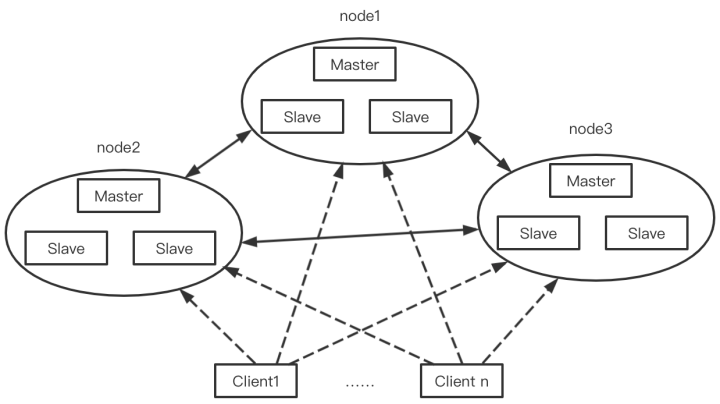

[TOC]

# Redis 高可用 - Cluster 模式

我们之前讲过 Redis 高可用的模式，主从复制，哨兵机制。但是，在某些场景下，单实例存 Redis 缓存会存在的几个问题：

（1）写并发：

Redis 单实例读写分离可以解决读操作的负载均衡，但对于写操作，仍然是全部落在了 master 节点上面，在海量数据高并发场景，一个节点写数据容易出现瓶颈，造成 master 节点的压力上升。

（2）海量数据的存储压力：

单实例 Redis 本质上只有一台 Master 作为存储，如果面对海量数据的存储，一台 Redis 的服务器就应付不过来了，而且数据量太大意味着持久化成本高，严重时可能会阻塞服务器（fork 子进程），造成服务请求成功率下降，降低服务的稳定性。

## 推荐阅读

在极客时间中这篇文章《[09 | 切片集群：数据增多了，是该加内存还是加实例？](https://time.geekbang.org/column/article/276545)》中讲明白了**切片集群在保存大量数据方面的优势，以及 Redis 切片集群基于哈希槽的数据分布机制和客户端定位键值对的方法**。

## Redis Cluster

Redis 3.0 加入了 Redis 的集群模式，**实现了数据的分布式存储，对数据进行分片，将不同的数据存储在不同的 master 节点上面**，从而解决了海量数据的存储问题。

Redis 集群采用去中心化的思想，没有中心节点的说法，对于客户端来说，整个集群可以看成一个整体，可以连接任意一个节点进行操作，就像操作单一 Redis 实例一样，不需要任何代理中间件。

如上图所示，Redis 集群可以看成多个主从架构组合起来的，每一个主从架构可以看成一个节点。其中，只有master 具有处理请求的能力（注意不是读写分离），slave 主要是用于节点的高可用（备份）。

### 高可用及故障转移

Redis Cluster 中保证集群高可用的思路和实现和 Redis Sentinel 如出一辙。

## 参考文章

- http://t.csdn.cn/LrulF

