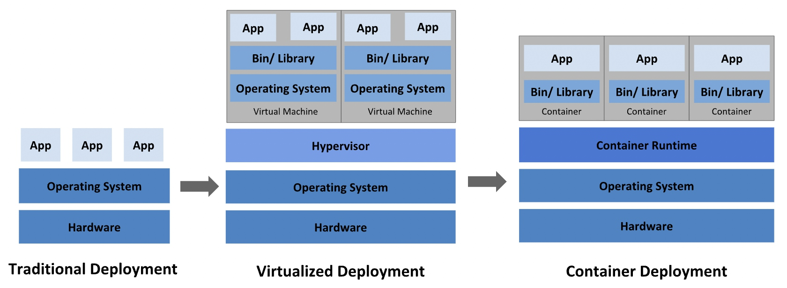

[TOC]

# 容器和 Kubernetes

## 容器



应用部署方式从传统的部署到用虚拟机，再到容器化部署。那么容器比虚拟机的优势在哪里呢？

- 容器比虚拟机更加轻量化

- 容器在操作系统级别进行虚拟化，而虚拟机在硬件级别进行虚拟化

- 容器共享操作系统内核，其占用的内存与虚拟机相比微乎其微

### 什么是容器

容器是软件的可执行单元，它采用通用方式封装了应用程序代码及其库和依赖项，可以随时随地运行容器

### 容器原理: NameSpace

Linux Namespace 提供了一种内核级别隔离系统资源的方法，通过将系统的全局资源放在不同的 Namespace 中，来实现资源隔离的目的。不同 Namespace 的程序，可以享有一份独立的系统资源。

linux 通过 clone 系统调用来创建一个独立 Namespace 的进程。

```c
int clone(int (*fn)(void *), void *stack, int flags, void *arg, ... /* pid_t *parent_tid, void *tls, pid_t *child_tid */ );
```

### 容器镜像（容器和镜像的区别）

待补充

参考链接：https://blog.csdn.net/weixin_40475396/article/details/118407987?spm=1001.2014.3001.5502

## Kubernetes

Kubernetes(k8s) 是一个可移植的、可扩展的开源平台，用于管理容器化的工作负载和服务，可促进声明式配置和自动化。

待后续补充
