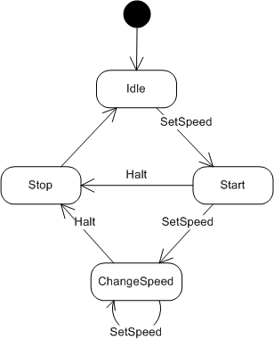

[TOC]

# 有限状态机

有限状态机，英文翻译是 Finite State Machine，缩写为 FSM，简称为状态机。状态机有 3 个组成部分：状态（State）、事件（Event）、动作（Action）。其中，事件也称为转移条件（Transition Condition）。事件触发状态的转移及动作的执行。不过，动作不是必须的，也可能只转移状态，不执行任何动作。

## 电机状态转移图

我们下面以电机的状态为例子：我们要启动和停止电机，以及改变电机的速度。

- **Motor state diagram**



### 定义事件

1. **Set Speed** – sets the motor going at a specific speed
2. **Halt** – stops the motor

### 定义状态

1. **Idle** — the motor is not spinning but is at rest
   - Do nothing
2. **Start** — starts the motor from a dead stop
   - Turn on motor power
   - Set motor speed
3. **Change Speed** — adjust the speed of an already moving motor
   - Change motor speed
4. **Stop** — stop a moving motor
   - Turn off motor power
   - Go to the Idle state

## 分支逻辑法

参照状态转移图，将每一个状态转移，原模原样地直译成代码。但这样编写的代码会包含大量的 `if-else` 或 `switch-case` 分支判断逻辑，甚至是嵌套的分支判断逻辑。

```c++
switch (currentState) {
   case ST_IDLE:
       // do something in the idle state
       break;
    case ST_STOP:
       // do something in the stop state
       break;
    // etc...
}
```

对于简单的状态机来说，分支逻辑这种实现方式是可以接受的。但是，对于复杂的状态机来说，这种实现方式极易漏写或者错写某个状态转移。除此之外，代码中充斥着大量的 `if-else` 或者 `switch-case` 分支判断逻辑，可读性和可维护性都很差。如果哪天修改了状态机中的某个状态转移，我们要在冗长的分支逻辑中找到对应的代码进行修改，很容易改错，引入 bug。

```c++
switch (currentState) {
  case ST_IDLE:
    if (SetSpeed) {
      currentState = ST_START;
    }
    break;
  case ST_START:
    if (Halt) {
      currentState = ST_STOP;
    } else if (SetSpeed) {
      currentState = ST_CHANGE_SPEED;
    }
    break;
  case ST_CHANGE_SPEED:
    if (SetSpeed) {
      currentState = ST_CHANGE_SPEED;
    } else if (Halt) {
      currentState = ST_STOP;
    }
    break;
  case ST_STOP:
    break;
}
```

## 查表法

分支逻辑法有点类似 hard code，对于复杂的状态机来说不适用。

实际上，除了用状态转移图来表示之外，状态机还可以用二维表来表示，如下所示。在这个二维表中，**第一维表示当前状态，第二维表示事件，值表示当前状态经过事件之后，转移到的新状态及其执行的动作**。

> 表中的斜杠表示不存在这种状态转移

|                 | SetSpeed        | Halt    |
| --------------- | --------------- | ------- |
| ST_IDLE         | ST_START        | /       |
| ST_START        | ST_CHANGE_SPEED | ST_STOP |
| ST_CHANGE_SPEED | ST_CHANGE_SPEED | ST_STOP |
| ST_STOP         | /               | /       |

相对于分支逻辑的实现方式，查表法的代码实现更加清晰，可读性和可维护性更好。当修改状态机时，我们只需要修改 `TransitionTable` 二维数组即可。实际上，如果我们把这个二维数组存储在配置文件中，当需要修改状态机时，我们甚至可以不修改任何代码，只需要修改配置文件就可以了。具体的代码如下所示：

```c++
const std::vector<std::vector<State>> TransitionTable = {
  // SetSpeed       Halt
  {ST_START,        ST_IDLE},  // ST_IDLE
  {ST_CHANGE_SPEED, ST_STOP},  // ST_START
  {ST_CHANGE_SPEED, ST_STOP},  // ST_CHANGE_SPEED
  {ST_STOP,         ST_STOP},  // ST_STOP
};

current_state = TransitionTable[current_state][event];
```

基于查表法原理，实现了一个简单的有限状态机类：https://github.com/Yuu177/fsm

## 状态模式

在查表法的代码实现中，事件触发的动作一般都是非常简单。但是，如果要执行的动作并非这么简单，而是一系列复杂的逻辑操作（比如加减积分、写数据库，还有可能发送消息通知等等），这个时候，查表法就没那么好用了。

状态模式通过将事件触发的状态转移和动作执行，拆分到不同的状态类中，来避免分支判断逻辑。

// TODO 设计模式之状态模式（State Pattern）

## 总结

三种实现状态机的方式：

- 第一种实现方式叫**分支逻辑法**。利用 `if-else` 或者 `switch-case` 分支逻辑，参照状态转移图，将每一个状态转移原模原样地直译成代码。对于简单的状态机来说，这种实现方式最简单、最直接，是首选。
- 第二种实现方式叫**查表法**。对于状态很多、状态转移比较复杂的状态机来说，查表法比较合适。通过二维数组来表示状态转移图，能极大地提高代码的可读性和可维护性。
- 第三种实现方式叫**状态模式**。对于状态并不多、状态转移也比较简单，但事件触发执行的动作包含的业务逻辑可能比较复杂的状态机来说，我们首选这种实现方式。

## 开源仓库

- [boost::sml](https://github.com/boost-ext/sml)

## 参考文章

- [64 | 状态模式：游戏、工作流引擎中常用的状态机是如何实现的？](https://time.geekbang.org/column/article/218375)
- [State Machine Design in C++](https://github.com/endurodave/StateMachine)