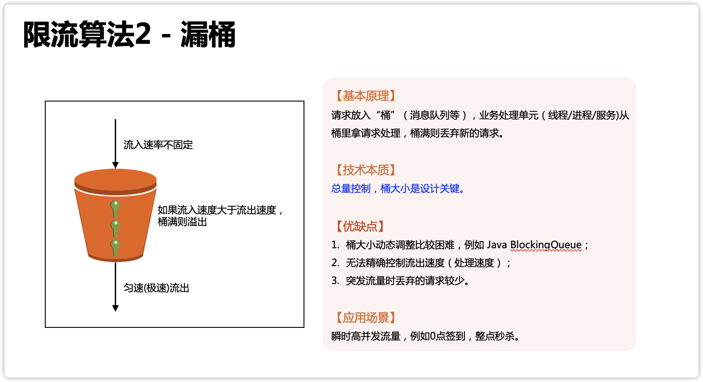
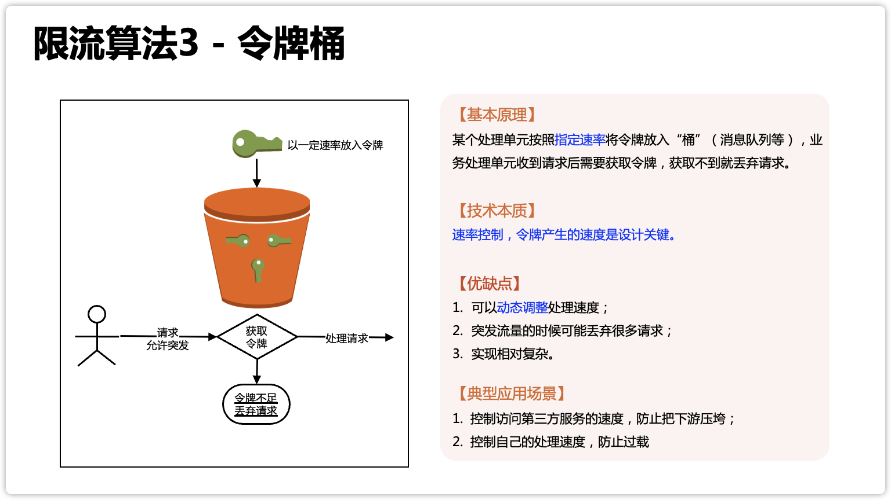

[TOC]

# 漏桶和令牌桶

在开发高并发系统时有三把利器用来保护系统：**缓存、降级和限流**

**缓存**：缓存的目的是提升系统访问速度和增大系统处理容量
**降级**：降级是当服务器压力剧增的情况下，根据当前业务情况及流量对一些服务和页面有策略的降级，以此释放服务器资源以保证核心任务的正常运行
**限流**：限流的目的是通过对并发访问/请求进行限速，或者对一个时间窗口内的请求进行限速来保护系统，一旦达到限制速率则可以拒绝服务、排队或等待、降级等处理

## 漏桶

## 令牌桶

## 区别

漏桶算法和令牌桶算法本质上都是为了做流量整形（Traffic Shaping）或速率限制（Rate Limiting），避免系统因为大流量而被打崩，但两者核心差异在于限流的方向是相反的。

- 令牌桶限制的是流量的平均流入速率，并且允许一定程度的突然性流量，最大速率为桶的容量和生成 token 的速率。

- 漏桶限制的是流量的流出速率，是相对固定的。

**漏桶的本质是总量控制，令牌桶的本质是速率控制**。

漏桶和令牌桶都有保护作用，但漏桶的保护是尽量缓存请求（缓存不下才丢），令牌桶的保护主要是丢弃请求（即使系统还能处理，只要超过指定的速率就丢弃，除非此时动态提高速率）。

### 对应的业务场景

> 看到网上有不同的说法

**令牌桶更适合突发流量**

令牌桶的算法原本是用于网络设备控制传输速度的，而且它控制的目的是保证**一段时间内的平均速率控制**，之所以说令牌桶适合突发流量，是指在网络传输的时候，可以**允许某段时间内（一般就几秒）超过平均传输速率（而漏桶的流出速率是不变的）**，这在网络环境下常见的情况就是『网络抖动』，但这个短时间的突发流量是不会导致雪崩效应，网络设备也能够处理得过来。对应到令牌桶应用到业务处理的场景，就要求即使有突发流量来了，系统自己或者下游系统要真的能够处理的过来，否则令牌桶允许突发流量进来，结果系统或者下游处理不了，那还是会被压垮。

**漏桶更适合瞬时高并发**

秒杀、抢购、整点打卡签到、微博热点事件这种业务高并发场景，它不是由于『XX 抖动』引起的，而是由业务场景引起的，并且持续的事件可能是几分钟甚至几十分钟，这种业务场景为了用户体验和业务尽量少受损，优先采取的不是丢弃大量请求，而是缓存请求，避免系统出现雪崩效应。

所以如果在秒杀、抢购、整点打卡签到、微博热点事件这些业务场景用令牌桶的话，会出现大量用户访问出错，因为请求被直接丢弃了；而用漏桶的话，处理可能只是会慢一些，用户体验会更好一些。

## 参考链接

- [漏桶算法和令牌桶算法，区别到底在哪里？](https://xie.infoq.cn/article/4a0acdd12a0f6dd4a53e0472c)
- [带你快速了解：限流中的漏桶和令牌桶算法](https://segmentfault.com/a/1190000037506482)