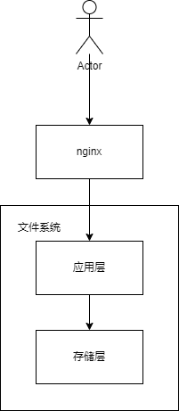
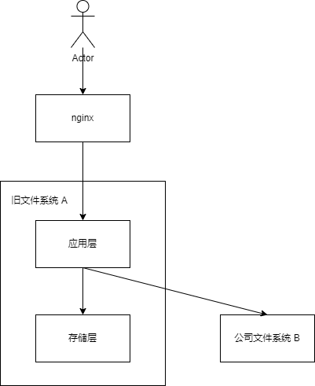
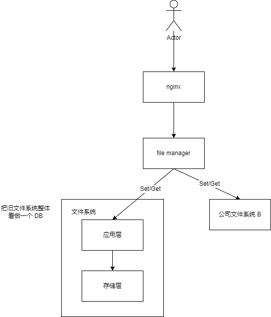
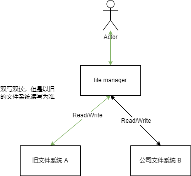
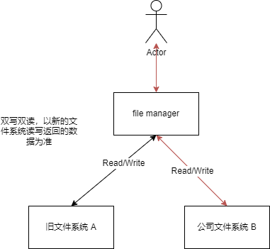

[TOC]

# 文件系统迁移项目

## 背景

公司旧文件系统 A 存储层需要我们后台自己维护，对于日益增长的用户量，我们决定将存储层迁移到公司级别的文件系统 B。这样子我们后台只需要专注于业务的代码开发和维护，迁移后系统的稳定性和可用性将会大大提高。

## 如何迁移

下面我将介绍一下在线如何对数据进行迁移，以及迁移中需要注意的事项和问题。

因为作为公司的通讯软件，停服迁移的代价比较大，为了不影响用户的体验，我们将按步骤有序地进行迁移。

### 确定新系统架构

- 旧架构



- 迁移架构，方案一



复用原来服务的应用层，在应用层下接入新的存储系统。

优点：架构简单，易理解，且现有的链路已经打通，只需要打通和新的存储链路即可。

缺点：旧服务已经运行较为稳定，而且代码历史原因结构混乱，代码耦合严重，引入新的存储需要修改的代码比较多，风险较大。

- 方案二

把应用层独立成一个新的服务。在新的服务下去接入新的存储系统。



优点：应用和存储解耦，新代码可以抛弃历史包袱，可读性可维护性更高，可以更方便做新功能的扩展。

缺点：需要搭建新的服务，新服务需要适配客户端和文件系统服务器接口，一条全新的链路，需要大量人力去调试。

- 迁移完架构图


### 灰度

因为新的存储系统我们是未知的，所以全部流量一下子放开双写双读可能会影响到新的存储系统，所以我们要去做灰度慢慢放开双写双读，减少万一出问题对线上的影响。

我们按照白名单去灰度（组内人员等），按照业务维度用户百分比去灰度（业务：比如单聊图片，群聊图片，单聊文件，群聊文件，头像等）。

通过业务代码和修改配置中心配置实现。

```c++
oldDB.DoHandle();
if (满足灰度条件)
{
	newDB.DoHandle();
}
```

### 双写双读

迁移开始需要先双写。我们需要把新增的数据写入新和旧数据库。之后再把旧的数据库的旧数据同步到新数据库。



- 双写双读的返回值以哪个数据库为准？

开启双写双读后我们还是需要默认返回旧数据库读写返回。

- 双写失败怎么办？

记录失败日志和上报监控

- 双读失败怎么办？

新的数据库读取不到数据，旧的数据可读取到数据，记录日志和上报监控。

- 两边的数据库读取的数据内容可能不一致，如何解决？

我们把读取到的内容再进行 MD5 比较。如果 MD5 相同，我们上报 same（说明新旧数据库读取到的内容一样），否则上报 MD5-no-same。记录日志等待后续决定是否手动进行补偿。

> 每个文件对应的 md5 值是固定的，文件内容发生变化时，md5 值也会发生变化。文件内容相同时，md5 值相同。所以，md5 值可以作为文件的唯一标识符

### 切换读写返回值

一开始我们以旧数据库的读写返回为准，切换后就是使用后新的数据库读写返回。

到这里我们还要再细分一下数据类型：永久数据和非永久数据（14 天过期）。

对于非永久数据，我们双写双读 14 天后，旧的存储系统的存量数据就会过期自动删除，那么剩下的数据理论上来说就和新的存储系统的数据一致了。

对于永久数据，我们额外开发了一个工具来做存量数据的迁移。

```c++
keys = oldDB.SelectAll();
for (auto key : keys)
{
	data = oldDB.Read(key);
	if (!newDB.Exist(key));
	{
		newDB.Write(data);
	}
}
```

那什么时候去切呢？如何确定两边的数据库的数据基本一致？

因为我们之前每次双写双读都会上报监控，所以我们可以通过监控去观察。当请求的读和写都为成功后，我们就可以确定两边的数据一致了。这个时候我们就可以切换使用新文件系统的返回值（按业务用户百分比，白名单来灰度）。



### 停读停写

当永久数据和非永久数据迁移完毕后，我们逐步停止对旧文件系统的读和写，至此，文件存储系统完全迁移了过来。

