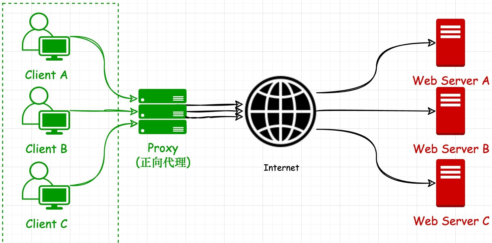
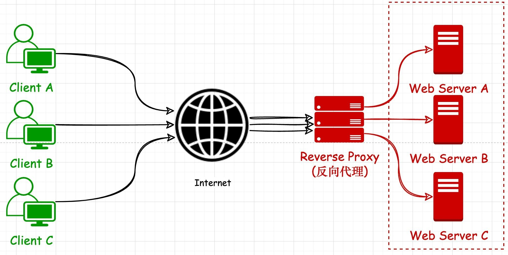
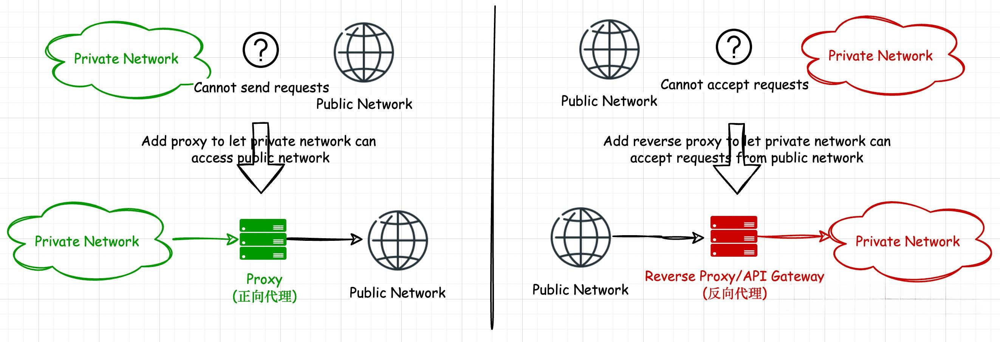

[TOC]

# HTTP 代理

`HTTP` 代理（HTTP Proxy）是一种位于客户端和服务器之间的网络服务器，它充当客户端和服务器之间的中介，用于转发 `HTTP` 请求和响应。

1. **正向代理（Forward Proxy）：** 正向代理位于客户端和服务器之间，充当客户端的代理。客户端通过正向代理发送请求，然后代理服务器将请求转发给目标服务器，并将响应返回给客户端。正向代理通常用于隐藏客户端的真实 `IP` 地址、绕过访问限制或访问内容过滤等目的。
2. **反向代理（Reverse Proxy）：** 反向代理位于服务器端，充当服务器的代理。客户端发送请求到反向代理，然后代理服务器将请求转发给一个或多个后端服务器，并将后端服务器的响应返回给客户端。反向代理通常用于负载均衡、提供安全性、加速内容传递等目的。

## HTTP 介绍

[HTTP 基本概念](https://www.xiaolincoding.com/network/2_http/http_interview.html#http-是什么)

## curl 工具

`curl` 是常用的命令行工具，用来请求 Web 服务器。它的名字就是客户端（client）的 URL 工具的意思。

`curl` 的用法指南：https://www.ruanyifeng.com/blog/2019/09/curl-reference.html

> `-x` 参数指定 HTTP 请求的代理：`curl -x http://localhost:8080 https://www.example.com`

## 正向代理



### HTTP

因为 `HTTP` 是明文传输，要访问哪个站点地址是可以直接获取到的，所以处理起来就比较容易。

1. 接收到 `HTTP` 请求后，创建一个新的请求，将原始请求的信息复制到新请求中，发送新请求到目标服务器。
2. 复制目标服务器的响应给客户端。

所以代理服务有机会对客户端与目标服务器之间的通信数据进行窥探，而且有机会对数据进行串改，这也是 `HTTP` 协议明文传输带来的安全问题。

```bash
curl -v -x http://localhost:8080 http://www.bing.com
* Uses proxy env variable no_proxy == 'localhost,127.0.0.0/8,::1'
*   Trying 127.0.0.1:8080...
* TCP_NODELAY set
* Connected to localhost (127.0.0.1) port 8080 (#0)
> GET http://www.bing.com/ HTTP/1.1
> Host: www.bing.com
> User-Agent: curl/7.68.0
> Accept: */*
> Proxy-Connection: Keep-Alive
>
```

### HTTPS

客户端与服务器之间的 `HTTPS` 通信都是加密的。然而当客户端需要通过代理服务器发起 `HTTPS` 请求时，由于请求的站点地址和端口号都是加密保存于 `HTTPS` 请求头中的，代理服务器是如何既确保通信是加密的（代理服务器自身也无法读取通信内容）又知道该往哪里发送请求呢？

1. 为了解决这个问题，客户端需要先通过明文 `HTTP` 形式向代理服务器发送一个 `CONNECT` 请求告诉它目标站点地址及端口号。
2. 当代理服务器收到这个请求后，会在对应的端口上与目标站点建立一个 `TCP` 连接，连接建立成功后返回一个 `HTTP 200` 状态码告诉客户端与该站点的加密通道已建成。
3. 接下来代理服务器仅仅是来回传输客户端与该服务器之间的加密数据包，代理服务器并不需要解析这些内容以保证 `HTTPS` 的安全性。

```bash
curl -v -x http://localhost:8080 https://www.bing.com
* Uses proxy env variable no_proxy == 'localhost,127.0.0.0/8,::1'
*   Trying 127.0.0.1:8080...
* TCP_NODELAY set
* Connected to localhost (127.0.0.1) port 8080 (#0)
* allocate connect buffer!
* Establish HTTP proxy tunnel to www.bing.com:443
> CONNECT www.bing.com:443 HTTP/1.1
> Host: www.bing.com:443
> User-Agent: curl/7.68.0
> Proxy-Connection: Keep-Alive
>
```

## 代码实现

> 为什么选择 go？因为 go 相比与 C++ 来说，代码实现上会非常简单

- **简单代码示例**：https://github.com/Yuu177/goproxy

- **开源的第三方库**：https://github.com/elazarl/goproxy

## 反向代理



// TODO

## 总结

在网络架构的工程实践上，如果一个私有网络想要访问其他网络的资源，那么一般需要给私有网络加上一个正向代理（Proxy）。如果一个私有网络想要被其他网络访问，那么一般需要给私有网络加上一个反向代理（Reverse Proxy）或者 API Gateway（本身也可以算作一种 Reverse Proxy）。



## 参考

- [反向代理为何叫反向代理？ - Mingqi 的回答 - 知乎](https://www.zhihu.com/question/24723688/answer/2771833737)
- [理解 HTTP CONNECT 通道](https://joji.me/zh-cn/blog/the-http-connect-tunnel/)

