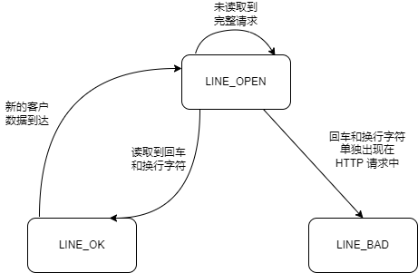
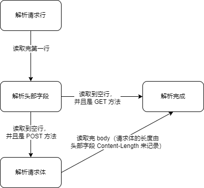

[TOC]

# HTTP Server

从 0 开始写一个 Linux HTTP Server。

## 创建 socket 接受客户端请求

1. 创建一个 IPV4 的 TCP 的 socket。

2. bind 地址（ip 地址和端口号）到这个 socket 上。
3. Listen socket。创建一个监听队列以存放处理的客户连接。
4. 接受连接。调用 accept 从 listen 监听队列中接受一个连接。
5. 调用 recv 读取 socket。接收客户端的数据，存入缓冲区中 buffer 中。

## HTTP 报文格式

HTTP 请求格式由三部分组成：1、请求行。2、头部字段。3、正文（body）

HTTP 报文一行以 `\r\n`（一对回车换行符号） 为结束。例如下面 HTTP 报文的 `\r\n` 表示回车换行符号。

```http
POST http://xiaobao.com/index HTTP/1.1\r\n
HOST: cn.good.com\r\n
User-Agent: Mozilla\r\n
Content-Length: 1024\r\n
\r\n（注释：空行）
"name":xiaobai,"age":18（注释：正文内容是不需要 \r\n 来表示结束的，是通过请求头 Content-Length:1024 来判断）
```

第一行是请求行，获取 method 信息，HTTP 版本信息，获得主机资源的具体地址（/index），判断 URL 的合法性等。

第一行之后就是头部字段。头部字段也是一行一行的，以 `\r\n` 结束，格式为 key : value。

首行和请求头，我们统称 HTTP 头部。我们判断 HTTP 头部结束的依据是遇到一个空行，该空行仅包含一对回车换行符（`\r\n`）。

如果是 GET 请求，那么我们就已经得到一个正确的 HTTP 报文了。如果是 POST 请求，我们还需要继续读取后面的正文内容。

因为 HTTP 协议规定，POST 请求，传输的数据内容在 body 里。（我们可以通过请求头的 Content-Length 和 recv 客户端返回的长度来判断 body 是否读取完整）。

## 解析 HTTP

使用一个有限状态机实现了最简单的 HTTP 请求的读取和分析。为了使表述简洁，我们约定，直接称 HTTP 请求的一行（包括请求行和头部字段）为行。

- 读取行

首先我们要读取行，读取到完整的行（LINE_OK），我们就可以解析该行，边读取边解析。



- 解析行



## 参考文章

- 《Linux 高性能服务器编程——游双》