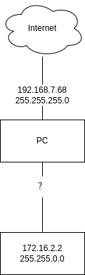
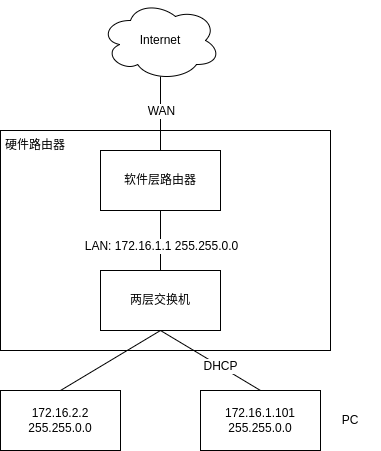
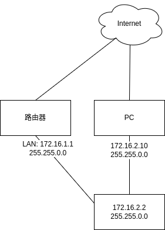

[TOC]

# IP网络配置

## 场景一

有一台 PC 和另外一台嵌入式设备（已经配置了静态 ip），通过连接网线，配置 PC 的网口，实现 SSH 登录到嵌入式设备上。



那么我们要怎么配置这个网口呢？首先我们知道，同一个网段才能够直接通信。通过嵌入式设备的 ip 和子网掩码，我们可以计算出网络号（网段）为 172.16.0.0/16。那么我们只要配置相同网段的 ip（172.16.x.x） 和子网掩码即可：

- ip：`172.16.x.x`

- 子网掩码：`255.255.0.0`

配置好后如下图：


但是经实验发现，如果我把 PC 网口的子网掩码改为 255.255.255.0，那么也是可以的。修改后的信息：

|                  | PC                        | 嵌入式设备                  |
| ---------------- | ------------------------- | --------------------------- |
| ip               | 172.16.2.10               | 172.16.2.2                  |
| 子网掩码         | 255.255.255.0             | 255.255.0.0                 |
| 网络号           | 172.16.2.0                | 172.16.0.0                  |
| 广播地址         | 172.16.2.255              | 172.16.255.255              |
| **可用地址范围** | 172.16.2.1 ~ 172.16.2.254 | 172.16.0.1 ~ 172.16.255.254 |

我们可以看到，修改了子网掩码后，PC 和嵌入式设备的网络号不一样。不是说同一网段的 ip 地址才能互相直接通讯吗？

答：掩码 24 的 172.16.2.100 认为 172.16.2.2 跟它在同一 LAN（查看上表：可用地址范围），后者配置的掩码是多少它并不关心，所以首次通讯之前会正常发起 ARP 获得后者的 MAC 地址。同理，掩码为 16 的 172.16.2.2 也会认为发起 ARP 请求的 172.16.2.100 的是合法的来源 IP，它也并不关心后者的掩码是多少。简而言之，掩码只是让本端知晓 LAN 的规模，不干涉对端的掩码大小。

### ARP 请求

ARP（Address Resolution Protocol）即地址解析协议， 用于实现从 IP 地址到 MAC 地址的映射，即询问目标 IP 对应的 MAC 地址。


- 主机会通过**广播发送 ARP 请求**，这个包中包含了想要知道的 MAC 地址的主机 IP 地址。
- 当同个链路中的所有设备收到 ARP 请求时，会去拆开 ARP 请求包里的内容，如果 ARP 请求包中的目标 IP 地址与自己的 IP 地址一致，那么这个设备就将自己的 MAC 地址塞入 **ARP 响应包**返回给主机。

广播地址用于在**同一个链路中相互连接（确定网络号后可用的地址范围）的主机之间发送数据包**。

## 场景二

嵌入式设备想要接入互联网，要如何做？

场景一的方法我们直连 PC，嵌入式设备是无法连接上网的（好像设置网桥等配置，比较麻烦）。最简单的方法就是弄多一台路由器。



我们只需要把路由的 LAN 口配置为和嵌入式设备同一网段即可。

- 路由器 LAN 口 ip：`172.16.1.1`（配置范围 172.16.0.1 ~ 172.16.255.254）
- 子网掩码：`255.255.0.0`

PC 通过 DHCP 服务自动配置 ip，不需要我们操作。

然后在嵌入式设备输入如下命令，设置嵌入式设备的默认路由网关为路由器的 ip。

```bash
route add defalut 172.16.1.1
```

这条命令作用：添加默认路由，指定网关为 172.16.1.1。

默认路由是当主机需要访问目的地地址时，如果在主机路由表中没有匹配的路由，则会将数据包发送到默认网关，让默认网关负责转发数据包到正确的目标地址。

所以说访问外网会经过默认网关到 Internet。如果 PC 和嵌入式设备互相访问，则不需要经过网关，而是通过两层交换机即可。

如果要解析域名，可以修改 `/etc/hosts` 文件，添加域名对应的 ip 地址即可。如：

```
14.215.177.39 www.baidu.com
```

我们通过 `ping www.baidu.com` 测试网络是否连通。

### 默认路由和默认网关的区别

默认路由（default route）是在路由表中指向下一跳的路由。当主机或路由器不知道如何直接路由一个数据包时，它会使用默认路由来将数据包发送到下一个路由器，直到数据包到达目的地。

默认网关（default gateway）是主机或路由器用于访问其他网络的IP地址。默认网关通常是本地网络的路由器 IP 地址，所有数据包通过这个地址发送到其他网络。

在许多情况下，默认网关和默认路由是相同的，但是它们的概念是不同的。默认网关是一个IP地址，用于路由数据包到其他网络，而默认路由是一个指向下一跳的路由，用于将数据包从当前网络发送到另一个网络。

## 场景三

我的 PC 不想通过路由器连上互联网，但是我又要要求 PC 和嵌入式设备能直接通信，嵌入式设备也需要能够连上互联网。

这个场景其实就是场景一和场景二的结合。



## 参考文章

- [5.1 IP 基础知识全家桶 | 小林coding](https://www.xiaolincoding.com/network/4_ip/ip_base.html)
