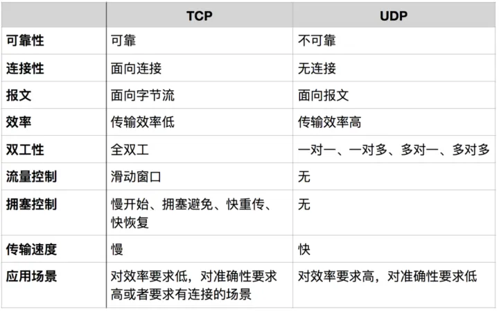
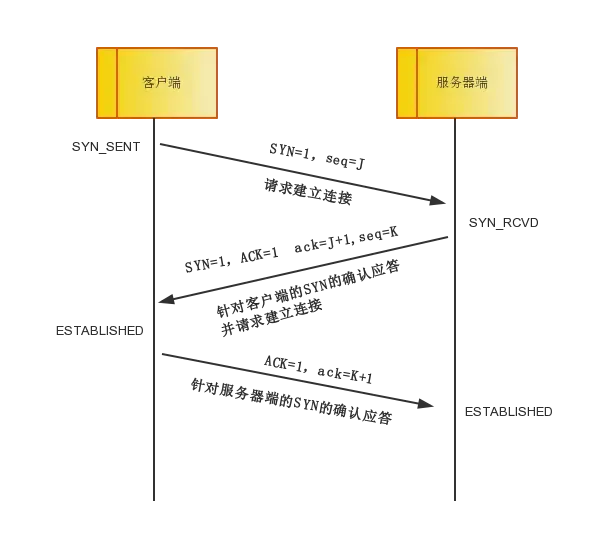
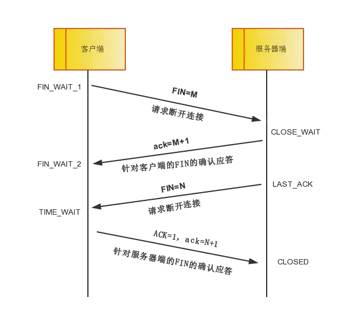
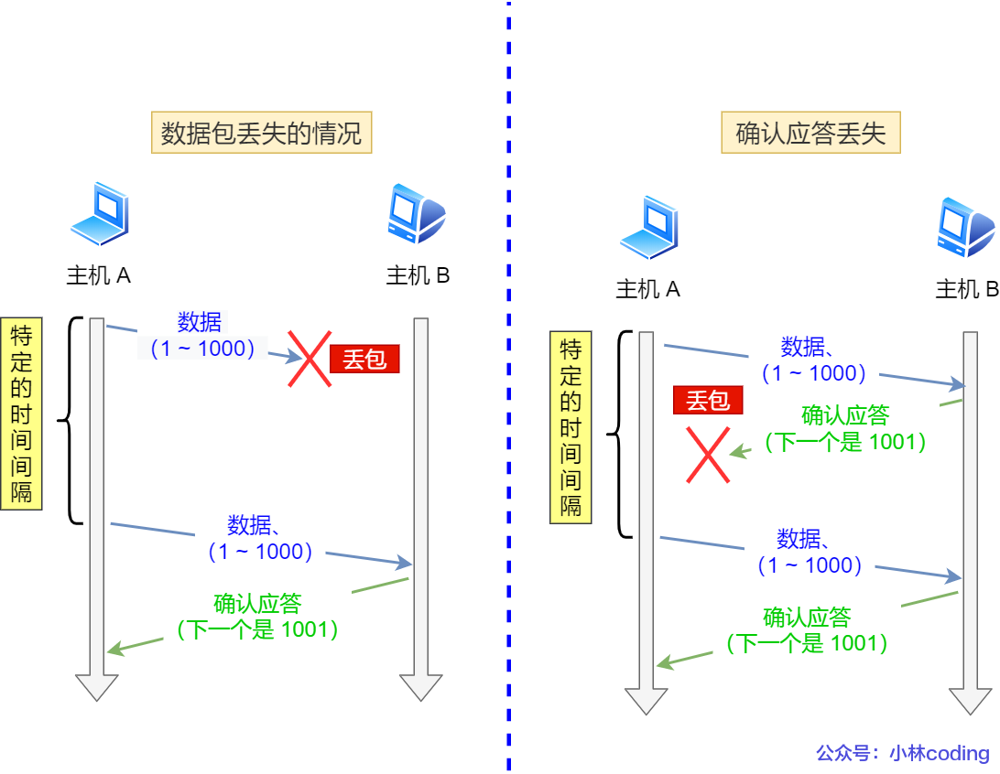
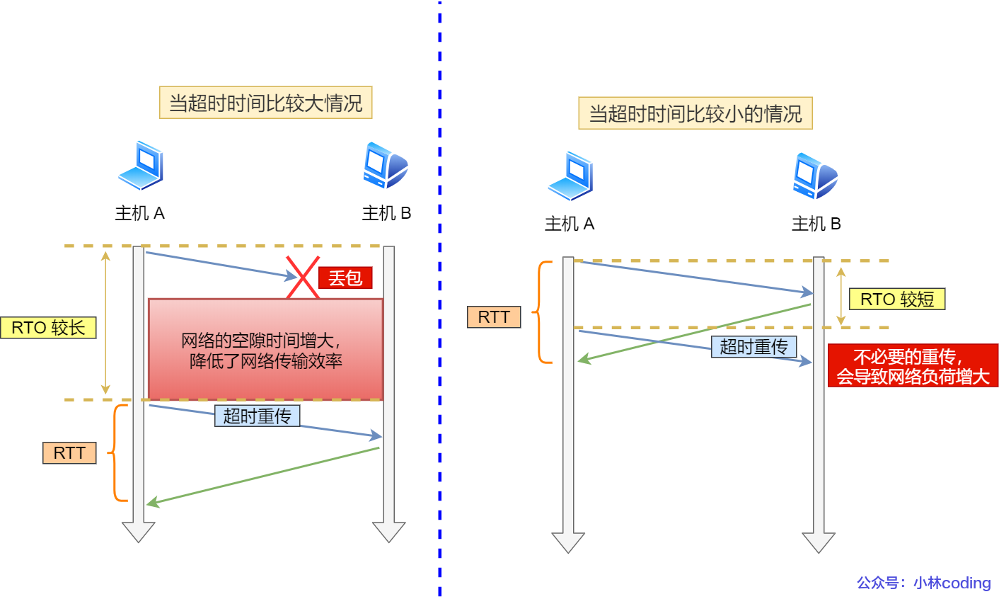
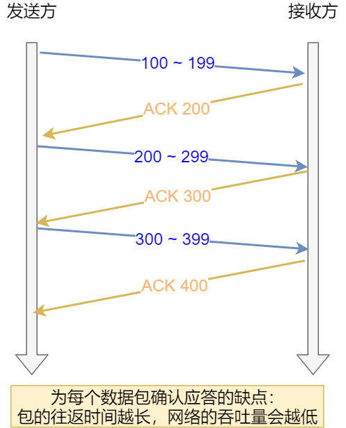
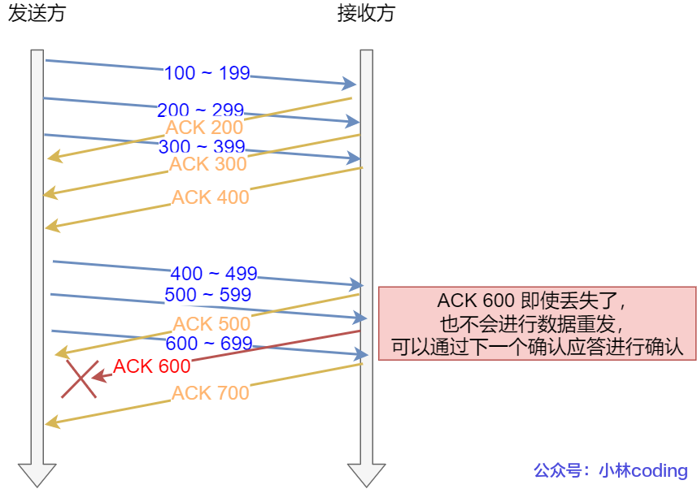
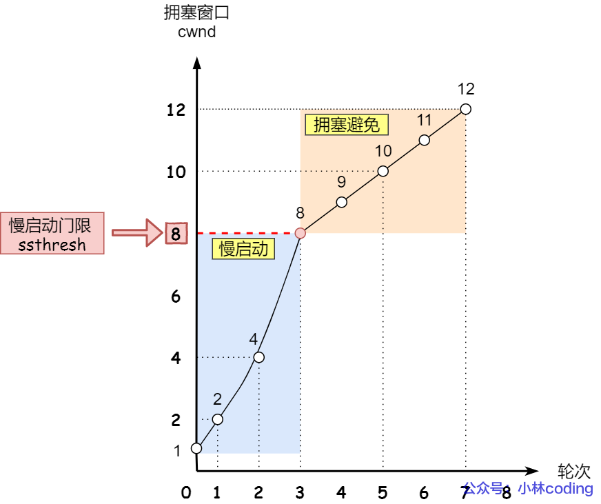
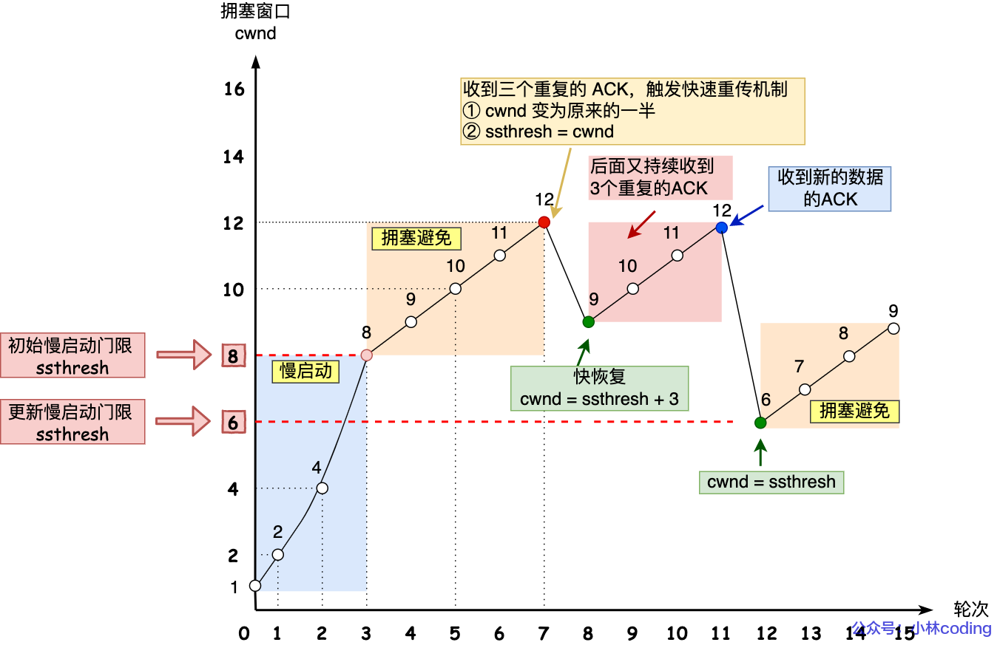

[TOC]

# TCP 协议

## TCP 和 UDP 对比

- TCP 实际的应用场景有：HTTP / HTTPS，FTP。

- UDP 实际的应用场景有：DNS，视频、音频等多媒体通信，广播通信。

## 三次握手

TCP 提供面向有连接的通信传输。面向有连接是指在数据通信开始之前先做好两端之间的准备工作。

**为什么 TCP 连接的时候是 3 次？2 次不可以吗？**

（1）传输不可靠，服务器不知道自己有无发件能力以及客户端有无收件能力。

（2）防止失效报文，服务器接收产生资源浪费。因为如果只有两次握手，客户端仍然是要有服务器端的 ack 报文才建立连接，而服务器端只要收到带 seq 连接请求就建立连接。此时如有失效报文（可能是之前网络拥塞，客户端超时重发的请求），此时服务器端建立连接（但此时客户端处于 close 状态）一直等待浪费连接资源。

## 四次挥手

由于 TCP 连接是全双工的，因此，每个方向都必须要单独进行关闭，这一原则是当一方完成数据发送任务后，发送一个 FIN 来终止这一方向的连接，收到一个 FIN 只是意味着这一方向上没有数据流动了，即不会再收到数据了，但是在这个 TCP 连接上仍然能够发送数据，直到这一方向也发送了 FIN。首先进行关闭的一方将执行主动关闭，而另一方则执行被动关闭。

> 中断连接端可以是客户端，也可以是服务器端。

- 第一次挥手：客户端发送一个 FIN=M，用来关闭客户端到服务器端的数据传送，客户端进入 FIN_WAIT_1 状态。意思是说我客户端没有数据要发给你了，但是如果你服务器端还有数据没有发送完成，则不必急着关闭连接，可以继续发送数据。
- 第二次挥手：服务器端收到 FIN 后，先发送 ack=M+1，告诉客户端，你的请求我收到了，但是我还没准备好，请继续你等我的消息。这个时候客户端就进入 FIN_WAIT_2 状态，继续等待服务器端的 FIN 报文。
- 第三次挥手：当服务器端确定数据已发送完成，则向客户端发送 FIN=N 报文，告诉客户端，好了，我这边数据发完了，准备好关闭连接了。服务器端进入 LAST_ACK 状态。
- 第四次挥手：客户端收到 FIN=N 报文后，就知道可以关闭连接了，但是他还是不相信网络，怕服务器端不知道要关闭，所以发送 ack=N+1 后进入 **TIME_WAIT** 状态，如果 Server 端没有收到 ACK 则可以重传。服务器端收到 ACK 后，就知道可以断开连接了。客户端等待了 2MSL（Maximum Segment Lifetime，报文最大生存时间） 后依然没有收到回复，则证明服务器端已正常关闭，那好，我客户端也可以关闭连接了。最终完成了四次握手。

> TIME_WAIT 状态存在的理由

（1）可靠地实现 TCP 全双工连接的终止。

如果客户端发送的最后一个 ACK 丢失，服务端将重传 FIN，为了能够收到这个超时重传的 FIN 并响应，客户端需要 TIME_WAIT 状态。

（2）为了保证本连接持续的时间所产生的所有分组都从网络中消失，也就是保证新建立一个 TCP 连接时，来自该连接老的重复分组都已经在网络中消失了。

为什么 TIME_WAIT 默认是 2MSL，这 2 个 MSL 中的第一个 MSL 是为了等自己发出去的最后一个 ACK 从网络中消失，而第二 MSL 是为了等在对端收到 ACK 之前的一刹那可能重传的 FIN 报文从网络中消失。

## 重传机制

### 超时重传

重传机制的其中一个方式，就是在发送数据时，设定一个定时器，当超过指定的时间后，没有收到对方的 `ACK` 确认应答报文，就会重发该数据。

TCP 会在以下两种情况发生超时重传：

- （发送的）数据包丢失
- 确认应答丢失

- RTT

`RTT`（Round-Trip Time 往返时延）指的是**数据发送时刻到接收到确认的时刻的差值**，也就是包的往返时间。

- ROT

`RTO` （Retransmission Timeout 超时重传时间）。超时时间 `RTO` 不宜设置较长或较短。

如上图所示

- 当超时时间 **RTO 较大**时，重发就慢，丢了老半天才重发，没有效率，性能差；
- 当超时时间 **RTO 较小**时，会导致可能并没有丢就重发，于是重发的就快，会增加网络拥塞，导致更多的超时，更多的超时导致更多的重发。

精确的测量超时时间 `RTO` 的值是非常重要的，这可让我们的重传机制更高效。根据上述的两种情况，我们可以得知，**超时重传时间 RTO 的值应该略大于报文往返 RTT 的值**。

Linux 有一套公式来计算 `RTO` 。

如果超时重发的数据，再次超时的时候，又需要重传的时候，TCP 的策略是**超时间隔加倍。**

也就是**每当遇到一次超时重传的时候，都会将下一次超时时间间隔设为先前值的两倍。两次超时，就说明网络环境差，不宜频繁反复发送。**

超时触发重传存在的问题是，超时周期可能相对较长。那是不是可以有更快的方式呢？

于是就可以用「快速重传」机制来解决超时重发的时间等待。

### 快速重传

TCP 还有另外一种**快速重传（Fast Retransmit）机制**，它**不以时间为驱动，而是以数据驱动重传**。

在 TCP 传输的过程中，**如果发生了丢包，即接收端发现数据段不是按序到达的时候，接收端的处理是重复发送之前的 ACK**。

比如第 5 个包丢了，即使第 6、7 个包到达的接收端，接收端也一律返回第 4 个包的 ACK（第五个无法 ACK）。当发送端收到 3 个重复的 ACK 时，意识到丢包了，于是马上进行重传，不用等到一个 RTO（Retransmission Timeout 超时重传时间）的时间到了才重传。

这就是**快速重传**，它解决的是**是否需要重传**的问题。

## 滑动窗口

最初 TCP 采用的是每发一个数据，得收到 ACK 后再发送下一个。这种方式效率比较低下，如果期间出现网络延迟的话会影响下一个数据的发送。

为了解决这个问题，TCP 引入了窗口的概念。窗口可以指定大小，而这个大小就是指**无需等待确认应答，而可以继续发送数据的最大值**。

发送端和接收端会各自维护一个自己的窗口，分别是发送窗口（swnd）和接收窗口（rwnd）。

窗口的实现实际上是操作系统开辟的一个缓存空间，发送方主机在等到确认应答返回之前，必须在缓冲区中保留已发送的数据。如果按期收到确认应答，此时数据就可以从缓存区清除。

> 图中的 ACK 600 确认应答报文丢失，也没关系，因为可以通过下一个确认应答进行确认，只要发送方收到了 ACK 700 确认应答，就意味着 700 之前的所有数据「接收方」都收到了。这个模式就叫**累计确认**或者**累计应答**。

## 流量控制

如果发送方把数据发送得过快，接收方可能会来不及接收，这就会造成数据的丢失。所谓流量控制就是让发送方的发送速率不要太快，要让接收方来得及接收。利用【滑动窗口】机制可以很方便地在 TCP 连接上实现**对发送方的流量控制**。

TCP 头里有一个字段叫 `Window`，也就是窗口大小。**这个字段是接收端告诉发送端自己还有多少缓冲区可以接收数据。于是发送端就可以根据这个接收端的处理能力来发送数据，而不会导致接收端处理不过来。**

所以，通常窗口的大小是由接收方的窗口大小来决定的。发送方发送的数据大小不能超过接收方的窗口大小，否则接收方就无法正常接收到数据。

## 拥塞控制

> 为什么要有拥塞控制呀，不是有流量控制了吗？

前面的流量控制是避免「发送方」的数据填满「接收方」的缓存，但是并不知道网络的中发生了什么。

一般来说，计算机网络都处在一个共享的环境。因此也有可能会因为其他主机之间的通信使得网络拥堵。

**在网络出现拥堵时，如果继续发送大量数据包，可能会导致数据包时延、丢失等，这时 TCP 就会重传数据，但是一重传就会导致网络的负担更重，于是会导致更大的延迟以及更多的丢包，这个情况就会进入恶性循环被不断地放大。**

所以，TCP 不能忽略网络上发生的事，它被设计成一个无私的协议，当网络发送拥塞时，TCP 会自我牺牲，降低发送的数据量。

于是，就有了**拥塞控制**，控制的目的就是**避免「发送方」的数据填满整个网络。**

为了在「发送方」调节所要发送数据的量，定义了一个叫做「**拥塞窗口**」的概念。

> 什么是拥塞窗口？和发送窗口有什么关系呢？

**拥塞窗口 cwnd**是发送方维护的一个的状态变量，它会根据**网络的拥塞程度动态变化的**。

我们在前面提到过发送窗口 `swnd` 和接收窗口 `rwnd` 是约等于的关系，那么由于加入了拥塞窗口的概念后，此时发送窗口的值是 `swnd = min(cwnd, rwnd)`，也就是拥塞窗口和接收窗口中的最小值。

拥塞窗口 `cwnd` 变化的规则：

- 只要网络中没有出现拥塞，`cwnd` 就会增大；
- 但网络中出现了拥塞，`cwnd` 就减少；

> 那么怎么知道当前网络是否出现了拥塞呢？

其实**只要「发送方」没有在规定时间内接收到 ACK 应答报文，就会认为网络出现了拥塞**。

### 慢开始

TCP 在刚建立连接完成后，首先是有个慢启动的过程，这个慢启动的意思就是一点一点的提高发送数据包的数量，如果一上来就发大量的数据，这不是给网络添堵吗？

慢启动算法，cwnd 的大小（发包的个数）是**指数性的增长**。

> 慢启动门限 `ssthresh` （slow start threshold）

- 当 `cwnd` < `ssthresh` 时，使用慢启动算法。
- 当 `cwnd` >= `ssthresh` 时，就会使用「拥塞避免算法」。

### 拥塞避免

前面说道，当拥塞窗口 `cwnd` 「超过」慢启动门限 `ssthresh` 就会进入拥塞避免算法。

所以，我们可以发现，拥塞避免算法就是将原本慢启动算法的**指数增长变成了线性增长**，还是增长阶段，但是增长速度缓慢了一些。

就这么一直增长着后，网络就会慢慢进入了拥塞的状况了，于是就会出现丢包现象，这时就需要对丢失的数据包进行重传。

### 快恢复

当然，**发送端收到三次重复 ACK 之后，发现丢包，觉得现在的网络已经有些拥塞了**，自己会进入**快速恢复**阶段。

在这个阶段，发送端如下改变：

- 拥塞阈值降低为 cwnd 的一半
- cwnd 的大小变为拥塞阈值
- cwnd 线性增加

## 参考文章

- https://xiaolincoding.com/network/3_tcp/tcp_feature.html
- https://zhuanlan.zhihu.com/p/147370653
- [为什么 TIME_WAIT 状态是 2MSL](http://t.csdn.cn/MQR8p)
- http://t.csdn.cn/B6jXf
- https://juejin.cn/post/6844904070889603085

