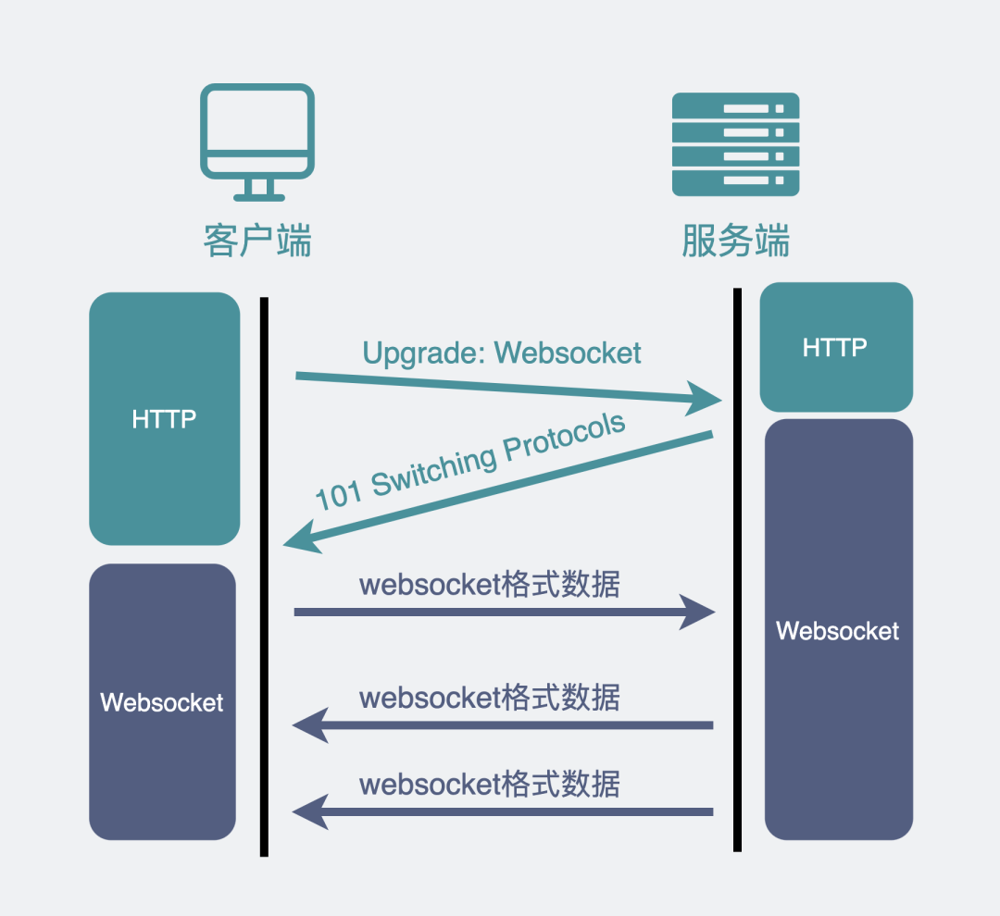
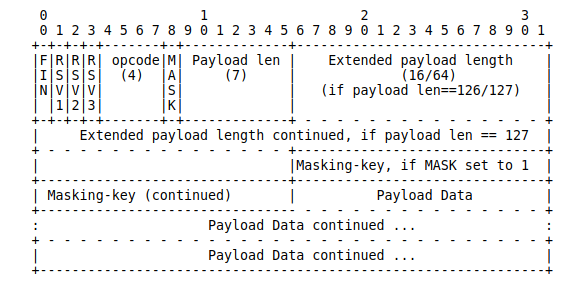

[TOC]

# WebSocket

我们知道 TCP 连接的两端，**同一时间里**，**双方**都可以**主动**向对方发送数据。这就是所谓的**全双工**。

而现在使用最广泛的 `HTTP/1.1`，也是基于 TCP 协议的，**同一时间里**，客户端和服务器**只能有一方主动**发数据，这就是所谓的**半双工**。也就是说，好好的全双工 TCP，被 HTTP/1.1 用成了半双工。

这是由于 HTTP 协议设计之初，考虑的是看看网页文本的场景，能做到**客户端发起请求再由服务器响应**，就够了，根本就没考虑网页游戏这种，客户端和服务器之间都要互相主动发大量数据的场景。

所以，为了更好的支持这样的场景，我们需要另外一个**基于 TCP 的新协议**。

于是新的应用层协议 **WebSocket** 就被设计出来了。

## 建立链接 WebSocket 连接

WebSocket 和 HTTP 一样都是基于 TCP 的协议。**经历了三次 TCP 握手之后，利用 HTTP 协议升级为 WebSocket 协议**。

你在网上可能会看到一种说法："WebSocket 是基于 HTTP 的新协议"，**其实这并不对**，因为 WebSocket 只有在建立连接时才用到了 HTTP，**升级完成之后就跟 HTTP 没有任何关系了**。

## WebSocket 的消息格式

数据包在 WebSocket 中被叫做帧，我们来看下它的数据格式长什么样子。

### opcode: 4 bits

这个是用来标志这是个什么类型的数据帧。比如。

- 等于 1 ，是指 text 类型（`string`）的数据包
- 等于 2 ，是二进制数据类型（`[]byte`）的数据包
- 等于 8 ，是关闭连接的信号

### Payload Len: 7 bits, 7+16 bits, or 7+64 bits

表示 Payload data 的长度（相当于 HTTP 的 Content-Length）。

WebSocket 会用最开始的 7 bits 做标志位。不管接下来的数据有多大，都先读最先的 7 bits，根据它的取值决定还要不要再继续读取 16 bits 或 64 bits。

- 如果最开始的 7 bits 的值是 `0~125`，那么它就表示了 payload 的长度，只读最开始的 7 bits 就完事了。

- 如果是 126（0x7E）。那它表示 payload 的长度范围在 `126~65535` 之间，接下来还需要再读 16 bits。这 16 bits 会包含 payload 的真实长度。
- 如果是 127（0x7F）。那它表示 payload 的长度范围 `>=65536`，接下来还需要再读 64 bits。这 64 bits 会包含 payload 的长度。

### Payload Data

这里存放的就是真正要传输的数据（相当于 HTTP 的 body），在知道了上面的 Payload Len 后，就可以根据这个值去截取对应的数据。

## 总结

WebSocket 数据格式是：数据头（内含 payload 长度）+ payload data 的形式。

这是因为 TCP 协议本身基于字节流，如果直接使用纯裸 TCP 去传输数据，会有**粘包**的 "问题"。为了解决这个问题，上层协议一般会用 "消息头 + 消息体" 的格式去重新包装要发的数据。

而消息头里一般含有消息体的长度，通过这个长度可以去截取真正的消息体。HTTP 协议和大部分 RPC 协议以及 WebSocket 协议，都是这样设计的。

## 参考文章

- [既然有 HTTP 协议，为什么还要有 WebSocket？](https://www.xiaolincoding.com/network/2_http/http_websocket.html)
- https://www.rfc-editor.org/rfc/rfc6455
