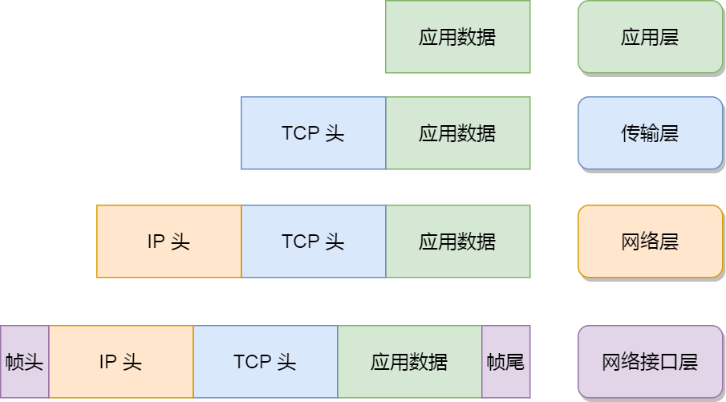

[TOC]

# 四层网络模型

## 网络接口层

生成了 IP 头部之后，接下来要交给**网络接口层**（*Link Layer*）在 IP 头部的前面加上 **MAC 头部**，并封装成数据帧（Data frame）发送到网络上。

IP 头部中的接收方 IP 地址表示网络包的目的地，通过这个地址我们就可以判断要将包发到哪里，但在以太网的世界中，这个思路是行不通的。

什么是以太网呢？电脑上的以太网接口，Wi-Fi接口，以太网交换机、路由器上的千兆，万兆以太网口，还有网线，它们都是以太网的组成部分。以太网就是一种在「局域网」内，把附近的设备连接起来，使它们之间可以进行通讯的技术。

以太网在判断网络包目的地时和 IP 的方式不同，因此必须采用相匹配的方式才能在以太网中将包发往目的地，而 MAC 头部就是干这个用的，所以，在以太网进行通讯要用到 MAC 地址。

MAC 头部是以太网使用的头部，它包含了接收方和发送方的 MAC 地址等信息，**我们可以通过 ARP 协议（地址解析协议，是根据 IP 地址获取物理地址）获取对方的 MAC 地址。**

所以说，网络接口层主要为网络层提供「链路级别」传输的服务，负责在以太网、WiFi 这样的底层网络上发送原始数据包，工作在网卡这个层次，使用 MAC 地址来标识网络上的设备。

## 参考文章

- https://xiaolincoding.com/network/1_base/tcp_ip_model.html