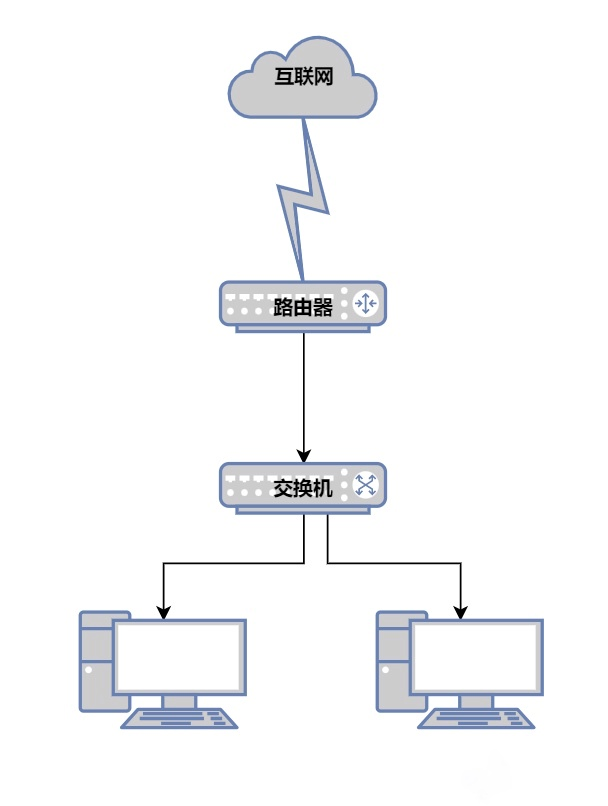

[TOC]

# 计算机网络面试问题

## 键入网址到网页显示，期间发生了什么？

1、首先浏览器对 URL 进行解析，生成 HTTP。

2、通过浏览器解析 URL 并生成 HTTP 消息后，需要委托操作系统将消息发送给 `Web` 服务器。但在发送之前，还有一项工作需要完成，那就是**查询服务器域名对应的 IP 地址**，因为委托操作系统发送消息时，必须提供通信对象的 IP 地址。有一种服务器就专门保存了 `Web` 服务器域名与 `IP` 的对应关系，它就是 `DNS` 服务器。

3、通过 DNS 获取到 IP 后，就可以把 HTTP 的传输工作交给操作系统中的**协议栈**。就是四层网络模型的组包过程。

4、网络包只是存放在内存中的一串二进制数字信息，没有办法直接发送给对方。因此，我们需要将**数字信息转换为电信号**，才能在网线上传输，也就是说，这才是真正的数据发送过程。负责执行这一操作的是**网卡**。

5、交换机

6、路由器

7、目标服务器解包处理并响应浏览器。

## 参考文章

- https://xiaolincoding.com/network/1_base/what_happen_url.html