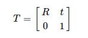
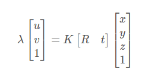

[TOC]

# OpenCV

## 类和方法

### cv::Mat

一切图像皆为 Mat。通过 cv::imread 读取图片，转换为 Mat 对象。Mat 数据是一个矩阵，用这个矩阵表示图片的每一个像素点。

- 单通道图，

俗称灰度图，每个像素点只能有有一个值表示颜色，它的像素值在 0 到 255 之间，0 是黑色，255 是白色，中间值是一些不同等级的灰色。

- 三通道图，

每个像素点都有 3 个值表示 ，所以就是 3 通道。也有 4 通道的图。例如 RGB 图片即为三通道图片，每一个像素点由三个通道的值表示：红（R）、绿（G）、蓝（B）。每个通道的范围也是 0 ~ 255。矩阵元素的值表示这个位置上的像素的亮度，一般来说像素值越大表示该点越亮。

// TODO

### cv::Affine3

在 OpenCV 中，`cv::Affine3f` 是一个三维仿射变换矩阵类，用于描述从一个三维坐标系到另一个三维坐标系的变换关系。

Affine transform.

It represents a 4x4 homogeneous transformation matrix T.



where R is a 3x3 rotation matrix and t is a 3x1 translation vector.

You can specify R either by a 3x3 rotation matrix or by a 3x1 rotation vector, which is converted to a 3x3 rotation matrix by the Rodrigues formula.

- To get the inverse transform of T, use

```c++
cv::Affine3f T, T_inv;
T_inv = T.inv();
```

`inv` 表示对 `T` 变换矩阵求逆矩阵。

求逆矩阵的作用是反转仿射变换矩阵的变换效果，即将从一个坐标系到另一个坐标系的变换关系反转，从而得到从另一个坐标系到原坐标系的变换关系。这通常用于将已知的仿射变换矩阵应用于另一个坐标系中的点或向量。

- concatenate

`concatenate` 是 `cv::Affine3f` 类的一个成员函数，表示将两个仿射变换矩阵进行串联操作的意思，即将一个仿射变换矩阵应用于另一个仿射变换矩阵。

If you have two transformations T=T1∗T2, use

```
cv::Affine3f T, T1, T2;
T = T2.concatenate(T1);
```

参考文章：https://docs.opencv.org/4.x/dd/d99/classcv_1_1Affine3.html

### cv::Vec

其实可以把它当成数组，例如 `Vec<uchar,3>`，就是定义一个 uchar 类型的，长度为 3 的数组。

Vec3b，Vec3f 是它具体情况下的别名

```c++
typedef  Vec<uchar,3>  Vec3b   // 为 Vec<uchar,3> 定义别名 Vec3b
typedef  Vec<float,3>  Vec3f   // 为 Vec<float,3> 定义别名 Vec3f    
```

### cv::solvePnP

PnP（Perspective-N-Point）问题，是指已知 3D 点 (x, y, z)，即世界坐标点，及其在相机上的投影 (u，v)，求解相机位姿变换 R、t。

投影方程可表示为：



这里 K 为相机内参矩阵，是已知的。我们要做的就是，从 n 对这样的 2D-3D 对应关系中，恢复出相机姿态变换，即旋转矩阵 R 和平移向量 t。

典型的 PnP 问题求解方式有很多种，例如 DLT、P3P、EPnP、UPnp。

DLT（Direct Linear Transformation）算法原理：[3D 视觉（六）：PnP 问题（pespective-n-point）- CSDN](https://blog.csdn.net/Twilight737/article/details/121978577?ops_request_misc=%257B%2522request%255Fid%2522%253A%2522167629844716800217032541%2522%252C%2522scm%2522%253A%252220140713.130102334.pc%255Fall.%2522%257D&request_id=167629844716800217032541&biz_id=0&utm_medium=distribute.pc_search_result.none-task-blog-2~all~first_rank_ecpm_v1~rank_v31_ecpm-1-121978577-null-null.142^v73^insert_down2,201^v4^add_ask,239^v1^insert_chatgpt&utm_term=3D%20%E8%A7%86%E8%A7%89%EF%BC%88%E5%85%AD%EF%BC%89%EF%BC%9APnP%20%E9%97%AE%E9%A2%98%EF%BC%88pespective-n-point&spm=1018.2226.3001.4187)

> DLT 算法最少通过 6 对匹配点才能求解

#### 函数签名

```c++
CV_EXPORTS_W bool solvePnP( InputArray objectPoints, InputArray imagePoints,
                            InputArray cameraMatrix, InputArray distCoeffs,
                            OutputArray rvec, OutputArray tvec,
                            bool useExtrinsicGuess = false, int flags = SOLVEPNP_ITERATIVE );
```

- objectPoints：世界坐标系空间的物体点数组，一般是 N 个 3D 点的向量
- imagePoints：对应的图像点数组，一般可以是 N 个 2D 点的向量
- cameraMatrix：相机的内参矩阵（通过相机标定可以得到）
- distCoeffs：相机的畸变系数（通过相机标定可以得到）
- rvec：输出的旋转向量
- tvec：输出的平移向量
- useExtrinsicGuess：这个参数仅用于 `flags=SOLVEPNP_ITERATIVE`。此值如果为 true ，需要 rvec 和 tvec 有输入值，以便函数把输入值作为旋转和平移的估计初始值。
- flags：默认使用 SOLVEPNP_ITERATIVE。

solvePnP 函数实现了几种姿态估计算法，可以根据参数 flag 进行选择. 默认 flag 是 SOLVEPNP_ITERATIVE，其是采用 Levenberg-Marquardt 优化的 DLT 方案。

```c++
enum SolvePnPMethod {
  SOLVEPNP_ITERATIVE = 0,
  SOLVEPNP_EPNP = 1,
  SOLVEPNP_P3P = 2,
  SOLVEPNP_DLS = 3,
  SOLVEPNP_UPNP = 4,
  SOLVEPNP_AP3P = 5,
  SOLVEPNP_IPPE = 6,
  SOLVEPNP_IPPE_SQUARE = 7,
};
```

### cv::imdecode

```cpp
std::vector<char> buffer;
cv::Mat img = cv::imdecode(cv::Mat(buffer), cv::IMREAD_GRAYSCALE);
```

`imdecode` 函数默认将二进制数据解码为三通道的 BGR 彩色图像，如果二进制数据是灰度图像或者其他类型的图像，需要使用不同的 `flags` 参数来指定解码方式。

- `cv::IMREAD_UNCHANGED` 是 OpenCV 中读取图片的一种模式，表示读取图片时不对图像进行任何修改，包括原图像的颜色空间、通道数和位深度等信息都保持不变。该模式适用于需要保留原始图像信息的场景，比如读取图片的二进制数据或者读取带 alpha 通道的 PNG 图像等。

- `cv::IMREAD_COLOR`：将图像读取为 3 通道的 BGR 彩色图像，忽略任何 alpha 通道信息。
- `cv::IMREAD_GRAYSCALE`：将图像读取为单通道的灰度图像。
- `cv::IMREAD_ANYDEPTH`：以原始深度读取图像，即将每个像素的值读取为与图像深度相同的数据类型。例如，如果图像是 16 位深度的，将像素读取为 16 位的整数类型。
- `cv::IMREAD_ANYCOLOR`：读取图像时不进行颜色空间转换，直接使用原始的颜色空间，适用于需要保留原始颜色信息的场景。

## 参考文章

