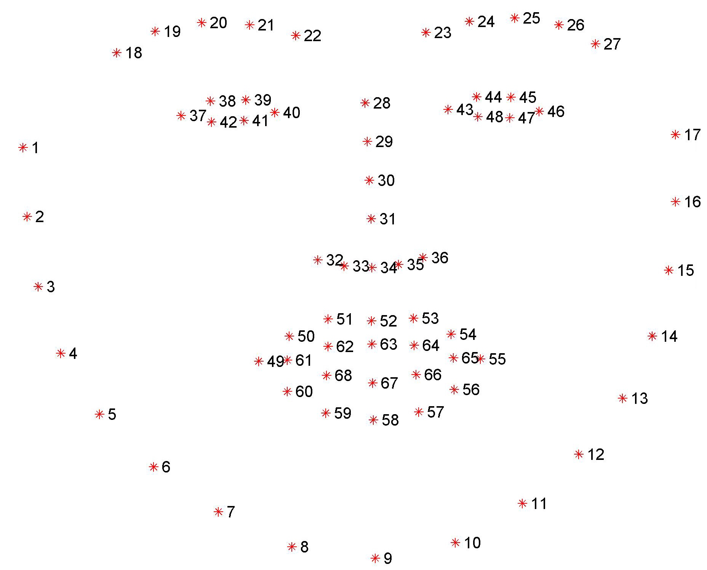
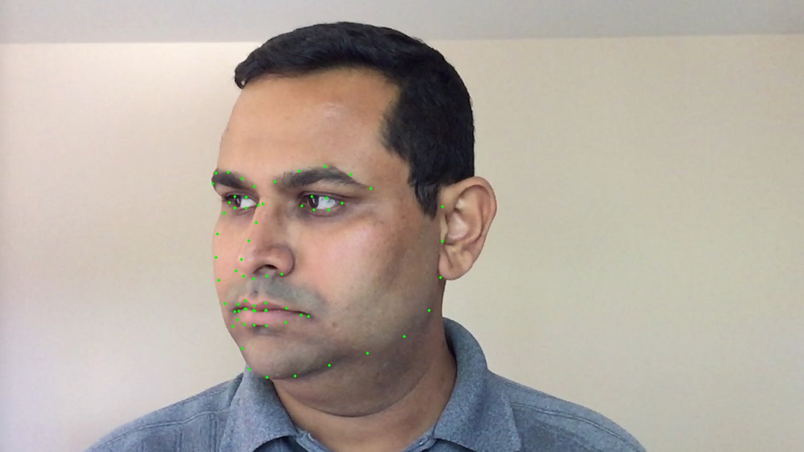

[TOC]

# 人脸关键点检测

人脸关键点检测是指给定人脸图像，定位出人脸面部的关键点，包括眉毛、眼睛、鼻子、嘴巴、脸部轮廓区域的点。人脸关键点是人脸各个部位的重要特征点，通常是轮廓点与角点。



下图是使用 OpenCV Dlib 库对一张人脸图像的 68 个面部关键点检测结果。



人脸关键点可以有以下主要应用：

1. 人脸姿态对齐，人脸识别等算法都需要对人脸的姿态进行对齐从而提高模型的精度。
2. 人脸美颜与编辑，基于关键点可以精确分析脸型、眼睛形状、鼻子形状等，从而对人脸的特定位置进行修饰加工，实现人脸的特效美颜，贴片等娱乐功能，也能辅助一些人脸编辑算法更好地发挥作用。
3. 人脸表情分析，基于关键点可以对人的面部表情进行分析，从而用于互动娱乐，行为预测等场景。

## Caffe 和 Dlib 区别

之前我们用的是 Caffe 进行人脸检测，但是现在这个程序用的是 Dlib，它们之间有什么区别呢？

Dlib 和 Caffe 都是用于图像识别、分类、检测等任务的计算机视觉库。它们有以下主要区别：

模型架构：Caffe 是一个深度学习框架，它主要支持 CNN 和 RNN 等模型，而 Dlib 是一个机器学习工具包，它支持 SVM、决策树、随机森林等传统机器学习模型。

编程语言：Caffe 是用 C++ 和 Python 实现的，而 Dlib 则是用 C++ 实现的。

功能：Caffe 是一个专门针对深度学习的框架，它主要用于图像分类、识别、检测等任务，而 Dlib 则是一个更加通用的机器学习工具包，它可以用于计算机视觉、自然语言处理等领域。

预训练模型：Caffe 有大量预训练的模型可供选择，但 Dlib 并不提供预训练的模型，但它有很多内置的机器学习算法可以用于各种任务。

总之，Caffe 和 Dlib 都是非常强大的计算机视觉库，它们的选择取决于您的具体需求和使用场景。如果您的需求是图像识别、分类、检测等深度学习任务，您可以选择 Caffe；如果您的需求是更加通用的计算机视觉任务，您可以选择 Dlib。此外，如果您希望快速上手和实现，Dlib 可能是一个更好的选择，因为它有很多内置的机器学习算法，而 Caffe 则需要更多的代码实现。

## 环境配置

- opencv 4.5.5
- dlib 19.24

## 问题报错

运行 Conan 安装 dlib 库报错：

```
'dlib/19.19' requires 'libjpeg/9d' while 'opencv/4.5.5' requires 'libjpeg/9e'
```

这个错误消息表明，dlib 和 opencv 两个库都需要不同版本的 libjpeg 库，但它们之间存在冲突。dlib 需要 libjpeg 9d 版本，而 opencv 需要 libjpeg 9e 版。

解决方法：在 conanfile.txt 中设置：

```
[options]
dlib:with_jpeg=False
```

这行代码的意思是，在安装 dlib 库时禁用使用 libjpeg 库。换句话说，Conan 在安装 dlib 库时不会安装 libjpeg 库，并且 dlib 库将使用其自己的 JPEG 解码器实现，而不是依赖于 libjpeg 库。这可能会影响性能，因为 dlib 库的 JPEG 解码器实现可能不如 libjpeg 库快。它还可能导致兼容性问题，因为 dlib 库的 JPEG 解码器实现可能与 JPEG 文件的其他实现不同。但是，这是一种解决 dlib 和 opencv 之间的兼容性问题的方法，因为 dlib 库和 opencv 库需要不同版本的 libjpeg 库。

## 代码仓库

https://github.com/Yuu177/facial-landmarks