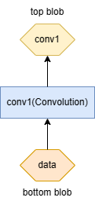
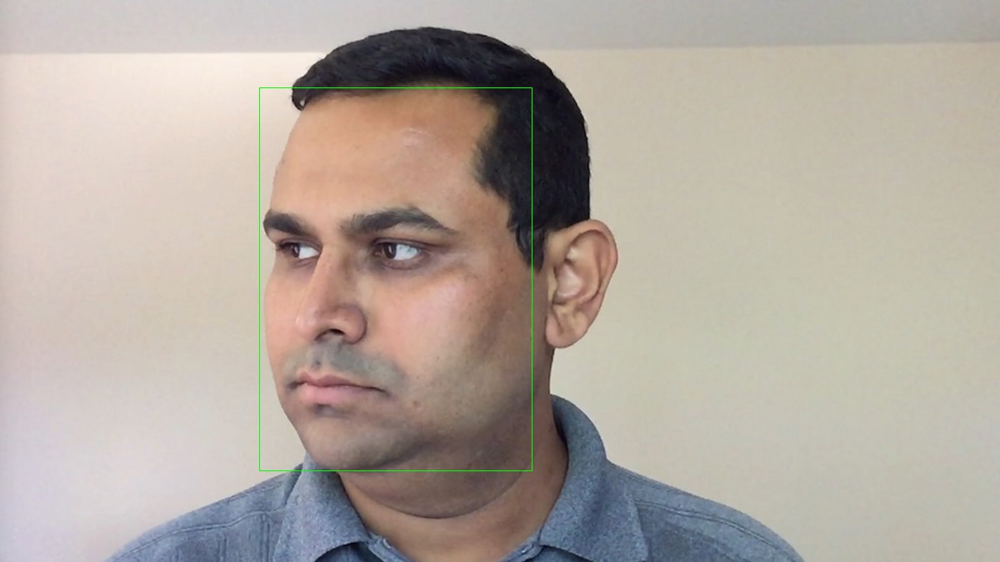
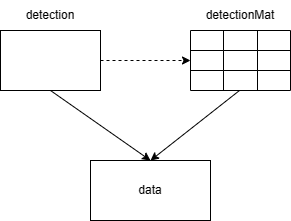
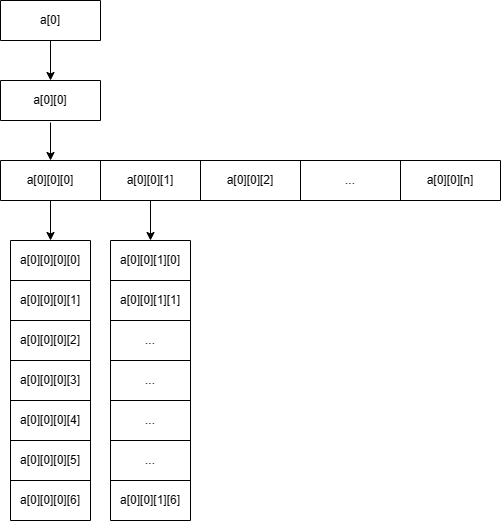
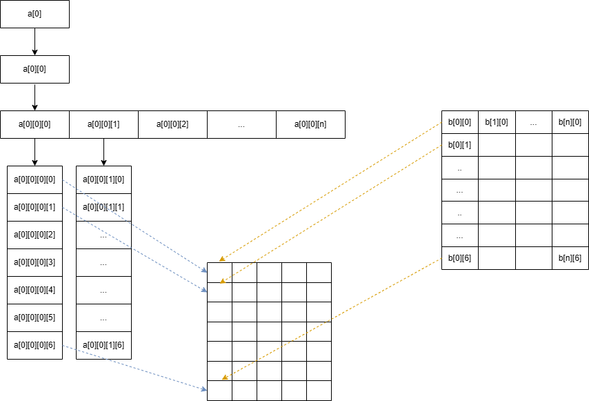

[TOC]

# Face detection with OpenCV

使用 OpenCV 调用 Caffe 模型算法来实现人脸检测。

## 环境配置

- cmake
- conan：C/C++ 进行依赖管理的包管理器。不懂可以看这里：https://docs.conan.io/en/latest/getting_started.html
- OpenCV

## 预备知识

### 什么是算法模型？

假设图像中有各种类别，猫、骆驼、鹿、大象等。我们的任务是将这些图像分类到相应的类（或类别）中。卷积神经网络（CNN）对于此类图像分类任务非常有效。所以我们需要去实现这个模型，但是如果你开始从头开始编写 CNN，那么获得工作模型将是几天后，而这就是深度学习框架真正改变了这尴尬的局面，无须写上百行代码，我们仅仅需要使用一个适合的框架去帮助我们快速建立这样的模型。

### 什么是 Caffe？

Caffe 全称为 Convolutional Architecture for Fast Feature Embedding，是一个被广泛使用的开源深度学习框架。

### 使用 Caffe 深度学习模型需要加载的两个文件

prototxt 文件和 caffemodel 文件是构成 caffe 深度学习模型的两个关键文件。

prototxt 文件是定义神经网络结构的文件，它描述了每一层的类型，每一层的输入，每一层的参数以及每一层的输出。

caffemodel 文件是存储模型训练得到的参数的文件，它包含了每一层的权重和偏移量等信息。

通过 prototxt 和 caffemodel 文件可以完整地描述一个深度学习模型，并且可以使用 caffe 框架进行预测、分类等任务。

### Caffe Layer

Caffe 的核心概念是 Layer，每一个神经网络的模块都是一个 Layer。Layer 接收输入数据，同时经过内部计算产生输出数据。设计网络结构时，只需要把各个 Layer 拼接在一起构成完整的网络（通过写 protobuf 配置文件定义）。

### Caffe Blob

Caffe 中进行网络层计算时，每一层的输入输出都是以 Blob 对象。Blob 简单理解就是一个 4 维数组 [num, channel, width, height]。

这四个维度通常分别代表着：

```
num: 图像数量
channel：通道数量
width：图像宽度
height：图像高度
```

### Layer 与 Blob 的关系



如图，名为 conv1 的 Layer 的输入是名为 data 的 bottom blob，其输出是名为 conv1 的 top blob。

其 prototxt 文件定义如下，一个 layer 有一个到多个的 top 和 bottom。

```protobuf
layer {
  name: "conv1"
  type: "Convolution"
  bottom: "data"
  top: "conv1"
  ...
}
```

"Convolution" 是该 layer 的类型，表示这个 layer 是一个卷积层。卷积层的主要作用是对数据进行特征提取，抽象出数据的关键特征。

> 通常看 prototxt 文件的 layer 定义可以了解模型的构建方式和部分参数的定义。但是关于模型的详细信息，如果没有相关的文档说明，很可能不能从 prototxt 文件中完全理解。因此，在使用别人训练好的模型时，最好还是寻找对应的文档或者询问相关的人员，以便更好地使用模型。

## 仓库代码

https://github.com/Yuu177/face-detection

代码实现使用的是 OpenCV 4.5.5 版本。OpenCV 面部检测器提供了 Caffe 模型——人脸检测器 FP16（原始 Caffe 实现的浮点 16 版本）。该 Caffe 模型文件和配置文件如下：

- `res10_300x300_ssd_iter_140000_fp16.caffemodel`：此文件包含实际层的权重。 可以从[这里](https://github.com/opencv/opencv_3rdparty/raw/19512576c112aa2c7b6328cb0e8d589a4a90a26d/res10_300x300_ssd_iter_140000_fp16.caffemodel)下载。
- `deploy.prototxt`：此文件定义模型架构。 可以从[这里](https://github.com/opencv/opencv/blob/master/samples/dnn/face_detector/deploy.prototxt)下载。

> 从 OpenCV 3.1 开始，提供了 DNN 模块，该模块使用流行的深度学习框架（例如 Caffe，TensorFlow，Torch 和 Darknet）使用经过预训练的深度网络来实现前向传递（推理）。 在 OpenCV 3.3 中，该模块已从 `opencv_contrib` 存储库升级到主存储库，并得到了显着加速。

## 目录结构

```bash
.
├── CMakeLists.txt # cmake 文件
├── README.md
├── build.sh # 编译 & 运行脚本
├── conanfile.txt # conan 指定 main 程序依赖的包
├── image
│   └── headPose.jpg # 人脸图片
├── main.cpp # 程序源码
└── model # caffe 模型
    ├── deploy.prototxt
    └── res10_300x300_ssd_iter_140000_fp16.caffemodel # Caffe 实现的 Single Shot MultiBox Detector（SSD）模型，用于目标检测
```

## 运行程序

直接运行 build.sh 即可。

conan 会自动帮我们下载相关的包，但是有些系统依赖包会出现 conan 无法自动下载的错误：`xorg/system: ERROR: while executing system_requirements():`

```bash
xorg/system: ERROR: while executing system_requirements(): System requirements: 'libx11-xcb-dev, libfontenc-dev, libxaw7-dev, libxkbfile-dev, libxmu-dev, libxmuu-dev, libxpm-dev, libxres-dev, libxss-dev, libxtst-dev, libxv-dev, libxvmc-dev, libxxf86vm-dev, libxcb-render-util0-dev, libxcb-xkb-dev, libxcb-icccm4-dev, libxcb-image0-dev, libxcb-keysyms1-dev, libxcb-randr0-dev, libxcb-shape0-dev, libxcb-sync-dev, libxcb-xfixes0-dev, libxcb-xinerama0-dev, libxcb-dri3-dev' are missing but can't install because tools.system.package_manager:mode is 'check'.Please update packages manually or set 'tools.system.package_manager:mode' to 'install' in the [conf] section of the profile, or in the command line using '-c tools.system.package_manager:mode=install'
ERROR: Error in system requirements
```

我们可以通过 apt install 来一个一个安装依赖。

```
sudo apt install libx11-xcb-dev
```

或者配置 conan 来自动安装（推荐）。配置 `~/.conan/global.conf`，没有就新建。

```bash
➜  .conan cat global.conf
tools.system.package_manager:mode = install
tools.system.package_manager:sudo = True
```

## 运行效果图

- 输入


- 输出



## 代码说明

这里使用的是 OpenCV 和 Caffe 来实现人脸检测。简单来说就是 OpenCV 读取图片，然后 Caffe 加载人脸检测算法模型，使用该算法模型识别人脸，以生成最终的目标检测结果，如物体类别，置信度，**左上角位置和右下角位置**等信息（当然不同的算法模型返回的详细结果信息会有所不同，使用别人的算法模型的时候最好参考文档）。最终再通过 OpenCV 显示目标检测框等信息。下面将会对重点的代码进行说明。

### Load the model

加载 SSD 模型架构和预先训练的 SSD 模型文件，并将模型加载到深度学习网络中。

```cpp
std::string modelConfig = "model/deploy.prototxt";
std::string modelBinary = "model/res10_300x300_ssd_iter_140000_fp16.caffemodel";
cv::dnn::Net caffe_net = cv::dnn::readNetFromCaffe(modelConfig, modelBinary);
```

### Read an image

读取图片。

```cpp
 cv::Mat frame = cv::imread("image/input.jpg");
```

### Pre-process the image

我们将把输入图片处理成可以满足 SSD 网络的输入。如：发送 SSD 大小合适的图像，即 300 x 300，并从输入图像中减去平均值。

```cpp
cv::Mat input_blob = cv::dnn::blobFromImage(frame, 1.0, cv::Size(300, 300),
                                            cv::Scalar(104, 117, 123));
```

- 这个 300 x 300 的值是如何确定的？

我们可以通过查看模型架构文件 deploy.prototxt 来确定图片大小和通道数。

```protobuf
input: "data"
input_shape {
  dim: 1 // 表示这个张量有 1 个样本
  dim: 3 // 表示这个张量有 3 个通道，通常代表图像有三个通道
  dim: 300 // 表示图像的高度为 300 像素
  dim: 300 // 表示图像的宽度为 300 像素
}
```

- `cv::Scalar(104, 117, 123)`

`Scalar(104, 117, 123)` 在这个代码片段中代表的是图像颜色的均值（mean value）。 在图像处理和计算机视觉领域中，通常需要将图像的 RGB 通道的值减去一个固定的均值，以降低图像的复杂度和防止因图像光照变化导致的问题。均值可以认为是图像的背景色。

在此代码中，`Scalar(104, 117, 123)` 的三个参数分别代表 BGR 通道的均值。当图像的 BGR 通道的值减去这个均值时，会得到一张以该均值为基准的图像。这样做有助于提高模型的泛化能力，使其能够适用于不同光照条件下的图像。

一般来说，不同的应用场景，例如人脸检测、物体识别等，所使用的数据集和模型都不同，因此均值也不同。一个常见的方法是对所使用的图像数据集计算均值，并使用该均值。这样的话，模型将在与其训练数据集相似的均值环境中进行预测。有时也可以直接使用一个固定的均值，例如 104, 117, 123。这个均值的选择不一定是最优的，但它已经被广泛应用在各种图像处理和计算机视觉任务中，具有一定的参考价值。

### Forward pass

现在我们可以将数据设置到网络中，并分别使用 `net.setInput` 和 `net.forward` 函数获得预测/检测。 这会将检测结果转换为我们可以读取的检测 `mat`。

> detection_out layer 是 ssd 网络最后一层，用于整合预选框、预选框偏移以及得分三项结果，最终输出满足条件的目标检测框、目标的 label 和得分等。detection_out layer 输出 blob（mat）为 [1, 1, x, 7]，这是个四维数组。其中 x 是最后保留的框的个数，最后一维存放的数据为 [image_id, label, confidence, xmin, ymin, xmax, ymax]。

```cpp
caffe_net.setInput(input_blob, "data");
cv::Mat detection = caffe_net.forward("detection_out");
```

其中 detection.size[2] 是检测到的对象的数量，对应 x。detection.size[3] 是每次检测的结果数量（边界框数据和置信度），对应 7。

- 列 0：物体存在的置信度
- 列 1：包围盒的置信度
- 列 2：检测到的人脸置信度
- 列 3：左上边界框 x 坐标比例。表示检测到的物体的边界框左上角的 x（横）坐标在整张图片中的比例，即 x/300 的值（300 为输入给 caffe 模型的图片宽的大小）
- 列 4：左上边界框 y 坐标比例
- 列 5：右下边界框 x 坐标比例
- 列 6：右下边界框 y 坐标比例

### Get the result

把 caffe forward 的检测输出的四维的 detection（blob）转换为二维的 mat。

```cpp
cv::Mat detection_mat(detection.size[2], detection.size[3], CV_32F,
                       detection.ptr<float>());
```

Mat 的构造函数之一：

```cpp
Mat(int rows, int cols, int type, void* data, size_t step=AUTO_STEP);
```

该构造函数创建行数为 rows，列数为 cols，类型为 type 的图像，此构造函数不创建图像数据所需内存，而是直接使用 data 所指内存，图像的行步长由 step 指定。

这里创建了一个 Mat，其中 rows 为 `detection.size[2]`，cols 为 `detection.size[3]` 。type 为 CV_32F（表示 float 像素并且是在 0~1.0 之间的任意值），data 指针指向 detection 的内存 。



把四维数组转换成了二维数组，这个转换有点抽象。假设我们有四维数组 `a[1][1][n][7]`，如下图：



观察分析可得，因为前面的两维都是 1，所以实际上决定数据大小的是后面的两维。所以真正存储 data 的内存就是宽为 n，高为 7 的二维数组。降维后我们就可以简单方便的去理解和读取数据。



### Draw the rectangles

```cpp
// Draw the rectangles
for (int i = 0; i < detection_mat.rows; i++) {
  float confidence = detection_mat.at<float>(i, 2);
  if (confidence > 0.5) {
    int x_left = static_cast<int>(detection_mat.at<float>(i, 3) * frame.cols);
    int y_top = static_cast<int>(detection_mat.at<float>(i, 4) * frame.rows);
    int x_right = static_cast<int>(detection_mat.at<float>(i, 5) * frame.cols);
    int y_bottom = static_cast<int>(detection_mat.at<float>(i, 6) * frame.rows);

    // 检测到目标的矩形
    cv::Rect face_rec(x_left, y_top, x_right - x_left, y_bottom - y_top);
    // 把边框画到图片上
    cv::rectangle(frame, face_rec, cv::Scalar(0, 255, 0));
  }
}
```

- 置信度 confidence

```cpp
float confidence = detection_mat.at<float>(i, 2);
```

置信度（confidence score）是指模型对于特定的输入数据的预测结果的确信度，通常以 0~1 的值表示。一般来说，如果模型的置信度越高，它的预测结果就越可信。因此，如果检测到的置信度大于 0.5，这意味着模型对于该检测结果的置信度较高，即认为该检测结果是有效的。

- 为什么要乘以 `frame.cols`

```cpp
int x_left = static_cast<int>(detection_mat.at<float>(i, 3) * frame.cols);
```

由于最终的人脸检测边界框需要在图片上绘制，因此需要将这个比例值转化为实际的像素坐标，这就是为什么要乘上图片宽度（即 `frame.cols`）的原因。

## 参考文章

- [OpenCV 深度学习](https://github.com/apachecn/apachecn-cv-zh/blob/master/docs/build-cv-proj-opencv4-cpp/12.md)

