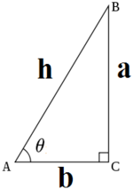
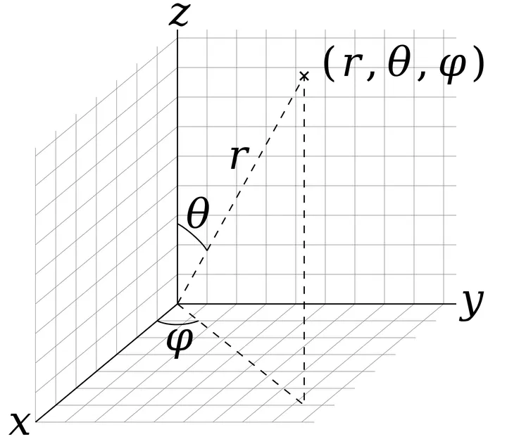

[TOC]

# 坐标系

## 三角函数

正弦  $\sin \theta=\frac{a}{h}$

余弦 $\cos \theta=\frac{b}{h}$

正切 $\tan \theta=\frac{a}{b}$

### 反正切函数

反正切函数指函数 $y=\tan x$ 的反函数。计算方法：若 $\tan \theta=\frac{a}{b}$，则 $\theta=\arctan \frac{a}{b}$。

使用代码表示：`atan2(a, b)`。注意 `atan2` 计算结果为弧度，弧度转角度还要乘以 $180/\pi$

> `atan2` 说明参考：[atan2 函数](https://github.com/Yuu177/learn/blob/main/%E7%AE%97%E6%B3%95%E5%AD%A6%E4%B9%A0/%E9%A1%BA%E6%97%B6%E9%92%88%E6%8E%92%E5%BA%8F.md#atan2)

## 直角坐标系和球坐标系的转换

如图下图所示，空间中的一点可以用 $(x,y,z)$ 和 $(r,\theta,\varphi)$ 来表示。通过几何关系，容易得到直角坐标系下的三个分量与球坐标系下的三个分量之间的转换关系：

给定以下球坐标系到直角坐标系的转换公式：
$$
\begin{cases}
x = r \sin\theta \cos\varphi \\
y = r \sin\theta \sin\varphi \\
z = r \cos\theta
\end{cases}
$$

1. **求 $r$（径向距离）**：
   $$
   r = \sqrt{x^2 + y^2 + z^2}
   $$
   
2. **求 $\theta$（极角）**：

   由 $z = r \cos\theta$ 可以得到：

   $$
   \cos\theta = \frac{z}{r} \implies \theta = \arccos\left(\frac{z}{r}\right)
   $$
   统一用 $\arctan$ 表示：
   $$
   \tan\theta = \frac{\sqrt{x^2 + y^2}}{z} \implies \theta = \arctan\left(\frac{\sqrt{x^2 + y^2}}{z}\right)
   $$

3. **求 $\varphi$（方位角）**：

   由 $x$ 和 $y$ 的关系可以得到：
   $$
   \tan\varphi = \frac{y}{x} \implies \varphi = \arctan\left(\frac{y}{x}\right)
   $$

最终求得：
$$
\begin{cases}
r = \sqrt{x^{2}+y^2+z^2} \\
\theta = \arctan(\frac{\sqrt{x^{2}+y^{2}}}{z}) \\
\varphi = \arctan(\frac{y}{x})
\end{cases}
$$
