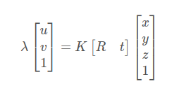
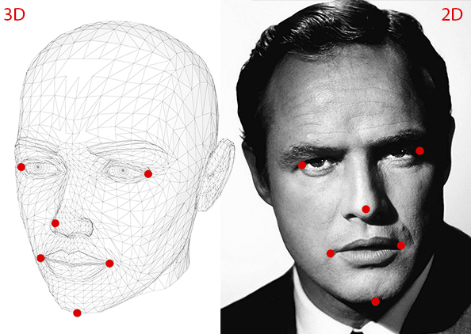

[TOC]

# 头部姿态估计

姿态估计问题就是确定某一三维目标物体的方位指向问题。

## PnP 问题

姿态估计其实就是求解 Pnp 问题。PnP（Perspective-N-Point）问题是指已知 3D 点 (x, y, z)，即世界坐标点，及其在相机上的投影 (u，v)，求解相机位姿变换 R、t 矩阵（相机外参）。

> 扩展知识：[相机模型与相机内参外参](https://github.com/Yuu177/learn/blob/main/%E8%AE%A1%E7%AE%97%E6%9C%BA%E8%A7%86%E8%A7%89/%E7%9B%B8%E6%9C%BA%E6%A8%A1%E5%9E%8B%E4%B8%8E%E7%9B%B8%E6%9C%BA%E5%86%85%E5%8F%82%E5%A4%96%E5%8F%82.md)。

投影方程可表示为：



这里 K 为相机内参矩阵，是已知的。我们要做的就是，从 n 对这样的 2D-3D 对应关系中，恢复出相机姿态变换，即旋转矩阵 R 和平移向量 t。

典型的 PnP 问题求解方式有很多种，例如 DLT、P3P、EPnP、UPnp。

DLT（Direct Linear Transformation）算法原理：[3D 视觉（六）：PnP 问题（pespective-n-point）- CSDN](https://blog.csdn.net/Twilight737/article/details/121978577?ops_request_misc=%257B%2522request%255Fid%2522%253A%2522167629844716800217032541%2522%252C%2522scm%2522%253A%252220140713.130102334.pc%255Fall.%2522%257D&request_id=167629844716800217032541&biz_id=0&utm_medium=distribute.pc_search_result.none-task-blog-2~all~first_rank_ecpm_v1~rank_v31_ecpm-1-121978577-null-null.142^v73^insert_down2,201^v4^add_ask,239^v1^insert_chatgpt&utm_term=3D%20%E8%A7%86%E8%A7%89%EF%BC%88%E5%85%AD%EF%BC%89%EF%BC%9APnP%20%E9%97%AE%E9%A2%98%EF%BC%88pespective-n-point&spm=1018.2226.3001.4187)

> DLT 算法最少通过 6 对匹配点才能求解

## 姿态估计所需信息



要计算图像中对象的三维姿态，需要以下信息

### 一些点的 2D 坐标位置

你需要图像中几个点的 2D（x，y）位置。对于面部，可以选择眼角、鼻尖、嘴角等。Dlib 的面部标志探测器为我们提供了许多选择点（可以参考之前讲过的 [Facial landmarks with OpenCV and Dlib](https://github.com/Yuu177/facial-landmarks) 相关代码和文档说明）。在本教程中，我们将使用鼻尖、下巴、左眼左角、右眼右角、嘴角左角和嘴角右角。

### 同一批点的 3D 位置

同时还需要 2D 特征点对应的 3D 位置。

首先我们会想，我需要照片中人物的 3D 模型来获取 3D 位置。理想情况下是的，但在实际中，通用三维模型就足够了。而且我们不需要完整的 3D 模型，只需要一些点所对应的 3D 位置即可。

### 相机的固定参数

- 相机的内参矩阵
- 畸变系数

这些值在相机标定的时候可以得到。

## cv::solvePnP

OpenCV 中，solvePnP 函数函数可以用于估计姿态。

```c++
CV_EXPORTS_W bool solvePnP( InputArray objectPoints, InputArray imagePoints,
                            InputArray cameraMatrix, InputArray distCoeffs,
                            OutputArray rvec, OutputArray tvec,
                            bool useExtrinsicGuess = false, int flags = SOLVEPNP_ITERATIVE );
```

- objectPoints：世界坐标系空间的物体点数组，一般是 N 个 3D 点的向量
- imagePoints：对应的图像点数组，一般可以是 N 个 2D 点的向量
- cameraMatrix：相机的内参矩阵（通过相机标定可以得到）
- distCoeffs：相机的畸变系数（通过相机标定可以得到）
- rvec：输出的旋转向量
- tvec：输出的平移向量
- useExtrinsicGuess：这个参数仅用于 `flags=SOLVEPNP_ITERATIVE`。此值如果为 true ，需要 rvec 和 tvec 有输入值，以便函数把输入值作为旋转和平移的估计初始值。
- flags：默认使用 SOLVEPNP_ITERATIVE。

solvePnP 函数实现了几种姿态估计算法，可以根据参数 flag 进行选择. 默认 flag 是 SOLVEPNP_ITERATIVE，其是采用 Levenberg-Marquardt 优化的 DLT 方案。

```c++
enum SolvePnPMethod {
  SOLVEPNP_ITERATIVE = 0,
  SOLVEPNP_EPNP = 1,
  SOLVEPNP_P3P = 2,
  SOLVEPNP_DLS = 3,
  SOLVEPNP_UPNP = 4,
  SOLVEPNP_AP3P = 5,
  SOLVEPNP_IPPE = 6,
  SOLVEPNP_IPPE_SQUARE = 7,
};
```

## 代码实现

https://github.com/Yuu177/head-pose-estimation

## 参考文章

- [Head Pose Estimation using OpenCV and Dlib - LearnOpenCV](https://learnopencv.com/head-pose-estimation-using-opencv-and-dlib/)
