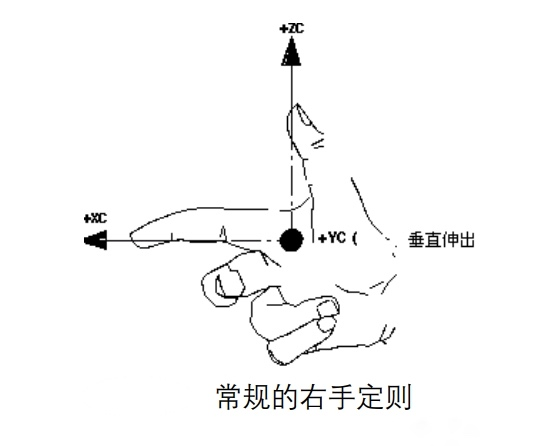
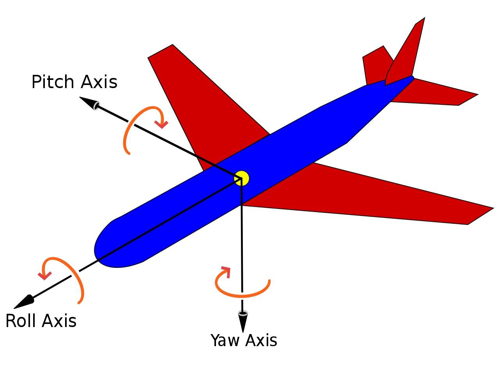

# 欧拉角

欧拉角用于描述刚体相对于固定坐标系的方向。它符合坐标系右手定则，拇指指向 Z 轴的正方向，食指伸直的方向对应于 X 轴的正方向，中指向外延伸的方向则为 Y 轴的正方向。

- Roll：绕着 X 轴进行旋转
- Pitch：绕着 Y 轴进行旋转
- Yaw：绕着 Z 轴进行旋转

## 欧拉角的算法思想

陌生的你来到了成都，站在盐市口茫然四顾，想知道春熙路怎么走？

这个时候你选择了去问路，得到了两种回答：

- 往东经 104°04′、北纬 30°40′ 走
- 右转后一直走

第一种回答，告诉了你春熙路的绝对坐标，可是很反人类。

第二种回答，告诉了你春熙路的相对坐标，很具有操作性。

欧拉角算法的思想就是采用的第二种回答的方式，优点在于很好理解。
