[TOC]

# 相机模型与相机内参外参

## 相机模型

### 针孔相机

- A simple working camera model: the pinhole camera model

- A formal construction of the pinhole camera model

小孔成像的孔大小影响了成像的效果。孔径越小，通光量不足，成像很暗，质量很差。但是孔径越大，成像越模糊。容易看出，物体上一点发出的光线，通过针孔在底片形成一个亮斑，这个亮斑的大小和针孔的大小是正比的。

### 透镜相机

在普通相机中，通过使用镜头（可以聚焦或分散光线的设备），可以缓解上述清晰度和亮度之间的冲突。如果我们用镜头来替换针孔，将传播过来的光线聚集，这样子就能得到清晰明亮的图像了。

物品上有些点是通过透镜折射后能够聚焦到 image 上，但是有些点投射过来的光线不能完全聚合到 image 上。

- 平行光

刚才我们说的是非平行光，当我们的物体足够远的时候，我们可以近似把它发射的光线认为是平行光。

镜头将所有平行于光轴传播的光线聚焦到一个被称为焦点的点，然后再发散出来，打到 film 上面形成图像。

### 针孔模型

不管是透镜相机还是针孔相机都可以简化为针孔相机的数学模型。

## 四个不同类型的坐标系

相机成像就是将三维物体转换成照片上的二维坐标，这个过程涉及到四个坐标系进行转换。

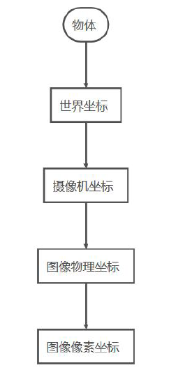

- 世界坐标系 `(Xw，Yw，Zw)`：用户定义的三维世界的坐标系，为了描述目标物在真实世界里的位置而被引入。单位：mm。
- 相机坐标系 `(Xc，Yc，Zc)`：在相机上建立的坐标系，为了从相机的角度描述物体位置而定义，作为沟通世界坐标系和图像/像素坐标系的中间一环。单位：mm。
- 图像物理坐标系 `(x，y)`：为了描述成像过程中物体从相机坐标系到图像坐标系的投影透射关系而引入，方便进一步得到像素坐标系下的坐标。单位：mm。

- 图像像素坐标系 `(u，v)`：为了描述物体成像后的像点在数字图像上（相片）的坐标而引入，是我们真正从相机内读取到的图像信息所在的坐标系。单位：pix（像素数目）。

总结：其实说白了，我们需要找到【世界坐标系】和【像素坐标系】之间的关系，而两者的关系可以通过将【世界坐标系】转化为【相机坐标系】，【相机坐标系】通过投影变换转化为 CCD 的【图像物理坐标系】，再通过变换可以把【图像物理坐标系】的物理单位转化为【图像像素坐标系】的像素单位（即 `(x,y)→(u,v)`），从而得到【世界坐标系】和【图像像素坐标系】之间的关系，即通过 A->B，B->C，C->D 之间的关系，找到 A->D 的关系。

>CCD，英文全称：Charge coupled Device，中文全称：电荷耦合元件，可以称为 CCD 图像传感器。CCD 是一种半导体器件，能够把光学影像转化为数字信号。 CCD上 植入的微小光敏物质称作像素（Pixel）。一块 CCD 上包含的像素数越多，其提供的画面分辨率也就越高。

## 齐次坐标

先看看矩阵乘法在三维坐标变换的缺点：将三维坐标视为一个列向量，那么【矩阵*列向量】得到的新向量的每一个分量，都是旧的列向量的线性函数，因而三维笛卡尔坐标与矩阵的乘法只能实现三维坐标的缩放（缩小和放大）和旋转，而无法实现坐标平移。

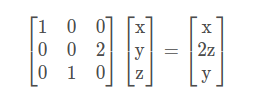

齐次坐标就是将一个原本是 n 维的向量用一个 n+1 维向量来表示。可以发现将三维的笛卡尔坐标添加一个额外坐标，就可以实现坐标平移了，而且保持了三维向量与矩阵乘法具有的缩放和旋转操作。

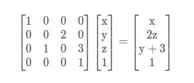

而这种变换也称为**仿射变换**（affine transformation），不属于线性变换（线性变换的一个重要规则就是 `(0, 0, 0)` 映射以后仍是 `(0, 0, 0)`）。所以齐次坐标优点就显而易见了：可以将缩放、旋转和平移用一种统一的格式来描述。

### 线性变换

线性变换从几何直观有三个要点：

- 变换前是直线的，变换后依然是直线
- 直线比例保持不变
- 变换前是原点的，变换后依然是原点

### 仿射变换

仿射变换（Affine transformation），又称仿射映射，是指在几何中，对一个向量空间进行一次线性变换并接上一个平移，变换为另一个向量空间。简单来说就是 “仿射变换“ = “线性变换” + “平移”。

仿射变换从几何直观只有两个要点：

- 变换前是直线的，变换后依然是直线
- 直线比例保持不变

少了原点保持不变这一条。

## 坐标转换

### 世界坐标 → 相机坐标（刚性变换）

`(Xw，Yw，Zw)` 代表世界坐标，`(Xc，Yc，Zc)` 代表相机坐标；R 代表正交单位旋转矩阵，t 代表三维平移矢量。

### 相机坐标 → 图像坐标系（中心投影）

相机坐标系到图像坐标系我们可以利用相似三角形进行计算：

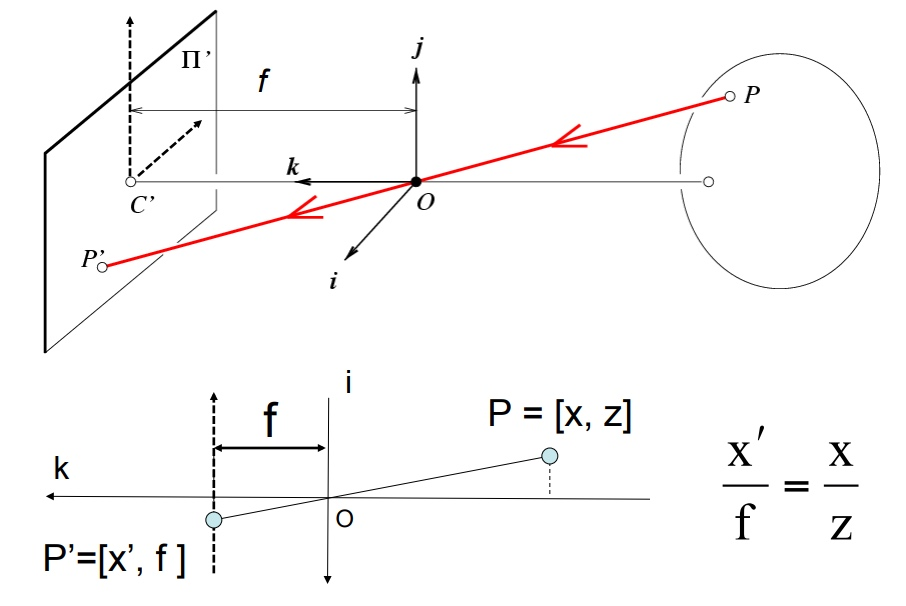

为了统一坐标的正负符号，根据三角形原理，把 P 点移动到了小孔 Oc 前面，所以可以推断出下面的公式：

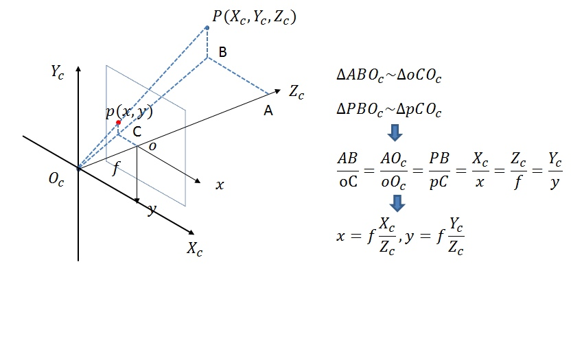

- 写成齐次坐标形式为：

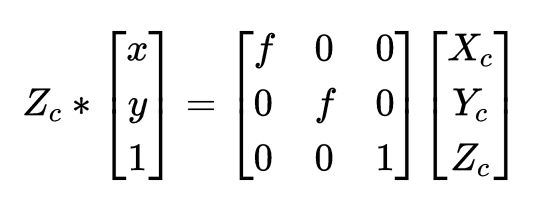

我们把 `Zc` 移到右边，所以上面的公式也可以写为：

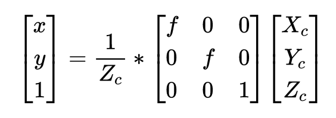

其中 `f` 代表焦距，即相机坐标系和图像坐标系在 Z 轴上的差。此时投影点 p 的单位还是 mm，并不是 pixel。

### 图像坐标系 → 像素坐标系（离散化）

像素坐标系的原点在左上角，并且单位为像素。像素坐标系和图像坐标系都在成像平面上，只是各自的原点和度量单位不一样。图像坐标系的原点为相机光轴与成像平面的交点，通常情况下是成像平面的中点。

图像坐标系的单位是 mm，属于物理单位，而像素坐标系的单位是 pixel，我们平常描述一个像素点都是几行几列。

下面 `dx` 与 `dy` 分别表示每个像素在横轴 x 和纵轴 y 上的物理尺寸。所以 `x / dx` 表示 x 长度下有多少个像素点。

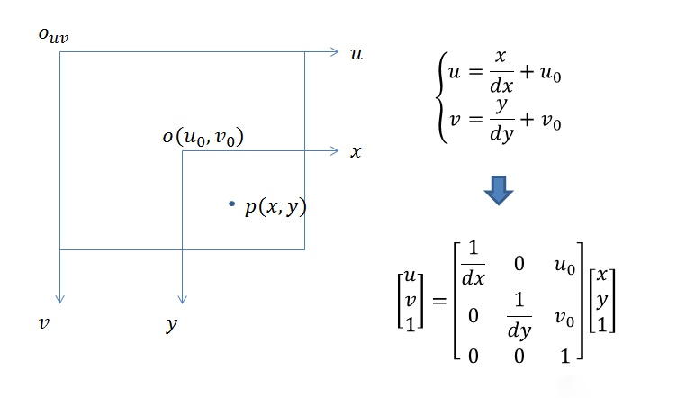

### 结论

综上所述，世界坐标 `(Xw，Yw，Zw)` 和像素坐标 `(u, v)` 的转换关系我们可以通过以下公式求出：

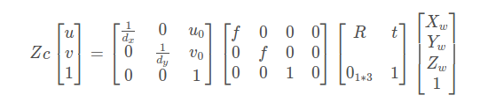

其中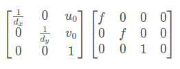为相机内参矩阵，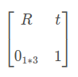 为外参矩阵。相机标定就是为了求解这两个矩阵的参数。

## 参考文章

- [世界坐标系、相机坐标系和图像坐标系的转换 - CSDN](http://t.csdn.cn/ZIXCE)

- [相机矩阵（Camera Matrix） - CSDN](http://t.csdn.cn/0HI04)

- [如何通俗地讲解「仿射变换」这个概念？ - 知乎](https://www.zhihu.com/question/20666664/answer/157400568)

  