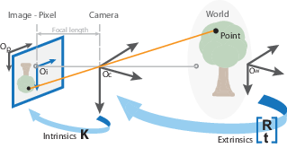
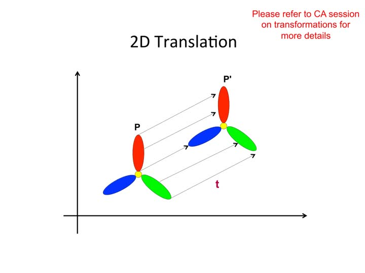
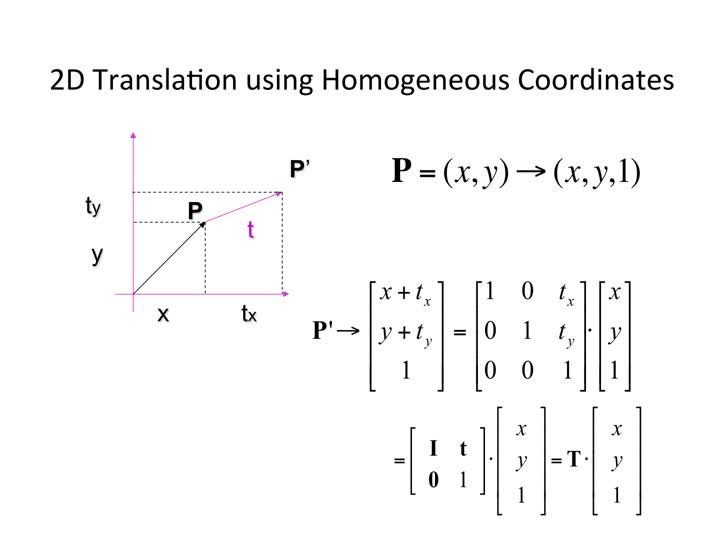
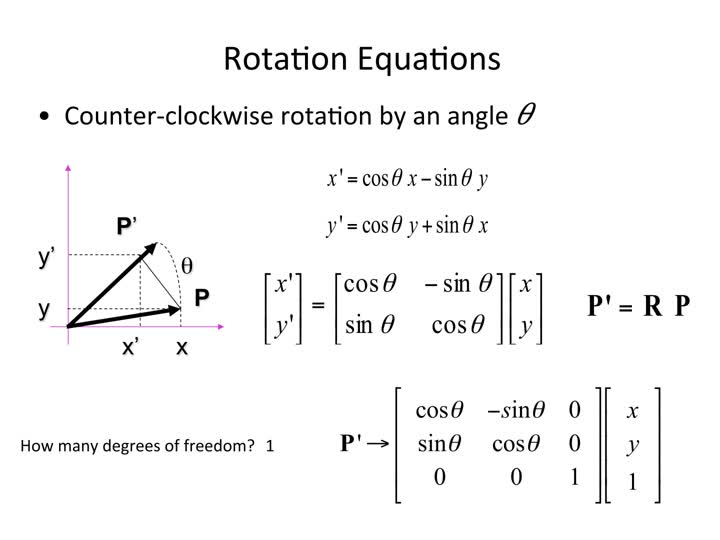
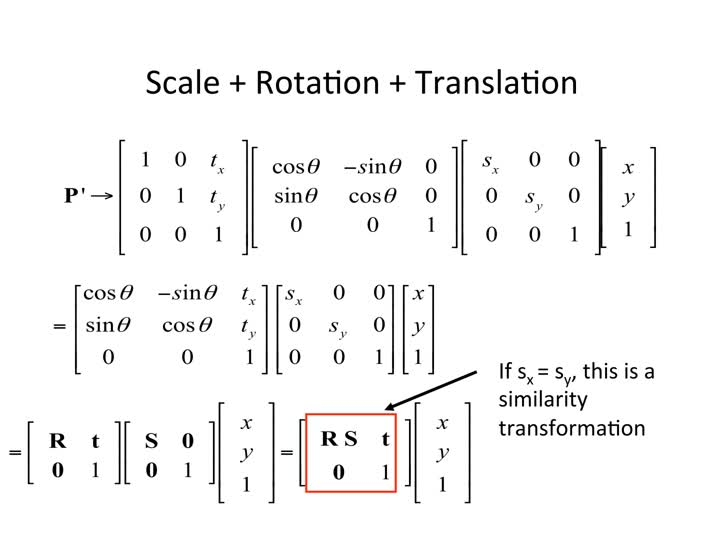
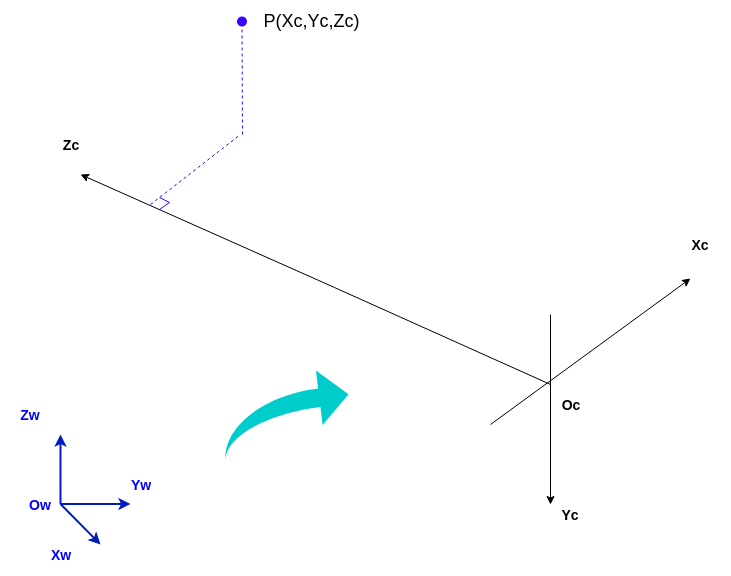

[TOC]

# 相机模型与相机内参外参

## 相机成像原理以及相机模型

### 针孔相机

- A simple working camera model: the pinhole camera model


- A formal construction of the pinhole camera model


小孔成像的孔大小影响了成像的效果。孔径越小，通光量不足，成像很暗，质量很差。但是孔径越大，成像越模糊。容易看出，物体上一点发出的光线，通过针孔在底片形成一个亮斑，这个亮斑的大小和针孔的大小是正比的。


### 透镜相机

在普通相机中，通过使用镜头（可以聚焦或分散光线的设备），可以缓解上述清晰度和亮度之间的冲突。如果我们用镜头来替换针孔，将传播过来的光线聚集，这样子就能得到清晰明亮的图像了。


物品上有些点是通过透镜折射后能够聚焦到 image 上，但是有些点投射过来的光线不能完全聚合到 image 上。


- 平行光

刚才我们说的是非平行光，当我们的物体足够远的时候，我们可以近似把它发射的光线认为是平行光。

镜头将所有平行于光轴传播的光线聚焦到一个被称为焦点的点，然后再发散出来，打到 film 上面形成图像。


### 针孔模型

不管是透镜相机还是针孔相机都可以简化为针孔相机的数学模型。


在实际的实现和应用中，为了表达的方便，通常会将图像平面放在小孔和三维场景之间。如下图所示：


> 对上图的一些直观补充




## 四个不同类型的坐标系

相机成像就是将三维物体转换成照片上的二维坐标，这个过程涉及到四个坐标系进行转换。


为了数学表达的方便，通常以光心为原点，建立一个图像坐标系。下图详细的描述了这些关系


- 世界坐标系 `(Xw,Yw,Zw)`：也称为测量坐标系，是一个三维直角坐标系，以其为基准可以描述相机和待测物体的空间位置。世界坐标系的位置可以根据实际情况自由确定。单位：通常使用米（m）或厘米（cm）等实际尺寸作为单位。
- 相机坐标系 `(Xc,Yc,Zc)`：也是一个三维直角坐标系，原点位于镜头光心处，x、y 轴分别与相面的两边平行，z 轴为镜头光轴，与像平面垂直，单位：通常使用米（m）或厘米（cm）等实际尺寸作为单位。
- 像素坐标系 `(u,v)`：二维直角坐标系，反映了相机传感器芯片中像素的排列情况。原点 o 位于图像的左上角，u 轴、v 轴分别于像面的两边平行。像素坐标系中坐标轴的单位是像素 pixel（整数）。


> 像素原点在图像的左上角，横坐标值表示列数 c，通常以 u 表示；纵坐标值表示行数 r，通常以 v 表示。

- 图像坐标系 `(x, y)`：由于像素坐标系不利于坐标变换，因此需要建立图像坐标系 oxy，其坐标轴的单位为毫米（mm），原点 o 是相机光轴与相面的交点（称为主点 Principal Point），即图像的中心点，x 轴、y 轴分别与 u 轴、v 轴平行。**故两个坐标系实际是平移关系，即可以通过平移就可得到**。当然还要考虑图像坐标系和像素坐标系的单位转换（放缩）。

  如下图：`(u0, v0)` 为图像坐标系中心 O 在像素坐标系下的位置表示


点在各个坐标系的表达：


## 数学知识复习

> 下面的坐标系转换涉及到数学的计算，复习一下

### 矩阵计算

https://www.ruanyifeng.com/blog/2015/09/matrix-multiplication.html

- 矩阵乘法


- 矩阵加法

矩阵加法就是相同位置的数字相加


### 三角函数

- 正弦和余弦


- 和角公式

```
sin(A+B) = sinAcosB + cosAsinB
sin(A-B) = sinAcosB - cosAsinB

cos(A+B) = cosAcosB - sinAsinB
cos(A-B) = cosAcosB + sinAsinB
```

## 齐次坐标

齐次坐标就是将一个原本是 `n` 维的向量用一个 `n+1` 维向量来表示。比如笛卡尔坐标上的点 `(x, y)` 可以以 `(x, y, 1)` 来表达。

图形应用涉及到几何变换（平移、旋转、缩放），以矩阵表示式来计算这些变换时，平移是矩阵相加，旋转和缩放则是矩阵相乘，综合起来可以表示为 `p' = m1 * p + m2`。 引入齐次坐标的目的主要是**合并矩阵运算中的乘法和加法**，表示为 `p' = M * p` 的形式，即**将放缩、旋转和平移用一种统一的格式来描述**。

## 坐标系的转换原理

**通过两个不同坐标系上的点的转换关系，可以推导出这两个坐标系之间的转换关系**，因为这些点之间的转换关系是坐标系转换的基础。

假设我们有两个二维坐标系：坐标系 A 和坐标系 B。现在，我们有坐标系 A 中的一个点 P，其坐标为 `(x_A, y_A)`，同时我们知道这个点在坐标系 B 中的坐标是 `(x_B, y_B)`。**我们要找出坐标系 A 与坐标系 B 之间的转换关系，即找到 x_B 和 y_B 如何表示为 x_A 和 y_A 的函数**。

下面我们先以二维坐标系的点来举例子：

### 2D 坐标转换

#### 平移



平移方程式


转换为矩阵的形式就是矩阵相加


使用齐次坐标



引入齐次坐标后，我们就可以**通过矩阵乘法来实现平移**。

#### 放缩


放缩方程式


使用普通坐标表示


#### 旋转


在二维空间中，旋转可以用一个单一的角 `θ` 定义。作为约定，正角表示逆时针旋转。把笛卡尔坐标的列向量关于原点逆时针旋转 `θ` 的矩阵是：



`P'(x', y')` 的详细推断过程：


```matlab
因为
cos α = x / r
sin α = y / r

所以
x = r * cos α
y = r * sin α

因为
x' = r * cos(α+θ)
y' = r * sin(α+θ)

又因为
cos(α+θ) = cos α * cos θ - sin α * sin θ
sin(α+θ) = sin α * cos θ + sin θ * cos α

所以
x' = r * cos α * cos θ - r * sin α * sin θ
y' = r * sin α * cos θ + r * sin θ * cos α

所以
x' = x * cos θ - y * sin θ
y' = y * cos θ + x * sin θ
```

#### 小结

`P(x, y)` 点经过放缩、旋转和平移的动作后，得到 `P'(x', y')` 点的公式如下：

> 矩阵连乘的物理意义就是相当于在欧式空间的连续动作



> 上图的 Sx，Sy 分别表示 x 方向的缩放尺度和 y 方向的缩放尺度。如果相等，我们称为相似变换。

- 坐标系转换的直观补充


### 3D 坐标转换

> 同 2D 坐标转换，只是多了个 z 轴

- 三维坐标的齐次坐标

同理，三维笛卡尔坐标与矩阵的乘法只能实现三维坐标的放缩（放大和缩小）和旋转，无法实现坐标平移。


齐次坐标实现了坐标平移，而且保持了三维向量与矩阵乘法具有的放缩和旋转操作。


- 平移方程式


- 旋转方程式


3D 的旋转和 2D 不一样，三维的旋转有三种方式的旋转，分别围绕着 x，y，z 轴。

构造三维旋转矩阵： `Rx(α)` 表示绕 x 轴旋转 `α` 度的意思是，y 和 z 动，x 不动。所以根据这个物理意义，我们要把 x 锁住不动，坐标乘以 `Rx(α)` 矩阵后，x 的坐标要保持不变（如下图所示，`k` 和 `n` 是变量）。所以矩阵对应的对角线上就是 1，剩下的两个轴凑出一个旋转矩阵，就是我们上面讲到的二维旋转矩阵。


同样的道理，绕 y 和 z 轴的旋转矩阵构造也一样。把三个动作连乘，就得到了旋转矩阵 R。

**注意**：旋转矩阵的相乘顺序是有一定的讲究（// TODO 还没来的急整理）可以参考文章：[欧拉角细节/旋转顺序/内旋外旋](https://zhuanlan.zhihu.com/p/85108850)

> // TODO 旋转矩阵在三维空间只有三个自由度：绕 x，y，z 轴转动。有三个自由度，但是却有 3x3 = 9 个数。

- 综合上面旋转加平移动作，和 2D 坐标转换同理，我们可以得出点 `P` 在三维空间转换为 `P'` 的矩阵公式如下：


可以看到，三维空间和二维平面的公式中少了放缩这一个步骤。因为在我们世界中的变换，一个东西是不能随便放大缩小的。比如一个汽车，它在空间中也就只能旋转和平移，一般没有尺度上的放缩，这也叫刚性变换。图像的平移加旋转，图像形状不变，得到的变换称为刚性变换。

## 仿射变换

仿射变换（Affine transformation），又称仿射映射，是指在几何中，对一个向量空间进行一次线性变换并接上一个平移，变换为另一个向量空间。简单来说就是【仿射变换】=【线性变换】+【平移】。

推荐阅读：如何通俗地讲解「仿射变换」？ - 马同学的回答 - 知乎 https://www.zhihu.com/question/20666664/answer/157400568

## 坐标转换

### 世界坐标 -> 相机坐标



根据前面我们说过的 3D 坐标转换，易得世界坐标系转换为相机坐标系的矩阵公式如下：


`(Xw, Yw, Zw)` 代表世界坐标，`(Xc, Yc, Zc)` 代表相机坐标；`R` 为 3x3 的旋转矩阵（Rotation Matrix），`t` 为 3x1 的平移向量（Translation Vector）。

### 相机坐标 -> 图像坐标系

> 中心投影


即先求出相机坐标系下的点 `P(Xc, Yc, Zc)` 在图像坐标系下的表达 `p(x, y)`。根据相似三角形原理，有以下推导及公式：


转换成矩阵相乘如下，其中 `f` 为有效焦距（光心到图像平面的距离），`(Xc, Yc, Zc, 1)` 是空间点 `P` 在相机坐标系的齐次坐标，`(x, y, 1)` 是图像点 `p` 在图像坐标系中的齐次坐标。


系数 `Zc` 有时也称之为 `s`（比例因子，不为 0）。

### 图像坐标系 -> 像素坐标系

根据在图像中点 `p` 的坐标 `(x, y)`，得到其在像素坐标系，即我们所能看到的图片像素中的位置 `(u, v)`。


`dx` 像素宽度，`dy` 像素高度，分别表示每个像素在水平 `u` 和竖直 `v` 方向上的实际物理尺寸（单位mm），即每个感光芯片的实际大小。由于单个像素点投影在图像平面上并非正方形而是矩形，故而 `dx!=dy`。假设图像坐标系中心在像素坐标系的表达为 `O(u0, v0)`，图像上的投影点 `p(x, y)` 在像素坐标系下可有如下表示：


### 结论

综上所述，世界坐标 `(Xw, Yw, Zw)` 到像素坐标 `(u, v)` 的转换关系我们可以通过以下公式求出：


合并等式右边的前两个转换关系（`相机->图像，图像->像素`），直接表示为`相机->像素`的转换矩阵后，表达为：


其中，（`dx` 像素宽度，`dy` 像素高度）可以理解为焦距 `f` 分别在 `x`，`y` 轴方向等价的像素个数（每个像素的物理尺寸为 `dx * dy`，单位为 mm）。以上等式右边，第一个矩阵（Intrinsic Matrix）即为**相机内参**，描述了物理世界与相片像素之间的对应关系；第二个矩阵（Extrinsic Matrix）即为**相机外参**，描述了世界坐标系（比如机械臂基座或小车)与相机的位置关系。

## 相机畸变和内参标定

// TODO

## 参考文章

- [《CS231A: Computer Vision, From 3D Reconstruction to Recognition》](http://web.stanford.edu/class/cs231a)
- [学习目标 - 黑马机器人 | 相机标定&物体检测](https://robot.czxy.com/docs/camera/chapter01/)

