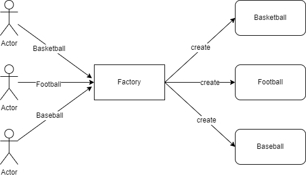
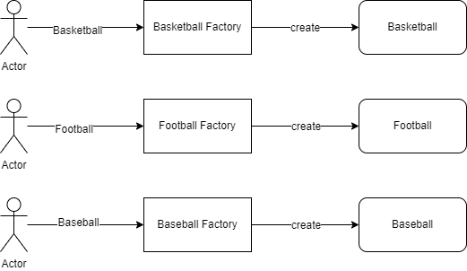
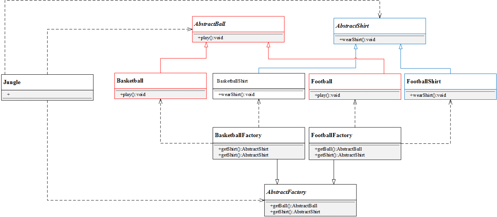

[TOC]

# 工厂模式

对创建对象的封装，**符合开闭原则**。工厂模式在许多项目中大量使用，因为它将对象的构造过程封装，使创建对象的接口统一且简洁，另一方面符合开闭原则。

## 简单工厂



- **工厂（Factory）**：根据客户提供的具体产品类的参数，创建具体产品实例。
- **抽象产品（AbstractProduct）**：具体产品类的基类，包含创建产品的公共方法。
- **具体产品（ConcreteProduct）**：抽象产品的派生类，包含具体产品特有的实现方法，是简单工厂模式的创建目标。

简单工厂模式UML类图如下：


代码结构如下：

```c++
#include <iostream>

using namespace std;

// 抽象产品类
class AbstractProduct
{
public:
    // 抽象方法
    virtual void doSomething() = 0;
};

// 具体产品类
class ProductA : public AbstractProduct
{
public:
    // 具体实现方法
    void doSomething()
    {
        cout << "ProductA" << endl;
    }
};

class ProductB : public AbstractProduct
{
public:
    void doSomething()
    {
        cout << "ProductB" << endl;
    }
};

// 工厂
class Factory
{
public:
    AbstractProduct* createProduct(string productName)
    {
        AbstractProduct* pro = nullptr;
        if (productName == "ProductA")
        {
            pro = new ProductA();
        }
        else if (productName == "ProductB")
        {
            pro = new ProductB();
        }
        // ...
        return pro;
    }
};

int main()
{
    Factory* f = new Factory();
    AbstractProduct* a = f->createProduct("ProductA");
    a->doSomething();
    return 0;
}

```

客户端在使用时，只需要创建一个工厂对象，调用工厂对象的 createProduct 方法，并传入所需要的产品参数，即可得到所需产品实例对象，而无需关心产品的创建细节。

简单工厂模式的优点在于：

- 工厂类提供创建具体产品的方法，并包含一定判断逻辑，客户不必参与产品的创建过程。
- 客户端只需要知道对应产品的参数即可，参数一般简单好记，如数字、字符或者字符串等。

当然，简单工厂模式存在明显的不足。假设有增加一个 ProductC，该怎么办呢？

你肯定会说，这还不容易吗？再从抽象产品类派生出一个 ProductC 类，并在工厂类的 `getSportProduct` 方法中增加 `productName== "ProductC"` 的条件分支即可。

的确如此，但是这明显违背了开闭原则（对扩展开放，对修改关闭），即在扩展功能时修改了既有的代码。另一方面，简单工厂模式所有的判断逻辑都在工厂类中实现，一旦工厂类设计故障，则整个系统都受之影响。

## 工厂方法

简单工厂模式中，每新增一个具体产品，就需要修改工厂类内部的判断逻辑。为了不修改工厂类，遵循开闭原则，工厂方法模式中不再使用工厂类统一创建所有的具体产品，而是针对不同的产品设计了不同的工厂，每一个工厂只生产特定的产品。



从工厂方法模式简介中，可以该模式有以下几种角色

- **抽象工厂（AbstractFactory）**：所有生产具体产品的工厂类的基类，提供工厂类的公共方法。
- **具体工厂（ConcreteFactory）**：生产具体的产品工厂。
- **抽象产品（AbstractProduct）**：所有产品的基类，提供产品类的公共方法。
- **具体产品（ConcreteProduct）**：具体的产品类。 

工厂方法模式 UML 类图如下：

// TODO

代码如下：

// TODO

如果要生产棒球（Baseball），只需要增加一个棒球工厂（Baseball Facory），然后在客户端代码中修改具体工厂类的类名，而原有的类的代码无需修改。由此可看到，相较简单工厂模式，工厂方法模式更加符合开闭原则。工厂方法是使用频率最高的设计模式之一，是很多开源框架和 API 类库的核心模式。

工厂方法优点：

- 工厂方法用于创建客户所需产品，同时向客户隐藏某个具体产品类将被实例化的细节，用户只需关心所需产品对应的工厂。
- 工厂自主决定创建何种产品，并且创建过程封装在具体工厂对象内部，多态性设计是工厂方法模式的关键。
- 新加入产品时，无需修改原有代码，增强了系统的可扩展性，符合开闭原则。

工厂方法缺点：

- 添加新产品时需要同时添加新的产品工厂，系统中类的数量成对增加，增加了系统的复杂度，更多的类需要编译和运行，增加了系统的额外开销；
- 工厂和产品都引入了抽象层，客户端代码中均使用的抽象层（AbstractFactory 和 AbstractSportProduct ），增加了系统的抽象层次和理解难度。

## 抽象工厂



## 参考链接

- [简单工厂模式简介](https://github.com/FengJungle/DesignPattern/blob/master/01.SimpleFactory/01.SimpleFactory.md)
- [工厂方法模式简介](https://github.com/FengJungle/DesignPattern/blob/master/02.FactoryMethod/02.FactoryMethod.md)

- [抽象工厂模式简介](https://github.com/FengJungle/DesignPattern/blob/master/03.AbstractFactory/03.AbstractFactory.md)