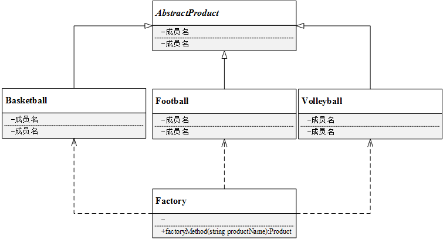

[TOC]

# 工厂模式

常用设计模式

**单例模式：**日志系统，资源管理器，线程池，内存池等

**工厂模式：**对创建对象的封装，**符合开闭原则**。工厂模式在许多项目中大量使用，因为它将对象的构造过程封装，使创建对象的接口统一且简洁，另一方面符合开闭原则，易于扩展。开源项目NVDLA的compiler中各类node的建立，TensorFlow源码和LLVM中的pass，都有工厂模式的用例。

**适配器模式：****STL中的容器适配器stack和queue**，是对象适配器的绝佳用例。项目开发中也常常使用。

**观察者模式：**频繁使用，观察者模式建立了一种一对多的联动，一个对象改变时将自动通知其他对象，其他对象将作出反应。这是不是很常见？**消息更新、广播机制、消息传递、链式触发（高级啊）**……比如Qt信号槽机制，订阅更新👻

**职责链模式：****将一个请求的发送者和接收者解耦，让多个对象都有机会处理请求**。将接收请求的对象连接成一条链，并且沿着这条链传递请求，直到有一个对象能够处理它为止。采用职责链模式不仅可以方便扩展（当增加一个接受者时，只需要在链上的适当位置插入对应的处理方法即可），而且可以替换掉代码中可能存在的switch-case或者if-else。在工具的设计、具有层级关系或权限关系的任务处理场景中可以应用职责链模式。

**策略模式：**常**常与工厂模式搭配，封装不同的算法（策略）**，再结合C++多态机制，策略模式在实际开发过程中应用十分广泛。

**代理模式：**C++**智能指针、引用计数**等

## 简单工厂

- **工厂（Factory）**：根据客户提供的具体产品类的参数，创建具体产品实例；
- **抽象产品（AbstractProduct）**：具体产品类的基类，包含创建产品的公共方法；
- **具体产品（ConcreteProduct）**：抽象产品的派生类，包含具体产品特有的实现方法，是简单工厂模式的创建目标。

简单工厂模式UML类图如下：

待补充

## 参考链接

https://github.com/FengJungle/DesignPattern/blob/master/01.SimpleFactory/2.Code/SimpleFactory.h