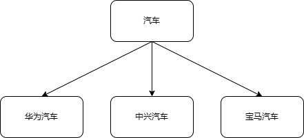
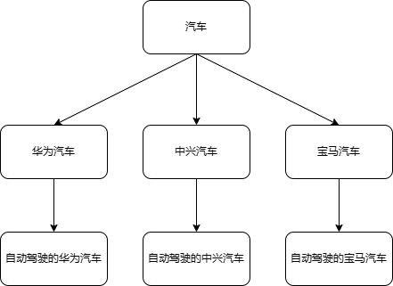
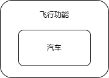
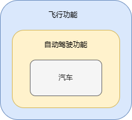
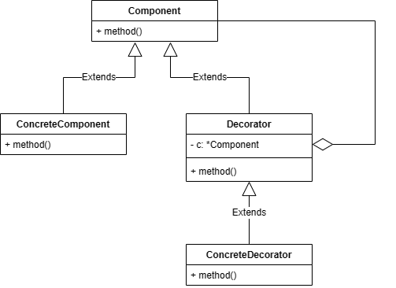

[TOC]

# 装饰器模式

装饰器模式是一种典型的结构型设计模式，对原有的类进行功能扩展。

举个例子，我们有一个汽车的接口，提供最基本的行驶功能。有三种具体的汽车品牌继承这个接口：

现在我们希望给汽车的行驶功能扩展，让汽车支持自动驾驶，我们可以通过以下方法实现。

1、直接修改具体类。缺点：不满足对扩展开发，对修改封闭。

2、让子类继承三个汽车类，在子类中增加自动驾驶功能。

这种方法是可以实现类的扩展，但是会带来一个新的问题，类太多了，而且代码复用性不够好。

目前只扩展了一个自动驾驶的功能就需要添加 3 个类，如果还要添加一个飞行功能，那又要新增 3 个类。

对于一个类的扩展，不仅可以使用继承，也可以通过组合来实现（一般我们优先推荐使用组合的方式）。组合可以让类的扩展更加灵活多变。

对于例子中的场景，我们并不需要从每一种汽车实现类派生出子类，只需要定义一个自动驾驶的包装类，让汽车对象成为包装类的成员。

同样，我们要为汽车扩展飞行功能，也可以定义一个飞行的包装类。

要既可以自动驾驶，也可以飞行。可以在包装类外面再套一层包装。

装饰器模式是在原有类的基础上动态添加新的功能，这种添加功能的方式不同于继承，它是在对象层面实现功能扩展，而不是继承的类层面，因此说装饰器模式比继承更加灵活。另外，装饰器模式属于结构型设计模式。之前讲的都是创建型设计模式。创建型可以理解为生成新的对象，而结构型可以理解为构建更大的类或类对象

// TODO

Component 接口

在我们上面的例子中，Component 接口相当于汽车接口，所有的被包装类、包装类，都继承于这个接口。

ConcreteComponent 类

ConcreteComponen t类是被包装的实现类。在例子中，奔驰汽车、宝马汽车、特斯拉汽车都属于这个角色。

Decorator抽象类

所有的包装类，都继承自 Decorator 抽象类，而 Decorator 类又实现了 Component 接口，这么做是为了实现多层嵌套包装。

ConcreteDecorator类

具体的包装类，用于扩充被包装类的功能，比如例子中的自动驾驶功能、飞行功能扩展。

这四大核心角色的关系是怎样的呢？我们可以用装饰器模式的UML类图来表达：

## 参考文章

- https://zhuanlan.zhihu.com/p/342111312，文章质量不行，后续删除
- https://mp.weixin.qq.com/s/4yOi9TGbk9XV4QtEZttdbA