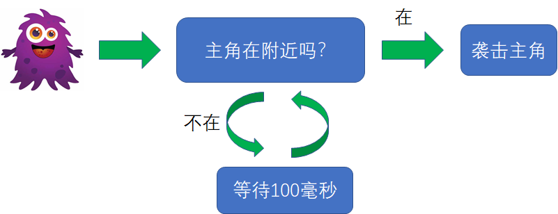
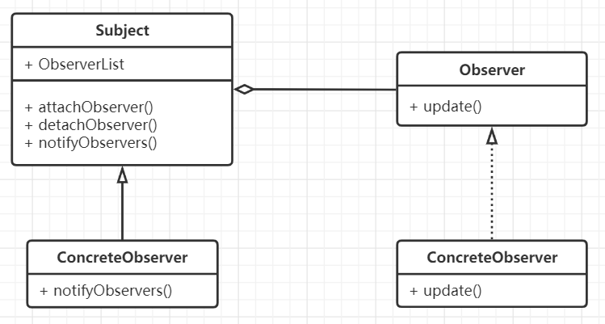

[TOC]

# 观察者模式

当对象间存在一对多关系时，则使用观察者模式（Observer Pattern）。比如，**当一个对象被修改时，则会自动通知依赖它的对象**。观察者模式属于行为型模式。

我们有以下的场景：在一个小游戏里，有一个迷宫，迷宫里有怪物、陷阱和宝物。一旦主角移动到怪物的有效范围，怪物会袭击主角；主角移动到陷阱的有效范围，陷阱会困住主角；主角移动到宝物的有效范围，宝物会为主角加血。如何让主角移动的事件被怪物、陷阱、道具感知到，并做出正确的反应？

- 方法一：循环检测



缺点：这样的思路是，是“拉取“的思路。如果事件没有发生，那么程序一直空转，浪费资源。即使事件发生了，由于每隔 100 毫秒才检测一次，也无法得到实时的响应。

- 方法二：设成类成员

把怪物、陷阱和宝物对象都设成主角类的成员，当主角移动的时候，就调用这些成员对象的方法，相当于出发了事件响应。

```java
class Hero {
 public:
  void move() {
    std::cout << "主角向前移动" << std::endl;
    //主角移动时，分别通知怪物、陷阱和宝物对象
    monster.update();
    trap.update();
    treasure.update();
  }

 private:
  //怪物
  Monster monster;
  //陷阱
  Trap trap;
  //宝物
  Treasure treasure;
};
```

缺点：这样子写确实把方法一的“拉取”变成了实时的“推送”。但是迷宫中怪物、陷阱和宝物对象在逻辑上并不属于主角。而且每次增加新的元素，都要修改主角类。这些都不符合软件的编程思想。

- 方法三：观察者模式



在上面的 UML 图中，主要有两组实体对象，一组是观察者，一组是被观察者。所有的观察者，都实现了 Observer 接口；所有的被观察者，都继承自 Subject 抽象类。

Subject 类的成员 OberverList，存储着已注册的观察者，当事件发生时，会通知列表中的所有观察者。需要注意的是，OberverList 所依赖的是抽象的 Observer 接口，这样就避免了观察者与被观察者的紧耦合。

## 代码示例

```cpp
#include <algorithm>
#include <iostream>
#include <vector>

// 观察者
class Observer {
 public:
  virtual void update() = 0;
};

// 被观察者
class Subject {
 public:
  // 添加观察者
  void attachObserver(Observer* observer) { observerList.push_back(observer); }
  // 移除观察者
  void detachObserver(Observer* observer) {
    auto it = std::find(observerList.begin(), observerList.end(), observer);
    if (it != observerList.end()) {
      observerList.erase(it);
    }
  }
  // 通知观察者
  void notifyObservers() {
    for (auto observer : observerList) {
      observer->update();
    }
  }

 private:
  std::vector<Observer*> observerList;
};

// 怪物
class Monster : public Observer {
 public:
  void update() override {
    if (inRange()) {
      std::cout << ("怪物 对主角攻击！") << std::endl;
    }
  }

  bool inRange() {
    // 判断主角是否在自己的影响范围内，这里忽略细节，直接返回 true
    return true;
  }
};

// 陷阱
class Trap : public Observer {
 public:
  void update() {
    if (inRange()) {
      std::cout << ("陷阱 困住主角！") << std::endl;
    }
  }

  bool inRange() { return true; }
};

// 主角
class Hero : public Subject {
 public:
  void move() {
    std::cout << ("主角向前移动") << std::endl;
    notifyObservers();
  }
};

int main() {
  // 初始化对象
  Hero hero;
  Monster m;
  Trap t;
  // 注册观察者
  hero.attachObserver(&m);
  hero.attachObserver(&t);
  // 移动事件
  hero.move();
  return 0;
}

```

## 参考文章

- [漫画：设计模式中的 “观察者模式”](https://mp.weixin.qq.com/s/JHIzGc1c0EyT-LfuUhyTtA)